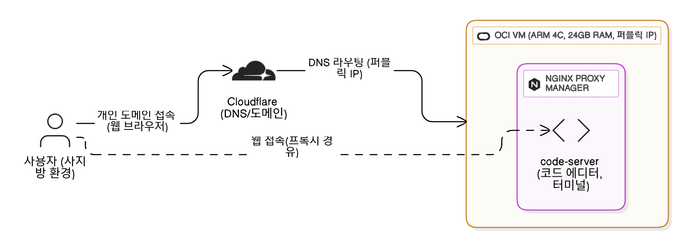

## 군생활을 시작하며

해군 SW개발병으로 입대하며, 어떻게 해야 이 시간을 생산적으로 보낼 수 있을지 깊이 고민했다. 훈련소와 후반기 교육을 마치고 자대에서 업무에 적응하다 보니, 어느덧 복무 기간의 30%가 훌쩍 지나 있었다. 매일 무언가를 꾸준히 공부하고 있었지만, 눈에 보이는 결과물이 없다는 생각에 종종 허탈함이 밀려왔다. 타오르던 학습 의욕도 명확한 결과물 없이는 쉽게 사그라들기 일쑤였다.

군대라는 특수한 환경에서 개인 프로젝트를 진행하거나 수익을 창출하는 것은 현실적으로 불가능에 가깝다. 이러한 제약 속에서 내가 남길 수 있는 가장 의미 있는 결과물은 바로 '기록'이라는 결론에 이르렀다.

군대에 입대하고 나서부터 일본어와 클라우드 및 시스템 엔지니어링 기술들을 꾸준히 공부하고 있다. 이를 기록하고 정리한다면, 내가 공부한 내용이 기록으로 남아 복기하기도 쉽고, 전역 후 돌아보면 큰 보람이 되어줄 거라 생각했다.

더 나아가, 나의 경험과 기록이 앞으로 SW개발병에 지원하려는 분들, 혹은 나처럼 군 복무 중 성장을 고민하는 분들께 작은 이정표가 될 수 있지 않을까 하는 기대도 있다. 군생활동안 이 블로그는 그런 고민과 성장의 과정을 담아내는 공간이 될 것이다. 비록 예전 일이지만 SW개발병 지원기와 같은 것도 기억해서 써보면 좋을 것 같다고 생각 중이다.

## 군대에서 개발하기

개발병으로 입대했지만, 군대에서의 개발 학습 환경은 예상보다 훨씬 열악했다.

주로 일과 시간 이후나 휴일에 사이버지식정보방(사지방)을 이용해 학습해야 했으나, 컴퓨터의 성능이 매우 낮아 원활한 개발이 불가능한 수준이었다. 브라우저 탭을 4 ~ 5개만 열어도 시스템이 멈추는 일이 잦았다. 사지방의 하드웨어를 개선하거나 개인 전자장비 반입 허가를 받는 것은 현실적으로 불가능했기에, 이 제약을 극복할 대안을 모색하기 시작했다.

초기 대안은 다음과 같았다.

1.  본가의 데스크톱을 24시간 가동하여 원격으로 접속하기
2.  본가의 데스크톱에 `code-server`를 구축하여 사용하기

하지만 이 방안들은 몇 가지 명확한 한계가 있었다. 사지방의 인터넷은 사용자가 몰리는 시간에는 매우 불안정했으며, 개인 PC를 상시 가동할 경우 전기 요금 문제와 더불어 고장 시 다음 휴가까지 대처가 불가능하다는 위험이 있었다. 그리고 1번 방안의 경우에는 부대 규정에 문제가 될 수 있다는 것을 알게되었다.

따라서 24시간 안정적인 컴퓨팅 자원을 공급받을 수 있는 클라우드 가상머신(VM)에 `code-server`를 구축하는 것이 가장 현실적인 해결책이라는 결론에 이르렀다. VM 호스팅 서비스로는 Oracle Cloud를 선택했다. 무료로 제공되는 ARM 코어 4개, 24GB 램과 넉넉한 네트워크 정책은 추가 비용 없이 개발 환경을 구축하기에 충분했다. 과거 개인 프로젝트에 사용했던 비활성 계정을 이를 위해 활용했다.

`code-server`는 호스트에 직접 설치하는 방식을 택했다. Docker를 이용할 경우 패키지 설치 및 연동이 복잡해질 수 있다고 판단했다. 또한, 사지방에서 호스트 터미널에 접속하기 위한 SSH(22번 포트) 연결은 (내 신변)보안상 우려가 있었기에, 웹소켓 기반 터미널을 제공하는 `code-server`는 훌륭한 대안이었다. 이를 통해 웹 브라우저만으로 안전하게 호스트를 관리할 수 있게 되었다. 여기에 Nginx Proxy Manager로 nginx 기반의 리버스 프록시 관리 시스템을 구성하고, Cloudflare를 통해 구매한 개인 도메인에 VM의 퍼블릭 IP를 연결했다. TLS 인증서 발급까지 마쳐 HTTPS 기반의 안전한 접속 환경을 완성했다. 오랜만에 수행하는 인프라 구성 작업이었지만, 모든 과정은 순조롭게 마무리되었다.

가장 우려했던 부분은 원격 환경에서 비롯되는 네트워크 지연 문제였다. 원격 코딩은 처음이었기에 어느 정도의 지연 시간이 발생할지 예측하기 어려웠다. 다행히 Oracle Cloud의 한국 리전(춘천)을 사용한 덕분에, 실제 사용 시 개발에 지장을 줄 정도의 지연은 체감되지 않았다. 현재 이 블로그 포스트 역시 새로 구축한 `code-server` 환경에서 매우 쾌적하게 작성하고 있다.

## 마무리

새롭게 블로그를 구축한 김에 꾸준히 글을 써나갈 계획이다. 사실 누군가에게 지식을 전달하는 글보다는, 특정 기술에 대한 개인적인 통찰이나 판단(소위 '똥글')을 담는 것이 더 매력적이라고 생각한다. 이러한 방식이 부담 없이 생각과 경험을 정리하는 데 도움이 될 것이며, 꾸준함을 유지하는 좋은 동기가 될 것이라고 판단했다. 

지난 이틀간 블로그 디자인 설정과 템플릿 커스터마이징에 매달렸다. Astro라는 도구는 처음 접했고, JS 생태계와는 다소 거리가 있어 쉽지 않았지만, 꾸준히 수정하며 내 취향에 맞게 다듬고 있다. 초기에 블로그를 잘 꾸며두어야 글쓰기에 대한 의욕도 더 생길 것이라 생각했다. 이미 동료 개발병들에게 블로그 개설 소식을 알렸으니, '작심삼일'을 백 번 반복하더라도 전역 전까지 50개 이상의 포스팅을 목표로 꾸준히 노력할 계획이다.