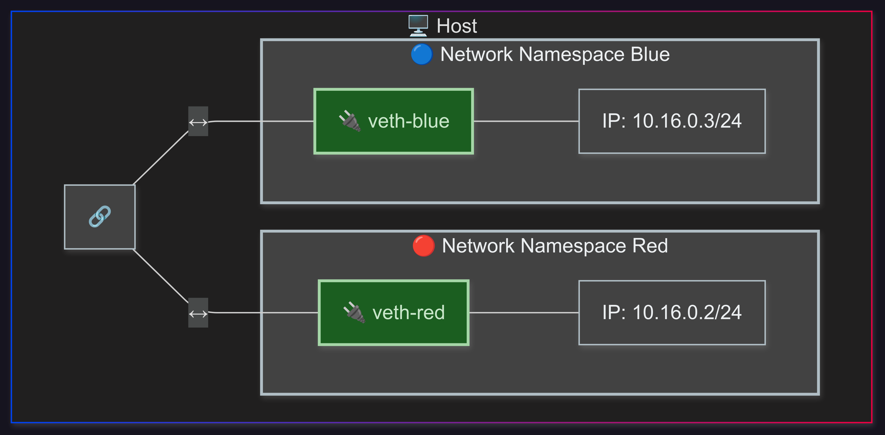
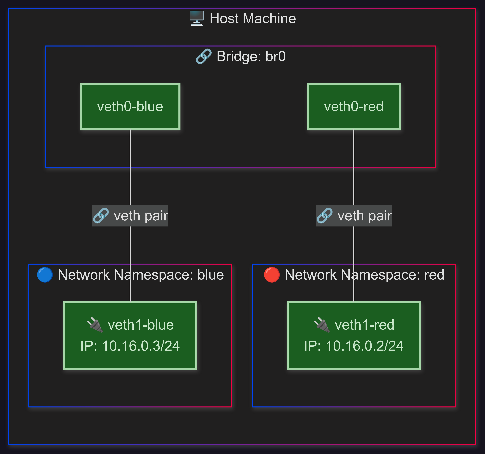

## 배경

군 복무 중 재미있는 학습 주제를 고민하게 되었다. 책을 통한 이론 학습도 의미 있지만, `code-server`를 활용하면 군부대 PC방(사지방)에서도 원격 리눅스 환경에 접속하여 실습을 진행할 수 있다.

이러한 환경을 바탕으로, 이론으로만 접했던 리눅스 네트워크 개념을 직접 실습하며 정리해보고자 한다. 리눅스는 다양한 네트워크 도구를 지원하므로, 이를 이용해 가상 네트워크 환경을 구성하고 실험을 진행하는 것이 가능하다.

실제로 Docker 컨테이너나 Kubernetes Pod의 네트워크는 이러한 리눅스 기능을 기반으로 구현된다. 따라서 이 과정을 학습하면 해당 기술의 내부 동작 원리를 더 깊이 이해하는 데 큰 도움이 될 것이라 생각한다.

이 시리즈는 개념의 상세한 설명보다는 실습을 통한 이해에 중점을 둔다. 이미 훌륭한 레퍼런스가 많이 존재하므로, 이론적 배경은 해당 자료들을 참고하는 것을 권장한다.

---

## 시나리오 A - Network Namespace간 veth을 통한 네트워크 통신 구현

이 시나리오는 **Network Namespace를 이용한 격리된 네트워크 환경을 구축하고 `veth`를 통해 통신**하는 과정을 구현한다.



### 1\. Network Namespace 생성

두 개의 독립적인 네트워크 환경을 구축하기 위해 `red`와 `blue`라는 이름의 Network Namespace를 생성한다. Network Namespace는 각각 독립적인 네트워크 스택(인터페이스, 라우팅 테이블, ARP 테이블 등)을 가진다.

```bash title="terminal"
ip netns add red
ip netns add blue
```

**결과 확인:**
`ip netns show` 명령을 통해 생성된 Network Namespace 목록을 확인한다.

```bash title="terminal"
ip netns show
# red
# blue
```

### 2\. veth(Virtual Ethernet Device) 생성

두 Network Namespace 간의 통신을 가능하게 하기 위해 가상 이더넷 페어(`veth` pair)를 생성한다. `veth`는 한쪽 끝에서 전송된 데이터가 다른 쪽 끝으로 즉시 전달되는 가상의 케이블이라고 생각할 수 있다. 여기서는 `veth-red`와 `veth-blue`라는 이름의 `veth` 페어를 생성한다.

```bash title="terminal"
ip link add veth-red type veth peer name veth-blue
```

**결과 확인:**
`ip link ls | grep veth` 명령을 통해 생성된 `veth` 페어의 상태를 확인한다. 현재는 어떤 Network Namespace에도 할당되지 않아 `DOWN` 상태인 것을 확인할 수 있다.

```bash title="terminal"
ip link ls | grep veth
# 12: veth-blue@veth-red: <BROADCAST,MULTICAST,M-DOWN> mtu 1500 qdisc noop state DOWN mode DEFAULT group default qlen 1000
# 13: veth-red@veth-blue: <BROADCAST,MULTICAST,M-DOWN> mtu 1500 qdisc noop state DOWN mode DEFAULT group default qlen 1000
```

### 3\. veth를 Network Namespace에 할당 및 활성화

생성된 `veth` 페어의 각 끝을 해당 Network Namespace에 할당하고 인터페이스를 활성화한다. 또한, 각 Network Namespace 내의 `lo` (loopback) 인터페이스도 활성화하여 내부 통신을 가능하게 한다. `lo`부분은 이 시나리오에서 생략해도 상관없다.

```bash title="terminal"
ip link set veth-red netns red
ip link set veth-blue netns blue

ip netns exec red ip link set veth-red up
ip netns exec blue ip link set veth-blue up

ip netns exec red ip link set lo up
ip netns exec blue ip link set lo up
```

### 4\. IP 주소 할당

각 Network Namespace 내의 `veth` 인터페이스에 IP 주소를 할당하여 통신할 수 있도록 설정한다. `red` Network Namespace의 `veth-red`에는 `10.16.0.2/24`를, `blue` Network Namespace의 `veth-blue`에는 `10.16.0.3/24`를 할당한다.

```bash title="terminal"
ip netns exec red ip a add 10.16.0.2/24 dev veth-red
ip netns exec blue ip a add 10.16.0.3/24 dev veth-blue
```

**결과 확인:**
각 Network Namespace에서 `ip a` 명령을 실행하여 할당된 IP 주소를 확인한다.

**`red` Network Namespace의 IP 주소:**

```bash title="terminal"
ip netns exec red ip a
#1: lo: <LOOPBACK,UP,LOWER_UP> mtu 65536 qdisc noqueue state UNKNOWN group default qlen 1000
#    link/loopback 00:00:00:00:00:00 brd 00:00:00:00:00:00
#    inet 127.0.0.1/8 scope host lo
#       valid_lft forever preferred_lft forever
#    inet6 ::1/128 scope host 
#       valid_lft forever preferred_lft forever
#13: veth-red@if12: <BROADCAST,MULTICAST,UP,LOWER_UP> mtu 1500 qdisc noqueue state UP group default qlen 1000
#    link/ether 16:c8:bb:1a:a0:d7 brd ff:ff:ff:ff:ff:ff link-netns blue
#    inet 10.16.0.2/24 scope global veth-red
#       valid_lft forever preferred_lft forever
#    inet6 fe80::14c8:bbff:fe1a:a0d7/64 scope link 
#       valid_lft forever preferred_lft forever
```

**`blue` Network Namespace의 IP 주소:**

```bash title="terminal"
ip netns exec blue ip a
#1: lo: <LOOPBACK,UP,LOWER_UP> mtu 65536 qdisc noqueue state UNKNOWN group default qlen 1000
#    link/loopback 00:00:00:00:00:00 brd 00:00:00:00:00:00
#    inet 127.0.0.1/8 scope host lo
#       valid_lft forever preferred_lft forever
#    inet6 ::1/128 scope host 
#       valid_lft forever preferred_lft forever
#12: veth-blue@if13: <BROADCAST,MULTICAST,UP,LOWER_UP> mtu 1500 qdisc noqueue state UP group default qlen 1000
#    link/ether 4e:88:d2:1a:cc:d0 brd ff:ff:ff:ff:ff:ff link-netns red
#    inet 10.16.0.3/24 scope global veth-blue
#       valid_lft forever preferred_lft forever
#    inet6 fe80::4c88:d2ff:fe1a:ccd0/64 scope link 
#       valid_lft forever preferred_lft forever
```

### 5\. Network Namespace 간 통신 시연

`red` Network Namespace에서 `blue` Network Namespace의 IP 주소로 `ping`을 시도하여 두 Network Namespace 간의 네트워크 통신이 성공적으로 이루어지는지 확인한다.

```bash title="terminal"
ip netns exec red ping 10.16.0.3
```

**시연 결과:**
`ping` 명령이 성공적으로 응답을 받아 `red`와 `blue` Network Namespace 간에 네트워크 통신이 원활하게 이루어지고 있음을 확인할 수 있다.

```bash title="terminal"
PING 10.16.0.3 (10.16.0.3) 56(84) bytes of data.
64 bytes from 10.16.0.3: icmp_seq=1 ttl=64 time=0.039 ms
64 bytes from 10.16.0.3: icmp_seq=2 ttl=64 time=0.048 ms
```

### 6\. Network Namespace 해제
동작 확인을 완료하고 아래 명령어를 이용하여 생성한 Network Namespace 자원 등을 해제한다.

```bash title="terminal"
ip netns del red
ip netns del blue
```

## 시나리오 B - Bridge를 통한 Network Namespace간 네트워크 통신 구현

이 시나리오는 **Bridge를 활용하여 여러 Network Namespace 간의 네트워크 통신을 구현하는 방법**을 보여준다. 각 단계별 설명과 해당 코드 블록, 그리고 실행 결과를 통해 명확하게 이해할 수 있도록 구성되었다.



### 1\. Network Namespace 생성

두 개의 독립적인 네트워크 환경을 구축하기 위해 **`red`와 `blue`라는 이름의 Network Namespace를 생성한다.** Network Namespace는 각각 독립적인 네트워크 스택(인터페이스, 라우팅 테이블, ARP 테이블 등)을 가진다.

```bash title="terminal"
ip netns add red
ip netns add blue
```

**결과 확인:**
`ip netns show` 명령을 통해 생성된 Network Namespace 목록을 확인할 수 있다.

```bash title="terminal"
ip netns show
# red
# blue
```

### 2\. veth(Virtual Ethernet Device) 및 Bridge 생성, 할당 및 활성화

각 Network Namespace에 연결할 **`veth` 페어를 생성하고, 이 `veth` 페어의 한쪽 끝을 브리지(`br0`)에 연결한 다음, 다른 한쪽 끝은 각 Network Namespace에 할당한다.** 이후 모든 관련 인터페이스를 활성화한다.

```bash title="terminal"
# veth 페어 생성 (red와 blue 각각)
ip link add veth0-red type veth peer name veth1-red
ip link add veth0-blue type veth peer name veth1-blue

# 브리지 생성
ip link add name br0 type bridge

# veth 페어의 한쪽 끝을 브리지에 연결
ip link set veth0-red master br0
ip link set veth0-blue master br0

# veth 페어의 다른 쪽 끝을 각 Network Namespace에 할당
ip link set veth1-red netns red
ip link set veth1-blue netns blue

# 브리지에 연결된 veth 인터페이스 활성화
ip link set veth0-red up
ip link set veth0-blue up

# Network Namespace 내부의 veth 인터페이스 활성화
ip netns exec red ip link set veth1-red up
ip netns exec blue ip link set veth1-blue up

# Network Namespace 내부의 lo(loopback) 인터페이스 활성화 (선택 사항이지만 일반적으로 수행)
ip netns exec red ip link set lo up
ip netns exec blue ip link set lo up
```

**참고:** `br_netfilter`가 활성화되어 있는 경우, **`sudo sysctl -w net.bridge.bridge-nf-call-iptables=0` 명령을 통해 해당 기능을 비활성화해야 한다.** 그렇지 않으면 브리지를 통한 패킷 전달에 문제가 발생할 수 있다.

### 3\. IP 주소 할당

각 Network Namespace 내의 **`veth` 인터페이스에 IP 주소를 할당하여 통신할 수 있도록 설정한다.** `red` Network Namespace의 `veth1-red`에는 `10.16.0.2/24`를, `blue` Network Namespace의 `veth1-blue`에는 `10.16.0.3/24`를 할당한다.

```bash title="terminal"
ip netns exec red ip a add 10.16.0.2/24 dev veth1-red
ip netns exec blue ip a add 10.16.0.3/24 dev veth1-blue
```

### 4\. 브리지 활성화

브리지(`br0`)를 활성화하여 연결된 모든 `veth` 인터페이스를 통해 패킷이 정상적으로 전달될 수 있도록 한다.

```bash title="terminal"
ip link set br0 up
```

### 5\. Network Namespace 간 통신 시연

`red` Network Namespace에서 `blue` Network Namespace의 IP 주소로 `ping`을 시도하여 **두 Network Namespace 간의 네트워크 통신이 성공적으로 이루어지는지 확인한다.**

```bash title="terminal"
ip netns exec red ping 10.16.0.3 
```

**시연 결과:**
`ping` 명령이 성공적으로 응답을 받아 `red`와 `blue` Network Namespace 간에 브리지를 통한 네트워크 통신이 원활하게 이루어지고 있음을 확인할 수 있다.

```bash title="terminal"
PING 10.16.0.3 (10.16.0.3) 56(84) bytes of data.
64 bytes from 10.16.0.3: icmp_seq=1 ttl=64 time=0.204 ms
64 bytes from 10.16.0.3: icmp_seq=2 ttl=64 time=0.062 ms
```

### 6\. Network Namespace 해제

동작 확인을 완료하고 아래 명령어를 이용하여 생성한 Network Namespace 자원 등을 해제한다.
```bash title="terminal"
ip netns del red
ip netns del blue
ip link del br0
```

---

## 마무리

리눅스 네트워크 기능을 활용해 몇 가지 간단한 시나리오를 정의하고 직접 구현해보니 매우 흥미로웠다. 이론으로만 접했던 내용을 실제로 구성하면서 오랜만에 재미있게 공부할 수 있었다. 다음에는 **Iptables**를 이용해 브리지를 통과하는 패킷에 규칙을 추가하여 트래픽을 제어하는 방법을 시도해볼 계획인데, 이 역시 즐거운 도전이 될 것 같다. 이렇게 실습하며 배우는 건 좋지만, 내용을 효과적으로 기록하기 위해 다이어그램을 그리는 일은 여전히 번거롭게 느껴진다.