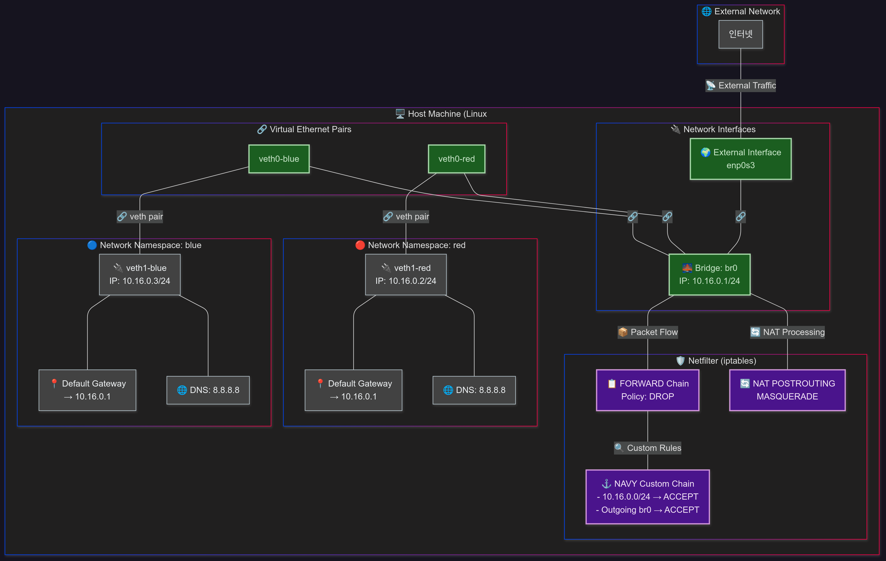

<<<<<<< HEAD
## 배경

저번 글에서 Bridge, veth, Network Namespace를 이용하여 간단한 가상 네트워크를 구성하고 통신하는 것을 구현했다. 자세한 내용은 [다음 링크](/posts/03-netnsintro/)에서 확인할 수 있다. 이번 글에서는 한 단계 더 나아가, **bridge를 통하는 네트워크 트래픽을 Iptables를 통해 효과적으로 제어하는 방법**에 대해 다룰 계획이다. 또한, 구성된 가상 네트워크가 외부 인터넷과 원활하게 통신할 수 있도록 **bridge에 IP 주소를 할당하고 이를 gateway로 설정하는 작업**은 물론, **NAT (Network Address Translation)를 위한 Iptables 테이블 설정**도 함께 진행해 볼 예정이다.

---

## 시나리오 - Iptables와 Bridge를 활용한 Network Namespace 네트워크 제어

이 시나리오는 **Bridge를 활용하여 여러 Network Namespace 간의 네트워크 통신을 구현하는 방법**을 확인하고 직접 구현한다. 가급적 바로 **제거해도 상관없는 깨끗한 VM 환경**에서 실행하는 것을 추천한다. Docker 등에서 실제 어플리케이션을 돌리고 있는 상황이라면 문제가 생길 수 있다. 글의 환경은 **Ubuntu 24.04 버전**을 사용하고 있다.



### 1\. Network Namespace 생성

두 개의 독립적인 네트워크 환경을 구축하기 위해 **`red`와 `blue`라는 이름의 Network Namespace를 생성한다.** Network Namespace는 각각 독립적인 네트워크 스택(인터페이스, 라우팅 테이블, ARP 테이블 등)을 가진다.

```bash title="terminal"
ip netns add red
ip netns add blue
```

**결과 확인:**
`ip netns show` 명령을 통해 생성된 Network Namespace 목록을 확인할 수 있다.

```bash title="terminal"
ip netns show
# red
# blue
```

### 2\. 시스템 네트워크 설정 초기화 및 브리지 관련 설정

Netfilter가 브리지 트래픽을 처리하도록 설정하고, IP 포워딩을 활성화하며, **`FORWARD` 체인의 기본 정책을 `DROP`으로 변경한다.** 이는 보안을 강화하고 명시적인 허용 규칙을 통해서만 트래픽이 흐르도록 하기 위함이다.

```bash title="terminal"
# Netfilter가 브리지 트래픽을 처리하도록 설정
=======
```bash
>>>>>>> parent of a272714 (post04)
sudo sysctl -w net.bridge.bridge-nf-call-iptables=1
sysctl -w net.ipv4.ip_forward=1

ip netns exec red ping 10.16.0.3 -c 3
# PING 10.16.0.3 (10.16.0.3) 56(84) bytes of data.
# ...
# --- 10.16.0.3 ping statistics ---
# 3 packets transmitted, 0 received, 100% packet loss, time 2061ms

iptables -L | grep FORWARD
# Chain FORWARD (policy DROP)

# FOWARD 체인 만들기, 룰 체인에 넣기\, RETURN 로직까지 넣기
iptables -N NAVY
iptables -I FORWARD 1 -j NAVY
iptables -A  NAVY -j RETURN
iptables -I NAVY 1 -s 10.16.0.0/24 -d 10.16.0.0/24 -j ACCEPT

# ping 날아가는거 확인하기
ip netns exec red ping 10.16.0.3 -c 3
PING 10.16.0.3 (10.16.0.3) 56(84) bytes of data.
64 bytes from 10.16.0.3: icmp_seq=1 ttl=64 time=0.363 ms
64 bytes from 10.16.0.3: icmp_seq=2 ttl=64 time=0.056 ms
64 bytes from 10.16.0.3: icmp_seq=3 ttl=64 time=0.062 ms

--- 10.16.0.3 ping statistics ---
3 packets transmitted, 3 received, 0% packet loss, time 2027ms
rtt min/avg/max/mdev = 0.056/0.160/0.363/0.143 ms

# 외부 인터넷 연결 되는지 확인하기

ip netns exec red ping 8.8.8.8
# ping: connect: Network is unreachable

ip a add 10.16.0.1/24 dev br0
ip netns exec red ip route add 0.0.0.0/0 via 10.16.0.1 dev veth1-red
ip route
# default via 10.16.0.1 dev veth1-red 
# 10.16.0.0/24 dev veth1-red proto kernel scope link src 10.16.0.2

ping 10.16.0.1 -c 2
# PING 10.16.0.1 (10.16.0.1) 56(84) bytes of data.
# 64 bytes from 10.16.0.1: icmp_seq=1 ttl=64 time=1.24 ms
# 64 bytes from 10.16.0.1: icmp_seq=2 ttl=64 time=0.062 m

iptables -I NAVY 2 -o br0 -j ACCEPT

ping 8.8.8.8 -c 2
# PING 8.8.8.8 (8.8.8.8) 56(84) bytes of data.
# 64 bytes from 8.8.8.8: icmp_seq=27 ttl=119 time=27.6 ms
# 64 bytes from 8.8.8.8: icmp_seq=28 ttl=119 time=27.7 ms

# 안됨. 그러면 NAT 테이블의 MASQUERRADE에 행을 추가해야함
# 그리고 브릿지를 통신할 수 있게 켜줌
# ipv4 포워드 설정을 켜줘야함.
# netns 내부에서 dns resolve 설정 해줘야함 (dns안쓰면 상관은 없음)

```

### 목표 시나리오 정의


### 1. NetNS 및 Veth, Bridge 생성


### 2. Veth을 각 NetNS와 Bridge에 연결


### 3. Bridge 및 각 NetNS의 네트워크 인터페이스 설정


### 4. 통신 확인