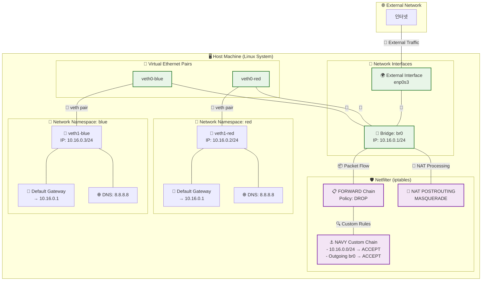

## 배경

저번 글에서 Bridge, veth, Network Namespace를 이용하여 간단한 가상 네트워크를 구성하고 통신하는 것을 구현했다. 자세한 내용은 [다음 링크](/posts/03-netnsintro/)에서 확인할 수 있다. 이번 글에서는 한 단계 더 나아가, **bridge를 통하는 네트워크 트래픽을 Iptables를 통해 효과적으로 제어하는 방법**에 대해 다룰 계획이다. 또한, 구성된 가상 네트워크가 외부 인터넷과 원활하게 통신할 수 있도록 **bridge에 IP 주소를 할당하고 이를 gateway로 설정하는 작업**은 물론, **NAT (Network Address Translation)를 위한 Iptables 테이블 설정**도 함께 진행해 볼 예정이다.

---

## 시나리오 - Iptables와 Bridge를 활용한 Network Namespace 네트워크 제어

이 시나리오는 **Bridge를 활용하여 여러 Network Namespace 간의 네트워크 통신을 구현하는 방법**을 확인하고 직접 구현한다. 가급적 바로 **제거해도 상관없는 깨끗한 VM 환경**에서 실행하는 것을 추천한다. Docker 등에서 실제 어플리케이션을 돌리고 있는 상황이라면 문제가 생길 수 있다. 글의 환경은 **Ubuntu 24.04 버전**을 사용하고 있다.



### 1\. Network Namespace 생성

두 개의 독립적인 네트워크 환경을 구축하기 위해 **`red`와 `blue`라는 이름의 Network Namespace를 생성한다.** Network Namespace는 각각 독립적인 네트워크 스택(인터페이스, 라우팅 테이블, ARP 테이블 등)을 가진다.

```bash title="terminal"
ip netns add red
ip netns add blue
```

**결과 확인:**
`ip netns show` 명령을 통해 생성된 Network Namespace 목록을 확인할 수 있다.

```bash title="terminal"
ip netns show
# red
# blue
```

### 2\. 시스템 네트워크 설정 초기화 및 브리지 관련 설정

Netfilter가 브리지 트래픽을 처리하도록 설정하고, IP 포워딩을 활성화하며, **`FORWARD` 체인의 기본 정책을 `DROP`으로 변경한다.** 이는 보안을 강화하고 명시적인 허용 규칙을 통해서만 트래픽이 흐르도록 하기 위함이다.

```bash title="terminal"
# Netfilter가 브리지 트래픽을 처리하도록 설정
sudo sysctl -w net.bridge.bridge-nf-call-iptables=1

# IP 포워딩 활성화
sudo sysctl -w net.ipv4.ip_forward=1

# FORWARD 넷필터 기본 폴리시를 DROP으로 수정
# iptables의 FORWARD 체인 기본 정책을 DROP으로 설정하여, 명시적으로 허용되지 않은 모든 포워딩 트래픽을 차단한다.
# 이는 보안을 강화하는 효과가 있다.
sudo iptables -P FORWARD DROP

# 현재 FORWARD 체인의 정책 확인
sudo iptables -L | grep FORWARD
# Chain FORWARD (policy DROP)
```

### 3\. veth(Virtual Ethernet Device) 및 Bridge 생성

각 Network Namespace에 연결할 **`veth` 페어를 생성하고, `br0`이라는 이름의 브리지를 생성한다.** `veth` 페어는 한쪽 끝이 한 Network Namespace에, 다른 한쪽 끝은 브리지에 연결되는 가상 이더넷 케이블과 같다.

```bash title="terminal"
# veth 페어 생성 (red와 blue 각각)
ip link add veth0-red type veth peer name veth1-red
ip link add veth0-blue type veth peer name veth1-blue

# 브리지 생성
ip link add name br0 type bridge
```

### 4\. veth를 Bridge 및 Network Namespace에 할당

생성된 **`veth` 페어의 한쪽 끝(`veth0-red`, `veth0-blue`)을 브리지(`br0`)에 연결하고, 다른 한쪽 끝(`veth1-red`, `veth1-blue`)은 각 Network Namespace에 할당한다.**

```bash title="terminal"
# veth 페어의 한쪽 끝을 브리지에 연결
ip link set veth0-red master br0
ip link set veth0-blue master br0

# veth 페어의 다른 쪽 끝을 각 Network Namespace에 할당
ip link set veth1-red netns red
ip link set veth1-blue netns blue
```

### 5\. 인터페이스 활성화

브리지와 각 Network Namespace 내의 `veth` 인터페이스를 활성화한다. `lo` (loopback) 인터페이스도 일반적으로 활성화하여 Network Namespace 내부의 자체 통신을 가능하게 한다.

```bash title="terminal"
# 브리지에 연결된 veth 인터페이스 활성화
ip link set veth0-red up
ip link set veth0-blue up

# Network Namespace 내부의 veth 인터페이스 활성화
ip netns exec red ip link set veth1-red up
ip netns exec blue ip link set veth1-blue up

# Network Namespace 내부의 lo(loopback) 인터페이스 활성화 (선택 사항이지만 일반적으로 수행)
ip netns exec red ip link set lo up
ip netns exec blue ip link set lo up
```

### 6\. IP 주소 할당

각 Network Namespace 내의 **`veth` 인터페이스에 IP 주소를 할당하여 통신할 수 있도록 설정한다.** `red`에는 `10.16.0.2/24`를, `blue`에는 `10.16.0.3/24`를 할당한다.

```bash title="terminal"
ip netns exec red ip a add 10.16.0.2/24 dev veth1-red
ip netns exec blue ip a add 10.16.0.3/24 dev veth1-blue
```

### 7\. 브리지 활성화

브리지(`br0`)를 활성화하여 연결된 모든 `veth` 인터페이스를 통해 패킷이 정상적으로 전달될 수 있도록 한다.

```bash title="terminal"
ip link set br0 up
```

### 8\. Network Namespace 간 통신 시연 (초기 상태)

`red` Network Namespace에서 `blue` Network Namespace의 IP 주소로 `ping`을 시도하여 **두 Network Namespace 간의 네트워크 통신이 성공적으로 이루어지는지 확인한다.** `FORWARD` 정책이 `DROP`이므로 통신이 되지 않음을 확인할 수 있다.

```bash title="terminal"
ip netns exec red ping 10.16.0.3 -c 3
```

**시연 결과:**
`ping` 명령이 성공적으로 응답을 받지 못하여 `red`와 `blue` Network Namespace 간에 브리지를 통한 네트워크 통신이 이루어지지 않고 있음을 확인할 수 있다.

```bash title="terminal"
PING 10.16.0.3 (10.16.0.3) 56(84) bytes of data.
...
--- 10.16.0.3 ping statistics ---
3 packets transmitted, 0 received, 100% packet loss, time 2061ms
```

### 9\. Network Namespace 간 통신 허용을 위한 Netfilter 규칙 추가

`10.16.0.0/24` 네트워크 간의 트래픽을 허용하는 `NAVY` 체인을 만들어 `FORWARD` 체인에 연결한다. 이는 `red`와 `blue` Network Namespace 간의 통신을 가능하게 한다.

```bash title="terminal"
# FOWARD 체인에 NAVY 체인 만들기
# 새로운 사용자 정의 체인 'NAVY'를 생성한다. 이 체인을 통해 특정 포워딩 규칙을 관리할 수 있다.
sudo iptables -N NAVY

# NAVY 체인을 FORWARD 체인의 첫 번째 규칙으로 삽입
# FORWARD 체인의 첫 번째 위치에 `-j NAVY` 규칙을 삽입한다.
# 이는 FORWARD 체인으로 들어오는 모든 패킷이 먼저 NAVY 체인의 규칙을 거치도록 한다.
sudo iptables -I FORWARD 1 -j NAVY

# NAVY 체인에 RETURN 규칙 추가 (다른 규칙이 없으면 통과)
# NAVY 체인의 마지막에 `-j RETURN` 규칙을 추가한다.
# NAVY 체인의 앞선 규칙에 의해 처리되지 않은 패킷은 이 규칙에 따라 NAVY 체인을 빠져나와
# 다시 FORWARD 체인의 다음 규칙으로 이동하게 된다.
sudo iptables -A NAVY -j RETURN

# 10.16.0.0/24 네트워크 간의 트래픽을 허용하는 규칙 추가
# NAVY 체인의 첫 번째 위치에 `-s 10.16.0.0/24 -d 10.16.0.0/24 -j ACCEPT` 규칙을 삽입한다.
# 이는 소스 IP 주소가 10.16.0.0/24 대역이고 목적지 IP 주소도 10.16.0.0/24 대역인 모든 패킷을 허용한다.
# 즉, red와 blue Network Namespace 간의 통신을 허용한다.
sudo iptables -I NAVY 1 -s 10.16.0.0/24 -d 10.16.0.0/24 -j ACCEPT
```

### 10\. Network Namespace 간 통신 재확인

`red` Network Namespace에서 `blue` Network Namespace로 `ping`을 다시 시도하여 통신이 성공적으로 이루어지는지 확인한다.

```bash title="terminal"
# ping 날아가는거 확인하기
ip netns exec red ping 10.16.0.3 -c 3
```

**시연 결과:**
`ping` 명령이 성공적으로 응답을 받아 `red`와 `blue` Network Namespace 간에 브리지를 통한 네트워크 통신이 이제는 이루어지고 있음을 확인할 수 있다.

```bash title="terminal"
PING 10.16.0.3 (10.16.0.3) 56(84) bytes of data.
64 bytes from 10.16.0.3: icmp_seq=1 ttl=64 time=0.363 ms
64 bytes from 10.16.0.3: icmp_seq=2 ttl=64 time=0.056 ms
64 bytes from 10.16.0.3: icmp_seq=3 ttl=64 time=0.062 ms

--- 10.16.0.3 ping statistics ---
3 packets transmitted, 3 received, 0% packet loss, time 2027ms
rtt min/avg/max/mdev = 0.056/0.160/0.363/0.143 ms
```

### 11\. 외부 인터넷 연결 확인 (초기 상태)

`red` Network Namespace에서 외부 인터넷으로 `ping`을 시도하여 현재 외부 연결이 되지 않음을 확인한다.

```bash title="terminal"
ip netns exec red ping 8.8.8.8
# ping: connect: Network is unreachable
```

### 12\. 브리지에 IP 주소 할당 및 라우팅 설정

브리지(`br0`)에 IP 주소(`10.16.0.1/24`)를 할당하여 Network Namespace의 게이트웨이 역할을 하도록 하고, `red` Network Namespace에 기본 게이트웨이를 설정한다.

```bash title="terminal"
# 브리지(br0)에 IP 주소 할당 (게이트웨이 역할)
sudo ip a add 10.16.0.1/24 dev br0

# red Network Namespace에 기본 게이트웨이 설정
ip netns exec red ip route add 0.0.0.0/0 via 10.16.0.1 dev veth1-red

# red Network Namespace 내부의 라우팅 테이블 확인
ip netns exec red ip route
# default via 10.16.0.1 dev veth1-red
# 10.16.0.0/24 dev veth1-red proto kernel scope link src 10.16.0.2
```

### 13\. 브리지 IP로 통신 테스트

`red` Network Namespace에서 브리지(`10.16.0.1`)로 `ping`을 시도하여 Network Namespace와 브리지 간의 통신을 확인한다.

```bash title="terminal"
# 브리지 IP로 ping 테스트
ip netns exec red ping 10.16.0.1 -c 2
# PING 10.16.0.1 (10.16.0.1) 56(84) bytes of data.
# 64 bytes from 10.16.0.1: icmp_seq=1 ttl=64 time=1.24 ms
# 64 bytes from 10.16.0.1: icmp_seq=2 ttl=64 time=0.062 m
```

### 14\. 외부 네트워크 포워딩 규칙 및 NAT 설정

브리지를 통한 외부 네트워크로의 포워딩을 허용하고, NAT(Network Address Translation) 규칙을 추가하여 Network Namespace 내부 IP 주소가 외부로 나갈 때 호스트의 공인 IP 주소로 변환되도록 한다. `enp0s3` 부분은 시스템의 실제 외부 인터페이스 이름으로 변경해야 한다.

```bash title="terminal"
# 브리지를 통한 외부 네트워크로의 포워딩 허용 (NAVY 체인에 추가)
# NAVY 체인의 두 번째 위치에 `-o br0 -j ACCEPT` 규칙을 삽입한다.
# 이는 br0 인터페이스를 통해 외부로 나가는 모든 트래픽을 허용한다.
# 즉, Network Namespace에서 브리지를 거쳐 외부 네트워크로 나가는 패킷을 허용한다.
sudo iptables -I NAVY 2 -o br0 -j ACCEPT

# NAT 설정: POSTROUTING 체인에 MASQUERADE 규칙 추가
# `iptables -t nat -A POSTROUTING` 명령은 nat 테이블의 POSTROUTING 체인에 규칙을 추가한다.
# `-s 10.16.0.0/24`는 소스 IP 주소가 10.16.0.0/24 대역인 패킷에만 이 규칙을 적용한다.
# `-o enp0s3`는 패킷이 'enp0s3' 인터페이스를 통해 나갈 때만 이 규칙을 적용하도록 지정한다.
# (이더넷 인터페이스 이름은 시스템마다 다를 수 있으므로 `ip a` 명령으로 확인 후 변경해야 한다. 예를 들어, `eth0`, `enp0s3` 등)
# `-j MASQUERADE`는 나가는 패킷의 소스 IP 주소를 호스트의 외부 인터페이스(여기서는 enp0s3)의 IP 주소로 변경하여 NAT를 수행한다.
# 이를 통해 Network Namespace의 사설 IP 주소를 가진 패킷이 외부 인터넷과 통신할 수 있게 된다.
sudo iptables -t nat -A POSTROUTING -s 10.16.0.0/24 -o enp0s3 -j MASQUERADE
```

### 15\. 외부 인터넷 연결 최종 확인

`red` Network Namespace에서 외부 인터넷 (`8.8.8.8`)으로 `ping`을 다시 시도하여 모든 설정이 완료되었고 외부 통신이 가능한지 최종적으로 확인한다.

```bash title="terminal"
ip netns exec red ping 8.8.8.8 -c 2
```

**시연 결과:**
`ping` 명령이 성공적으로 응답을 받아 `red` Network Namespace에서 외부 인터넷으로의 통신이 성공적으로 이루어지고 있음을 확인할 수 있다.

```bash title="terminal"
PING 8.8.8.8 (8.8.8.8) 56(84) bytes of data.
64 bytes from 8.8.8.8: icmp_seq=1 ttl=119 time=27.6 ms
64 bytes from 8.8.8.8: icmp_seq=2 ttl=119 time=27.7 ms
```

### 16\. Network Namespace DNS 설정 (선택 사항)

도메인 이름으로 외부 통신을 하고 싶다면 각 Network Namespace 내부에 `/etc/resolv.conf` 파일을 생성하고 네임 서버 IP 주소를 설정해줘야 한다. 8.8.8.8은 구글의 퍼블릭 DNS 서버이다.

```bash title="terminal"
# Network Namespace 내부에 resolv.conf 파일 생성 및 설정
# 실제 /etc/resolv.conf 내용을 참고하여 적절한 네임 서버 IP를 입력한다.
ip netns exec red echo "nameserver 8.8.8.8" | sudo tee /etc/resolv.conf
ip netns exec blue echo "nameserver 8.8.8.8" | sudo tee /etc/resolv.conf
```

### 17\. 리소스 해제

생성한 네트워크 리소스와 Iptables 규칙을 해제한다.

```bash title="terminal"
ip netns delete red
ip netns delete blue
ip link del br0
sudo iptables -F
sudo iptables -X
```

---

## 마무리

이 시나리오를 통해 **Netfilter를 활용하여 Bridge를 통한 Network Namespace 간의 통신뿐만 아니라 외부 인터넷 연결까지 제어하는 방법을 이해할 수 있었다.** 다른 Network Namespace에서도 동일한 방식으로 외부 인터넷 연결을 설정할 수 있으며, 더 나아가 다양한 Netfilter 정책들을 설정하여 통신을 세밀하게 제어할 수도 있다.

사실 본 시나리오에서는 매우 간단한 가상 네트워크 구성에 대해서만 다루고 있지만, 추후에는 **실제 Docker와 같은 컨테이너 플랫폼이 내부적으로 Network Namespace의 Bridge와 Iptables를 어떻게 관리하는지 분석해 볼 계획이다.** 이를 통해 컨테이너 네트워크가 실제 어떻게 동작하는지에 대한 깊이 있는 이해를 할 수 있으면 좋을 것 같다.