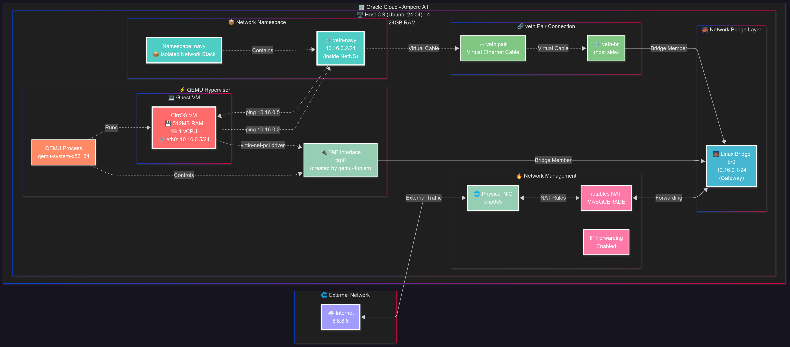

## 배경

최근 Linux의 **Network Namespace**(이하 NetNS), **veth**, **Bridge** 등을 활용하여 다양한 네트워크 구성을 직접 만들어보며 학습하고 있다. 이 과정에서 예전에 OpenStack 배포하면서 VM이 **TAP**을 통해 호스트의 브리지에 연결되어 외부와 통신했던 경험이 떠올랐다. 이에 호기심이 발동하여, 직접 생성한 브리지에 **NetNS**와 VM을 연결하여 서로 통신시킬 수 있을 것이라는 아이디어를 얻었다.

이러한 테스트를 위해 현재 필자의 `code-server`가 실행 중인 VM 내부에 또 다른 VM을 띄워야 하는 상황이었다. 필자의 `code-server`는 **Oracle Cloud**의 **Ampere A1** 인스턴스에 구축되어 있는데, 이 **CPU**가 Intel의 **VT-x**나 AMD의 **AMD-V**와 같은 하드웨어 가상화 기술을 지원하는지 궁금증이 생겼다.

조사 결과, **Ampere Computing** 블로그의 "[Unlocking Layers: Powering Nested Virtualization with Ampere CPUs](https://amperecomputing.com/blogs/unlocking-layers)" 게시물을 통해 **Ampere CPU**가 Nested Virtualization를 지원할 것이라는 기대를 가졌다. 하지만 **Oracle Cloud** 가이드를 추가로 확인하던 중 실망스러운 사실을 알게 되었다. **Oracle Linux** 블로그의 "[KVM Nested Virtualization in Oracle Cloud Infrastructure: A Hands-on Guide with Virtual Machines and Oracle Linux 9.5](https://blogs.oracle.com/linux/post/kvm-nested-virtualization-in-oci)" 게시물에 따르면, 필자가 사용하는 인스턴스에서는 중첩 가상화가 지원되지 않는다는 내용이었다.

결국, **QEMU**만을 이용하여 VM을 실행하는 방법 외에는 대안이 없었다. 이러한 방식으로는 성능 저하가 클 것으로 예상되지만, 간단한 네트워크 테스트는 가능할 것이라는 기대를 가지고 시도하게 되었다.

-----

## 시나리오 - 가상머신에서 QEMU를 이용하여 가상머신 생성하기

이 문서는 **Oracle Cloud의 Ampere A1 인스턴스 환경에서 QEMU를 사용하여 가상 머신(VM)을 생성하고 네트워크 네임스페이스(NetNS)와 연동하는 방법**을 구현한다. Ubuntu24.04버전 4코어 24GB 메모리의 인스턴스에서 진행되었다.



### 1단계: QEMU 설치 및 환경 준비

QEMU와 관련된 도구들을 설치해야 한다.

```bash title="Host Terminal"
sudo apt update
sudo apt install qemu-system-x86 bridge-utils net-tools -y

sudo sysctl -w net.bridge.bridge-nf-call-iptables=0
```

  * `qemu-system-x86`은 QEMU 가상 머신 에뮬레이터이다.
  * `bridge-utils`는 리눅스 브리지 관리에 필요한 유틸리티이다.
  * `net-tools`는 네트워크 인터페이스 정보를 확인하는 데 사용되는 도구이다. 예를 들어, `ifconfig` 명령어가 있다.
  * **`sudo sysctl -w net.bridge.bridge-nf-call-iptables=0`** 명령어는 브리지 네트워크 트래픽이 iptables의 `netfilter`를 통과하지 않도록 설정하는 것이다. 켜져 있으면, 사용자 환경에 따라 테스트가 원활히 진행되지 않을 수 있다.

### 2단계: QEMU 게스트 OS 이미지 다운로드

테스트에 사용할 가벼운 리눅스 OS 이미지를 다운로드한다. 여기서는 **CirrOS 이미지**를 사용한다. OpenStack 배포 후 테스트로 사용하는 이미지인데, 가볍기도 하고 내가 아는 가벼운 리눅스 이미지라 선택하였다.

```bash title="Host Terminal"
wget https://download.cirros-cloud.net/0.6.2/cirros-0.6.2-x86_64-disk.img
```

### 3단계: TAP 인터페이스 생성 스크립트 작성

QEMU VM이 사용할 TAP 인터페이스를 생성하고, 이를 브리지에 연결하기 위한 스크립트를 작성한다. 이 스크립트는 QEMU가 시작될 때 자동으로 실행된다.

`qemu-ifup.sh` 파일을 생성하고 다음 내용을 추가한다:

```bash frame="code" title="qemu-ifup.sh"
#!/bin/bash

# TAP 인터페이스 이름 (예: tap0)
TAP_DEV=$1

# 브리지 이름 (예: br0)
BRIDGE_DEV="br0"

# TAP 인터페이스 생성 및 IP 설정 (IP는 게스트 OS에 따라 조절)
sudo ip tuntap add dev "$TAP_DEV" mode tap
sudo ip link set "$TAP_DEV" up

# 브리지에 TAP 인터페이스 연결
sudo brctl addif "$BRIDGE_DEV" "$TAP_DEV"

echo "TAP interface $TAP_DEV added to bridge $BRIDGE_DEV"
```

스크립트 실행 권한을 부여한다.

```bash title="Host Terminal"
chmod +x qemu-ifup.sh
```

### 4단계: 브리지 생성 및 TAP 인터페이스 연결

QEMU VM과 NetNS를 연결할 **리눅스 브리지(`br0`)를 생성**한다.

```bash title="Host Terminal"
sudo ip link add name br0 type bridge
sudo ip link set br0 up
sudo ip a add 10.16.0.1/24 dev br0
```

  * `sudo ip link add name br0 type bridge`는 `br0`이라는 이름의 새로운 브리지 인터페이스를 생성한다.
  * `sudo ip link set br0 up`은 생성된 `br0` 브리지를 활성화한다.
  * `sudo ip a add 10.16.0.1/24 dev br0`은 브리지 `br0`에 `10.16.0.1/24` IP 주소를 할당한다. 이 IP 주소는 호스트가 브리지를 통해 가상 머신이나 NetNS와 통신할 때 사용되는 게이트웨이 역할을 한다.

### 5단계: QEMU VM 실행

이제 QEMU를 사용하여 VM을 실행한다. `-netdev tap,id=tap0,script=./qemu-ifup.sh,downscript=yes` 옵션을 사용하여 TAP 인터페이스를 통해 호스트의 브리지(`br0` 등)에 VM을 연결하고, QEMU가 시작될 때 `qemu-ifup.sh` 스크립트가 실행되도록 한다. 이 스크립트는 TAP 인터페이스를 생성하고 미리 정의된 브리지에 연결하는 역할을 한다. VM 종료 시 `downscript`가 실행되지는 않지만, TAP 인터페이스는 자동으로 해제된다.

```bash title="Host Terminal"
sudo qemu-system-x86_64 -hda cirros-0.6.2-x86_64-disk.img -m 512 -smp 1 -netdev tap,id=tap0,script=./qemu-ifup.sh,downscript=yes -device virtio-net-pci,netdev=tap0 -nographic
```

  * `-hda cirros-0.6.2-x86_64-disk.img`는 VM의 주 하드 디스크 이미지로 `cirros-0.6.2-x86_64-disk.img` 파일을 사용한다는 의미이다.
  * `-m 512`는 VM에 **512MB 메모리**를 할당한다.
  * `-smp 1`은 VM에 **1개의 가상 CPU 코어**를 할당한다.
  * `-netdev tap,id=tap0,script=./qemu-ifup.sh,downscript=yes`는 **`tap0`이라는 ID를 가진 TAP 네트워크 장치를 생성**한다.
      * `script=./qemu-ifup.sh`는 QEMU가 이 TAP 장치를 활성화할 때 `./qemu-ifup.sh` 스크립트를 실행하도록 지시한다. 이 스크립트는 TAP 인터페이스를 생성하고 이를 호스트의 브리지(예: `br0`)에 연결한다.
      * `downscript=yes`는 QEMU 종료 시 **TAP 인터페이스를 자동으로 정리**하도록 한다. 일반적으로 브리지에 연결된 TAP은 수동으로 관리해야 하지만, 이 옵션을 사용하면 QEMU가 기본적인 정리 작업을 수행한다.
  * `-device virtio-net-pci,netdev=tap0`는 **`virtio` 드라이버를 사용하는 가상 네트워크 카드**를 생성하고, 이를 위에서 정의한 `tap0` 네트워크 장치에 연결한다. `virtio`는 가상화 환경에서 높은 성능을 제공하는 장치 드라이버이다.
  * `-nographic`은 그래픽 인터페이스 없이 **콘솔 모드로 QEMU VM을 실행**하는 옵션이다.

VM이 부팅되면 콘솔이 나타날 것이다. CirrOS의 경우, 부팅 후 자동으로 로그인되거나 로그인 프롬프트가 나타날 것이다.

### 6단계: QEMU VM 내부 네트워크 설정

QEMU VM이 부팅된 후, 로그인(user:`cirros`,pw:`gocubsgo`)을 완료하고 VM 내부에서 네트워크 인터페이스에 IP 주소를 할당하고 기본 경로를 설정해야 한다. 이는 VM이 호스트의 브리지 및 NetNS와 통신할 수 있도록 한다.

* CirrOS와 같은 클라우드 이미지는 초기 부팅 시 메타 정보를 불러오거나 DHCP 서버를 통해 네트워크 설정을 시도한다. 테스트 환경에서는 불가능하므로 관련 메시지(예: Link-Local IP 관련)가 나타날 수 있다. 이러한 메시지는 설정이 아직 완료되지 않았음을 나타내는 것이므로, 기다리면 넘어갈 수 있다.

```bash title="VM Terminal"
# eth0에 IP 주소 할당
sudo ip addr add 10.16.0.5/24 dev eth0

# 기본 경로(default route) 설정
sudo ip route add default via 10.16.0.1
```

  * `sudo ip addr add 10.16.0.5/24 dev eth0`는 QEMU VM 내부의 `eth0` 네트워크 인터페이스에 `10.16.0.5/24` IP 주소를 할당한다. 이 IP 주소는 VM의 고유 식별자로 사용된다.
  * `sudo ip route add default via 10.16.0.1`은 VM의 기본 게이트웨이를 `10.16.0.1`(호스트의 브리지 IP)로 설정한다. 이는 VM이 자신과 동일한 서브넷에 없는 다른 네트워크로 패킷을 전송할 때 `10.16.0.1`을 통해 라우팅되도록 한다.

### 7단계: NetNS 생성 및 브리지 연결

이제 **네트워크 네임스페이스(NetNS)를 생성**하고 이를 `br0`에 연결한다. NetNS는 격리된 네트워크 스택을 제공하여 독립적인 네트워크 환경을 구축할 수 있게 한다.

```bash title="Host Terminal"
# NetNS 생성
sudo ip netns add navy

# veth pair 생성
sudo ip link add veth-br type veth peer name veth-navy

# veth0을 호스트 브리지에 연결
sudo brctl addif br0 veth-br
sudo ip link set veth-br up

# veth1을 NetNS 내부로 이동
sudo ip link set veth-navy netns navy

# NetNS 내부 veth1 인터페이스 활성화 및 IP 할당
sudo ip netns exec navy ip link set veth-navy up
sudo ip netns exec navy ip addr add 10.16.0.2/24 dev veth-navy
sudo ip netns exec navy ip route add default via 10.16.0.1
```

### 8단계: 네트워크 통신 테스트

이제 호스트의 NetNS와 QEMU VM 간의 통신을 테스트한다.

**NetNS에서 QEMU VM으로 Ping 테스트:**

```bash title="Host Terminal"
sudo ip netns exec navy ping 10.16.0.5 -c 2
```

**결과 확인**

```bash title="Ping Result"
PING 10.16.0.5 (10.16.0.5) 56(84) bytes of data.
64 bytes from 10.16.0.5: icmp_seq=1 ttl=64 time=0.922 ms
64 bytes from 10.16.0.5: icmp_seq=2 ttl=64 time=0.664 ms

--- 10.16.0.5 ping statistics ---
2 packets transmitted, 2 received, 0% packet loss, time 1045ms
rtt min/avg/max/mdev = 0.664/0.793/0.922/0.129 ms
```

**QEMU VM에서 NetNS로 Ping 테스트:**

QEMU VM 콘솔에서 다음 명령어를 실행한다.

```bash title="VM Terminal"
ping 10.16.0.2 -c 2
```

**결과 확인**
```bash title="Ping Result"
PING 10.16.0.2 (10.16.0.2) 56(84) bytes of data.
64 bytes from 10.16.0.2: icmp_seq=1 ttl=64 time=0.695 ms
64 bytes from 10.16.0.2: icmp_seq=2 ttl=64 time=1.53 ms

--- 10.16.0.2 ping statistics ---
2 packets transmitted, 2 received, 0% packet loss, time 1002ms
rtt min/avg/max/mdev = 0.695/1.113/1.532/0.418 ms
```

양쪽에서 성공적으로 Ping 응답이 온다면, NetNS와 QEMU VM이 브리지를 통해 서로 통신하는 것을 확인할 수 있다.

### 9단계: 외부 인터넷과 연결

이제 QEMU VM과 NetNS가 외부 인터넷과 통신할 수 있도록 네트워크 주소 변환(NAT)을 설정해야 합니다. 호스트 서버의 네트워크 인터페이스(`enp0s3` 등)를 통해 내부 가상 네트워크의 트래픽이 외부로 나갈 수 있도록 설정하는 과정입니다.

```bash
sudo sysctl -w net.bridge.bridge-nf-call-iptables=1

sudo sysctl -w net.ipv4.ip_forward=1


sudo iptables -I FORWARD 1 -s 10.16.0.0/24 -j ACCEPT

sudo iptables -I FORWARD 2 -o br0 -j ACCEPT

sudo iptables -t nat -A POSTROUTING -s 10.16.0.0/24 -o enp0s3 -j MASQUERADE
```

이 설정이 완료되면 QEMU VM 내부에서 외부 인터넷으로 ping 테스트를 수행하여 연결 상태를 확인할 수 있습니다.

```bash title="VM Terminal"
ping 8.8.8.8 -c 2
```

**결과 확인**

```bash title="Ping Result"
PING 8.8.8.8 (8.8.8.8) 56(84) bytes of data.
64 bytes from 8.8.8.8: icmp_seq=1 ttl=119 time=29.4 ms
64 bytes from 8.8.8.8: icmp_seq=2 ttl=119 time=28.2 ms

--- 8.8.8.8 ping statistics ---
2 packets transmitted, 2 received, 0% packet loss, time 1002ms
rtt min/avg/max/mdev = 28.243/28.799/29.355/0.556 ms
```
### 9단계: 정리

테스트가 완료되면 생성한 자원들을 정리할 수 있다. VM의 경우 터미널을 종료하면 자동으로 VM도 종료되고 tap 자원도 회수될 것이다.

```bash
# QEMU VM 종료 (QEMU 콘솔에서 Ctrl+A, then X 또는 QEMU 프로세스 종료)

# NetNS 삭제
sudo ip netns del navy

# veth pair 삭제
sudo ip link del veth-br

# 브리지 삭제
sudo ip link del br0
```

---

## 마무리

이번 프로젝트는 예상보다 훨씬 흥미로운 경험이었다. QEMU 명령어 가이드를 탐색하고, 필요해 보이는 부분을 GPT의 도움을 받아 조합하는 과정이 시간 가는 줄 모르게 재미있었다. 특히 CirrOS가 단 10초 만에 실행되는 것을 보고 놀랐는데, 이는 예상보다 훨씬 빠른 부팅 속도였다. 요즘 칩 성능이 좋은 덕분인지, CirrOS 자체가 가벼운 덕분인지, 아니면 둘 다의 시너지 효과인지는 모르겠지만 만족스러웠다.

앞으로도 네트워크와 관련된 재미있는 프로젝트를 계속 시도해볼 생각이다. **Open vSwitch**를 직접 활용해보거나, **dnsmasq**를 통해 NetNS나 VM에 IP를 동적으로 할당하는 방식, 그리고 브리지 설정을 통한 **VLAN 통신 구현** 등을 계획하고 있다. 매일 리눅스 터미널만 다루다 보니 코딩이 땡기고 있다. 아마 한동안은 코드 작업에 집중하게 될 것이라고 생각한다.
