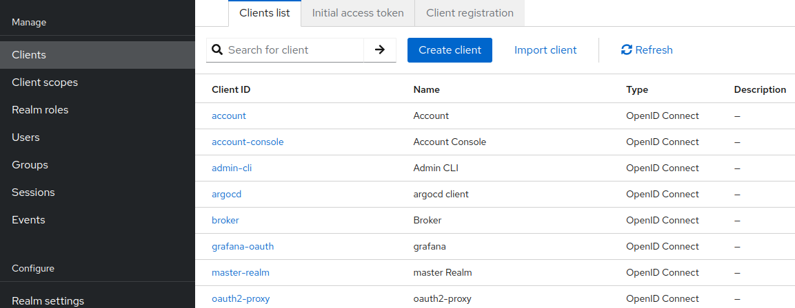
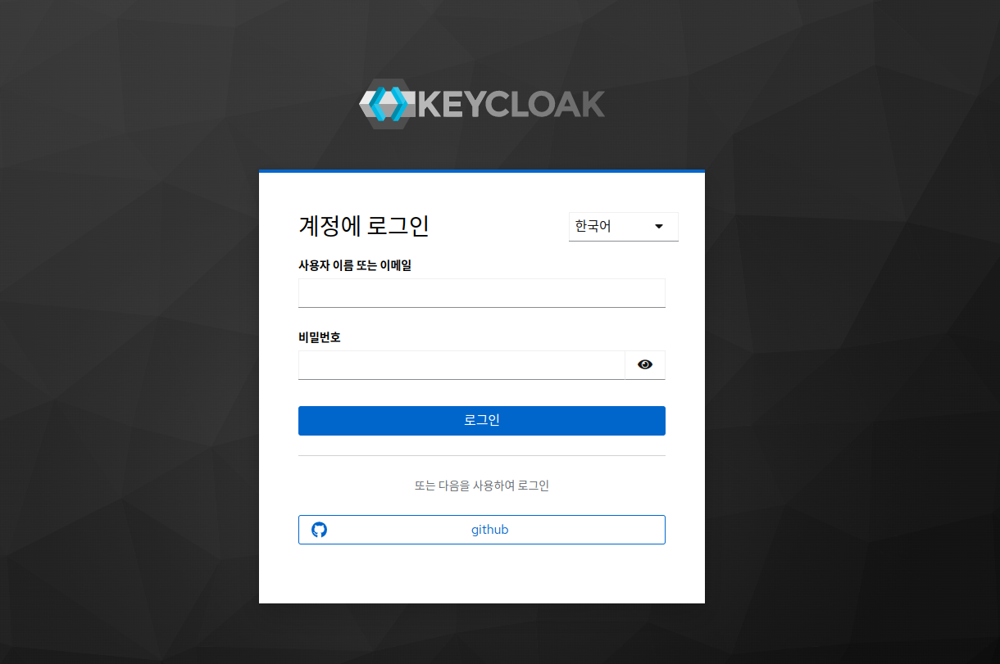
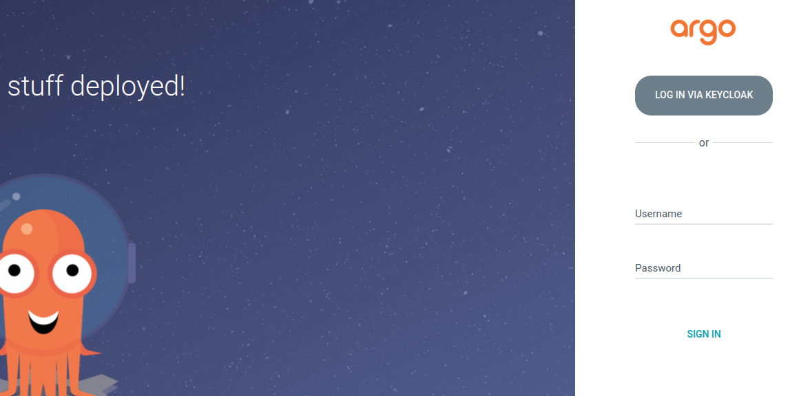
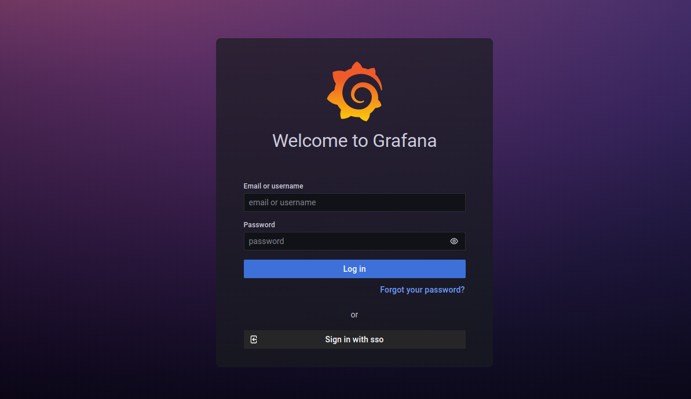
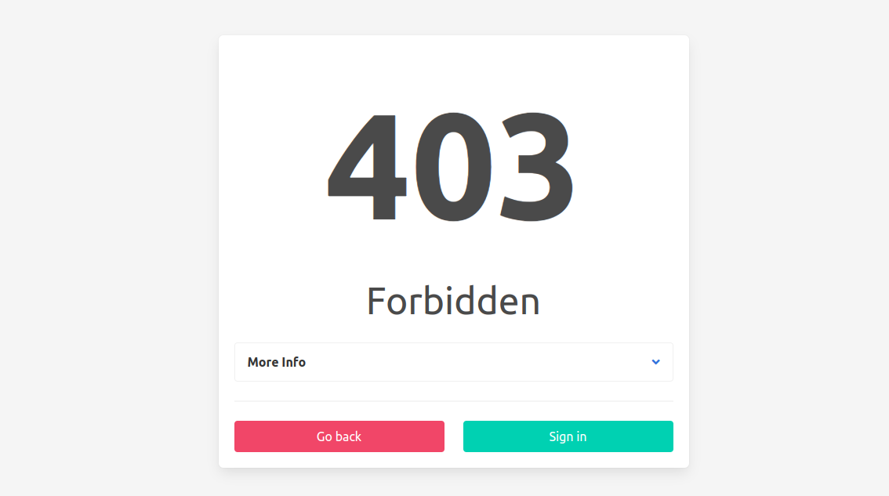

## 배경

최근 부대 사람들과 간단한 사이드 프로젝트를 진행하며 코딩 공부를 하고 있다. 매일 일본어를 공부하는 입장에서, 흥미를 잃지 않고 꾸준히 학습하려면 좋은 공부 자료가 중요하다는 생각을 하게 되었다.
이에 내가 원하는 주제로 매일 공부 자료를 만들어주는 서비스를 `LLM`을 이용해 직접 개발하기로 했다.

하지만 **군 내부 환경에서는 개발, 배포, 모니터링 인프라를 안전하게 구축하고 관리하기 어렵다**는 현실적인 문제에 부딪혔다. 원격 인프라에 `VPN`을 연결하는 것은 규정상 불가능했고, IP 주소 기반의 접근 제어는 개발 환경이 바뀔 때마다 규칙을 새로 추가해야 하는 번거로움이 따랐다. 보다 깔끔하고 효율적인 방법이 필요했다.

고민 끝에 `*.private.sigee.xyz`와 같은 **하위 도메인을 사용하는 것**으로 방향을 잡았다. 이 도메인으로 들어오는 모든 접속에 대해 **인증을 요구**하고, **도메인별로 인가된 사용자만 서비스에 접근**할 수 있도록 하는 것이다.

배포 인프라는 `Kubernetes`로 구축했다. 4코어 24GB VM 환경이라 `Docker` 사용도 고려했지만, 요즘은 `MicroK8s`나 `K3s`처럼 잘 만들어진 경량 쿠버네티스 배포판이 많았다. 익숙하게 사용해왔고 편리한 모듈도 많이 제공하는 쿠버네티스를 마다할 이유가 없었다. 특히 `MicroK8s`는 명령어 하나로 모든 설치가 완료될 정도로 간편했다. 과거 `kubeadm`으로 클러스터를 구축하다 어려움을 겪고 직접 `Ansible` 플레이북을 만들어 사용했던 경험에 비하면, 정말 세상이 좋아졌다고 느꼈다.

`Ubuntu` 환경과의 호환성을 고려하여 `MicroK8s`를 최종 선택했고, 그 위에 모니터링 시스템(`Loki`, `Prometheus`, `Grafana`), `ArgoCD`, `Nginx Ingress Controller` 등을 설치했다. 마지막으로 이 서비스들을 내부용 도메인에 `Ingress`로 연결하고, `cert-manager`를 통해 `TLS` 인증서를 발급받아 `HTTPS` 통신까지 완료하며 기본적인 환경 구축을 마쳤다. 예시로 적어둔 도메인은 예시일 뿐이고, 실제 도메인 주소는 이와 다르다.

## 아키텍처

이러한 요구사항을 만족하기 위해 다음과 같은 아키텍처를 구성했다.



## 구현 과정

> 🔒 **참고**: 아래 설정 파일에 등장하는 이메일 주소, 도메인, API 키 관련 Secret 이름 등은 모두 보안을 위해 예시 값으로 대체되었다. 실제 환경에서는 자신의 환경에 맞는 값을 사용해야한다.

### 1. Cert-Manager 설정

가장 먼저 `Cert-Manager`를 설치하고 `ClusterIssuer`를 설정했다. `Cloudflare`의 `DNS01` 방식을 사용하여 `Let's Encrypt`로부터 와일드카드 인증서(`*.private.sigee.xyz`)를 발급받도록 했다. 이를 통해 `Ingress`에 `TLS`를 손쉽게 적용할 수 있었다.

```yaml
# /cluster-config/base/cert-manager/cluster-issuer.yaml
apiVersion: cert-manager.io/v1
kind: ClusterIssuer
metadata:
  name: letsencrypt-production
spec:
  acme:
    server: https://acme-v02.api.letsencrypt.org/directory
    email: user@example.com
    privateKeySecretRef:
      name: letsencrypt-production-account-key 
    solvers:
    - dns01:
        cloudflare:
          email: user@example.com
          apiTokenSecretRef:
            name: cloudflare-api-token-secret
            key: api-token
```

### 2. Keycloak 설정

그 다음, `private-keycloak.sigee.xyz` 도메인에서 접근 가능한 `Keycloak` 서버를 구축했다. 여기서는 사용자 계정, 그룹(`developers` 등), 그리고 `OAuth2-Proxy`가 사용할 `OIDC` 클라이언트를 설정했다. `Keycloak` 자체는 외부에 직접 노출되어 로그인 및 계정 관리 역할을 수행한다.


*Keycloak에 등록된 OIDC 클라이언트 목록*

### 3. OAuth2-Proxy 설정

`OAuth2-Proxy`는 `Keycloak`(`private-keycloak.sigee.xyz`)과 연동되도록 설정했다. 중요한 설정은 다음과 같다.

-   `--oidc-issuer-url`: `Keycloak`의 realm을 바라보도록 설정.
-   `--allowed-group`: `/developers` 그룹에 속한 사용자만 접근을 허용.

```yaml
# /applications/oauth2-proxy/base/deployment.yaml 일부
...
        args:
        - --provider=oidc
        - --oidc-issuer-url=https://private-keycloak.sigee.xyz/realms/master
        - --email-domain=*
        - --cookie-domain=.private.sigee.xyz
        - --allowed-group="/developers"
        - --oidc-groups-claim=groups
...
```

### 4. Ingress 설정으로 모든 것 연결하기

마지막으로, 보호하려는 내부 서비스(`ArgoCD`, `Grafana` 등)의 `Ingress` 리소스에 다음과 같은 어노테이션을 추가하여 인증 과정을 완성했다.

```yaml
# /applications/argocd/base/ingress.yaml
apiVersion: networking.k8s.io/v1
kind: Ingress
metadata:
  name: argocd-ingress
  annotations:
    nginx.ingress.kubernetes.io/auth-url: "https://oauth2.private.sigee.xyz/oauth2/auth"
    nginx.ingress.kubernetes.io/auth-signin: "https://oauth2.private.sigee.xyz/oauth2/start?rd=$scheme://$http_host$request_uri"
spec:
  ingressClassName: nginx
  tls:
  - hosts:
      - argocd.private.sigee.xyz
    secretName: argocd-tls-secret
  rules:
  - host: argocd.private.sigee.xyz
    http:
      paths:
      - path: /
        pathType: Prefix
        backend:
          service:
            name: argocd-server
            port:
              number: 80
```

-   **`auth-url`**: `argocd.private.sigee.xyz`로 들어온 모든 요청은 먼저 `Nginx Ingress Controller`에 의해 `oauth2-proxy`의 `/oauth2/auth` 엔드포인트로 보내진다. `oauth2-proxy`는 요청 헤더의 쿠키를 검사하여 유효한 세션이 있는지 확인한다.
-   **`auth-signin`**: 만약 유효한 세션이 없다면, `oauth2-proxy`는 `401 Unauthorized` 응답을 반환하고, `Ingress Controller`는 사용자를 `auth-signin`에 명시된 URL로 리디렉션시킨다. 이 URL은 `Keycloak` 로그인 페이지로 연결되어 인증을 수행하게 된다.

모니터링 시스템인 `Grafana`(`monitor.private.sigee.xyz`)를 포함한 다른 모든 내부 서비스의 `Ingress`에도 위와 동일한 어노테이션을 적용하여 중앙 인증 시스템의 보호를 받도록 설정했다.

## 결과 확인

이제 모든 설정이 완료되었다. `argocd.private.sigee.xyz`나 `monitor.private.sigee.xyz` 같은 내부 서비스에 접속을 시도하면, 다음과 같이 `Keycloak` 로그인 페이지로 리디렉션된다.


*내부 서비스 접근 시 나타나는 Keycloak 로그인 화면*

로그인에 성공하면 원래 접속하려던 서비스로 정상적으로 이동하게 된다.

이렇게 Keycloak 인증을 거치면, 다음과 같이 ArgoCD와 Grafana 서비스에 안전하게 접근할 수 있다.


*Keycloak 인증 후 ArgoCD 접속 화면*


*Keycloak 인증 후 Grafana 접속 화면*

만약 `Keycloak`의 `/developers` 그룹에 속하지 않은 사용자가 로그인을 시도하면, 다음과 같이 `403 Forbidden` 에러 페이지가 나타나 접근이 차단된다.


*인가되지 않은 사용자의 접근 시도*

## 결론

이러한 구성을 통해 `VPN`이나 복잡한 IP 규칙 관리 없이도, `Keycloak` 계정만 있으면 어디서든 안전하게 내부 관리 도구에 접근할 수 있는 환경을 구축할 수 있었다. 모든 내부 서비스는 `HTTPS`로 통신하며, `Keycloak`의 `/developers` 그룹에 속한 인가된 사용자만 접근할 수 있게 되었다.

이제 새로운 개발 동료가 합류하면 `Keycloak`에서 권한을 부여하는 것만으로 간단히 인프라 접근 제어가 가능해졌다. 새로운 서비스를 추가할 때 약간의 번거로움은 있지만, 충분히 감수할 만한 관리 비용이라고 생각한다.

사실 망 관리를 통해 네트워크를 격리하는 것이 가장 안전하겠지만, 나의 특수한 환경이 이를 허락하지 않았다. 하지만 그 덕분에 `OIDC`를 깊게 탐구하며 이렇게 재미있는 아키텍처를 구성해볼 수 있었던 것 같다. 결과적으로 인프라에 대한 고민을 덜고, 본래 목표였던 프로젝트 개발에 더욱 집중할 수 있는 기반을 마련하게 되었다.
