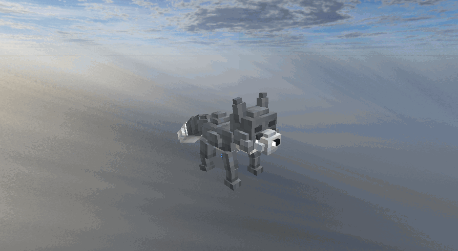
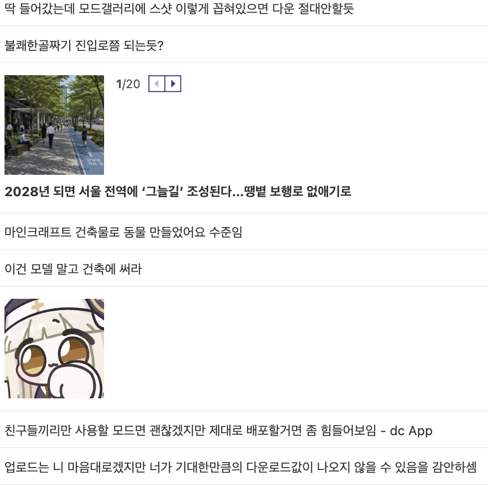

## 배경

군생활을 하면서, 세상이 AI를 중심으로 너무 빠르게 바뀌고 있다는 고민이 있었다.
그 변화를 따라가기 위해 다양한 도구와 사용 사례를 분석하고, 실제 작업에 적용해보는 연습을 계속해왔다.

그 과정에서 특히 눈에 들어온 건 에이전트 모델의 성능 상승이었다.
텍스트나 코드 영역은 이미 개발자의 워크플로우에 빠르게 통합되고 있었지만, 3D 에셋 생성은 아직 현업 흐름에 매끄럽게 들어오지 못하고 있다는 느낌이 강했다.
결과물이 나와도 포맷 정리, 수정 루프, 재활용 구조까지 이어지지 못해 실험으로 끝나는 경우가 많았다.

그래서 이런 질문이 생겼다.

고퀄리티 아트 자산을 한 번에 해결하는 건 아직 어렵더라도, 단순한 low poly 에셋이라면 대형 모델로 빠르게 만들고 사용자 프로젝트에 바로 도입할 수 있지 않을까?

그 질문을 시작으로 소소한 미니프로젝트를 시작하게 되었다.

## 아이디어

내가 확인하고 싶었던 건 두 가지였다.

1. low poly 수준의 자산이 실제로 쓸 만한 품질로 반복 생성되는가
2. 생성 결과를 개발 워크플로우에 바로 넣을 수 있을 만큼 연결 비용이 낮은가

이를 테스트하기 위해 Blockbench에 MCP 플러그인을 붙이고, 모델이 실제 툴을 다루는 흐름을 실험했다.

## 첫 실험

초반에는 기대를 크게 하지 않았다.
한두 번 운 좋게 나오는 것과 반복해서 쓸 수 있는 것은 완전히 다르다고 봤기 때문이다.

그런데 예상보다 빨리, 쓸 만한 결과가 나오기 시작했다.
물론 형태가 어색하거나 텍스처가 엇나가는 경우도 있었지만, 완전히 장난감 수준에서 머물지는 않았다.

이 정도면 개인 실험으로 끝낼 게 아니라, 실제 프로젝트 흐름에서 돌릴 수 있는 형태로 만들어볼 만하다고 생각이 들었다.

*Blockbench에서 Ashfox 워크플로우로 생성한 결과 일부*

## 프로젝트로 전환한 뒤의 고민과 시도

### 1) DSL을 이용해 볼까?

여기서부터는 무엇을 더 만들까보다 어떻게 계속 쓸 수 있게 만들까가 더 큰 과제가 됐다.

한 번 잘 나오는 건 가능했지만 비슷한 요청에 대해 비슷한 품질을 계속 유지하는 일이 매우 어려웠다.

해결을 위해 했던 시도는, 에이전트가 직접 각 큐브의 좌표와 사이즈를 추론하게 하는 것이 아니라, 의미 기반의 dsl을 제작하여 에이전트는 해당 의미를 코드처럼 형식에 맞게 작성하게 하는 것이었다.

"머리큐브 상단에 귀 두개를 위로 배치한다" 등의 의미 중심 인스트럭션 셋으로 좌표와 사이즈를 숫자가 아니라 의미 중심으로 작성하면 컴파일 단계에서 실제 에셋의 무드를 컴파일 단위에서 맞춰주는 전략으로, 이를 이용하면 일관된 품질의 결과를 뽑을 수 있을 것이라 생각했다. 물론 풍부한 표현이 생략된다는 단점이 있곘지만, 이를 트레이드 오프로 갇힌 명령 셋으로 일관된 품질을 뽑는게 더 실사용성에 유리하다고 생각했다.

결과적으로 가끔 잘 되는 결과는 줄었지만, 대체로 비슷하게 나오는 결과는 늘어났다. 하지만 결과가 의도와 다르게 나오는 경우가 있어서, 이 컴파일에 대한 방법을 어떻게 고도화 하는게 더 시각적 품질에 유리할지 고민하게 됐다.

### 2) 실패했을 때 이어서 복구할 수 있게 하기

실험 단계에서는 만들어보고 마음에 안들면 다시 생성하면 됐지만, 실제 사용자 ux를 고려한다면 그렇지 않다고 생각했다.
사용자는 기존 작업물을 수정하기를 바랄 것이고, 이를 기능적으로 제공하기 위해서는, 어디서 깨졌는지 빠르게 찾고, 같은 맥락에서 다시 이어갈 수 있어야 했다.

텍스처 uv 매핑이나, 큐브 배치의 부적합 등은 dsl 컴파일 단계에서 미리 이유와 함께 차단할 수 있지만, 사용자가 느끼는 시각적 만족감 등은 이 방식으로 해결하기가 어려웠다. 노력하고는 있지만, 아직은 에이전트의 비전모델과 이를 기반으로 하는 분석에 의존하는 방법이 한계였다.

### 3) 바로 도입 가능의 기준을 정하기

생성 결과가 있다는 것과, 사용자 프로젝트에 즉시 넣을 수 있다는 건 달랐다.
내가 생각한 바로 도입은 단순 출력이 아니라 실제 워크플로우 연결까지 포함한 기준이었다.

이 간극을 줄이기 위해 출력 포맷과 도구 사용 흐름을 실제 프로젝트 기준에 맞춰 정리했다. 내 프로젝트의 가장 큰 수요를 마인크래프트 모드에 도입 가능한 에셋 혹은 복셀장르의 게임 에셋 등으로 정의하였고, 마인크래프트 생태계에 널리 쓰이는 geckolib과 게임엔진에서 널리 사용되는 gltf 등의 확장자로 컴파일 결과를 익스포트할 수 있게 연결했다. 

## 지금 시점의 생각

적절한 결과가 나왔을 때, 마인크래프트 관련 디시 갤러리에 내 일부 결과물들을 소개하면서 평가를 요청했는데, 잔인한 평가들을 받았다...

팔이 안으로 굽는다고, 내가 보는 결과는 객관적일 수 없음을 다시 한 번 더 느낄 수 있었다. 그래도 잔인한 평가 속에서 어떤 방식으로 개선하면 좋을지 진심으로 조언해주는 글도 볼 수 있었다. 이를 기반으로 실제 유저에게 긍정적으로 평가받을 수 있도록 개선해보고자 한다.

## 참고 링크

1. GitHub: [sigee-min/ashfox](https://github.com/sigee-min/ashfox)
