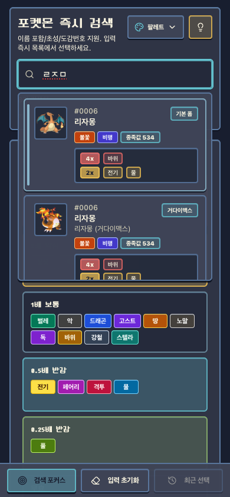
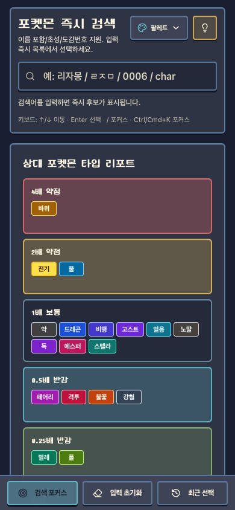

## 배경

요즘 군대에서 휴대폰으로, 포켓몬 팬게임 중에서 핫하다는 `어나더레드`와 `올라라포켓몬타워`를 자주 하고 있다.
문제는 난이도보다 추적 난이도였다. 세대가 계속 쌓이면서 모르는 포켓몬이 빠르게 늘어났고, 처음 보는 폼이 나오면 타입 상성이나 종족값 감각이 바로 떨어졌다. 결국 중요한 턴에서 판단이 늦어지는 일이 잦았다.

기존 위키는 정보량과 신뢰도는 충분했다. 다만 실전 중 병행 사용에서는 마찰이 있었다. 포커스를 자주 다시 잡아야 했고, 초성 검색이 없어 입력 비용이 높았고, 전투 판단에 바로 필요한 정보가 화면 상단에서 즉시 보이지 않았다. 정보의 품질 문제가 아니라 사용 문맥의 차이였다.

## 구현에서 집중한 부분

구현에 들어가기 전에 기준을 세 가지로 고정했다. 앱 진입 직후 입력 가능할 것, 키보드만으로 검색과 선택이 끝날 것, 선택 직후 상성 핵심 정보가 먼저 보일 것. 핵심 평가지표는 정보량이 아니라 의사결정까지 걸리는 시간이었다.

먼저 입력 흐름을 전투 입력 패턴에 맞췄다. `/`와 `Ctrl/Cmd + K`로 즉시 재포커스가 되게 했고, 방향키와 Enter로 선택을 끝낼 수 있게 했다. 여기서 가장 크게 고민한 부분은 단축키 충돌과 입력 안정성이었다. 브라우저 기본 단축키, IME 조합 입력, 포커스 손실 상황을 같이 처리하지 않으면 체감이 금방 흔들렸다.

검색 정확도는 단순 포함 매칭으로는 부족했다. 도감번호, 한글/영문 이름, 폼 정보, 초성을 함께 고려하는 점수 기반 정렬로 바꿨고, 특히 초성 검색은 짧은 입력으로도 후보를 빠르게 좁히는 데 효과가 컸다.

*모바일에서 초성으로 빠르게 검색하는 화면*

로딩 전략도 초기에 다시 설계했다. 처음에는 데이터를 한 번에 로드했지만 모바일에서 파싱 지연이 바로 드러났다. 그래서 초기에는 가벼운 목록만 로드하고, 상세 기술/부가 정보는 선택 이후 단계적으로 불러오는 구조로 분리했다. 초기 반응 속도와 데이터 완전성 사이의 균형을 이 방식으로 맞췄다.

상세 화면은 정보 배치 순서를 바꿨다. 4배/2배 약점과 무효 타입을 먼저 보여주고, 이후에 종족값·특성·진화·기술 정보를 이어서 보게 했다. "많이 보여주는 화면"보다 "먼저 판단하게 하는 화면"을 우선했다.

*선택 직후 상성 중심으로 확인할 수 있는 상세 화면*

마지막으로 공유성을 위해 정적 페이지와 메타데이터 생성 흐름을 붙였다. 플레이 중 사용성과 직접 연결되지는 않지만, 링크 공유와 기록성 측면에서는 운영 비용을 확실히 줄여줬다.

## 회고

이번 작업에서 가장 크게 체감한 변화는 포켓몬 검색과 판단에 들어가는 클릭 횟수가 압도적으로 줄었다는 점이다. 상대 교체 상황에서 조회 루틴이 일정해졌고, 턴 사이에 손이 끊기는 구간이 줄면서 플레이 피로감도 확실히 낮아졌다.

정리해보면 이 작업은 새로운 서비스를 확장했다기보다, 실제 플레이 문맥의 마찰을 줄인 최적화에 가까웠다. 핵심은 기술 스택 자체보다 기준 설정이었다. 어디서 막히는지 먼저 정의하고 그 지점을 줄이는 방향으로 구현하니 우선순위가 명확해졌다.

개인적으로는 군대에서 심심할 때 이런 걸 만들다 보니 시간이 훨씬 잘 가는 점도 좋았다.

실제 서비스 링크: [podex.sigee.xyz](https://podex.sigee.xyz)
