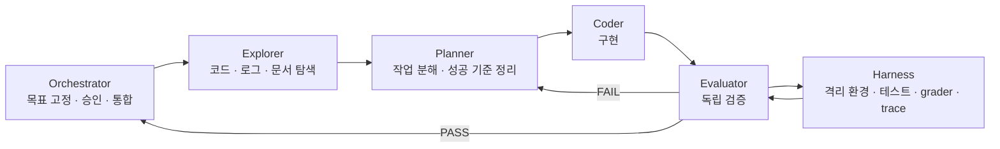

## 요즘 개발하면서 드는 생각

예전에는 개발하다가 막히는 부분이 생기면 `ChatGPT` 웹을 열어 질문하고, 답을 참고해서 다시 직접 구현하는 식으로 작업하곤 했다.
그때만 해도 `AI`는 어디까지나 "잘 답해주는 도우미"에 가까웠다.
내가 코드를 쓰고, 내가 실행하고, 내가 결과를 보고, `AI`는 중간중간 막히는 부분을 풀어주는 역할이었다.

그런데 요즘은 개발하면서 체감하는 분위기가 꽤 달라졌다.
에이전트가 `IDE`, 터미널, 문서, 배포 도구, 외부 서비스와 연결되기 시작하면서, 모델이 단순히 코드를 제안하는 수준을 넘어 실제 작업을 수행하는 쪽으로 빠르게 넘어가고 있기 때문이다.

사실 개발이라는 일은 원래부터 코드만 짜는 것으로 끝나지 않았다.
요구사항을 정리하고, 문서를 맞추고, 테스트를 돌리고, 실패 원인을 찾고, 빌드와 배포까지 이어지는 전체 흐름이 다 개발의 일부였다.
그래서 에이전트가 강해질수록 가장 크게 바뀌는 것은 "코드를 얼마나 잘 쓰느냐"보다, 이 전체 흐름을 얼마나 잘 맡길 수 있느냐인 것 같다.

나도 최근에는 직접 손으로 구현하는 시간보다, 작업을 어떻게 쪼갤지, 무엇을 먼저 시킬지, 결과를 어떻게 검증할지를 더 오래 고민하게 된다.
개발자의 역할이 조금씩 바뀌고 있다는 느낌을 가장 강하게 받는 지점도 바로 여기다.

## 도구가 좋아질수록 오히려 더 중요해진 것

요즘은 `MCP`, `plugin`, `skill` 같은 말이 자주 같이 언급된다.
이 셋은 완전히 같은 개념은 아니지만, 적어도 공통된 방향은 분명하다.
모델이 텍스트를 생성하는 데서 끝나지 않고, 실제 도구를 다루고 작업 문맥에 들어올 수 있게 만드는 흐름이라는 점이다.

이 변화 자체는 꽤 인상적이다.
문서 수정, 테스트 실행, `PR` 작성, 로그 확인, 간단한 배포 작업까지 예전보다 훨씬 자연스럽게 넘길 수 있게 됐다.
처음에는 이것만으로도 생산성이 크게 올라간다고 느꼈다.

그런데 조금 더 오래 써보니, 진짜 문제는 다른 데 있었다.
에이전트가 더 많은 일을 할수록, 결국 내가 가장 오래 붙잡고 있게 되는 질문은 늘 비슷했다.

`이 결과를 믿어도 되는가?`

속도가 빨라진 것 자체는 분명히 좋은 변화다.
하지만 속도가 빨라질수록, 마지막에 사람에게 남는 일은 점점 더 "직접 구현"이 아니라 "검증과 판단"이 된다.
그래서 나는 요즘 개발에서 병목이 점점 사람의 손과 눈으로 모이고 있다는 느낌을 자주 받는다.

## 결국 남는 문제는 검증이었다

한동안은 "어떻게 하면 더 똑똑한 프롬프트를 쓸 수 있을까"를 많이 고민했다.
물론 프롬프트도 중요하다.
하지만 실제로 에이전트를 작업에 붙여 돌려보면, 어느 순간부터는 프롬프트보다 더 중요한 것이 분명해진다.
바로 결과를 검증할 수 있는 구조다.

여기서 내가 중요하게 보는 것은 `하네스(harness)`다.
처음에는 그냥 테스트를 자동으로 돌리는 장치 정도로 생각했는데, 실제로는 그보다 훨씬 넓은 개념에 가깝다.

내가 생각하는 하네스는 보통 아래 요소들을 함께 포함한다.

- `task`: 무엇을 해야 하는지와 성공 조건
- `trial`: 한 번의 실행 시도
- `grader`: 결과를 판별하는 로직
- `trace`: 도구 호출과 로그, 중간 산출물을 포함한 실행 기록
- `environment`: 매번 독립적으로 재현 가능한 실행 환경

이게 중요한 이유는 단순하다.
에이전트 결과가 이상하게 나왔을 때, 그 원인을 제대로 분리해서 볼 수 있게 해주기 때문이다.

결과가 안 좋다고 해서 바로 모델이 멍청하다고 결론 내리면 안 된다.
적어도 아래 세 가지는 따로 봐야 한다.

1. 구현이 실제로 틀렸을 수 있다.
2. `task`나 평가 기준이 애매할 수 있다.
3. 하네스나 `grader`가 잘못됐을 수 있다.

이 구분이 안 되면 금방 이상한 방향으로 빠진다.
문제를 해결하는 대신, 잘못 만들어진 테스트를 통과하는 방향으로만 시스템을 비틀게 되기 쉽다.
요즘 하네스와 `eval` 이야기가 계속 나오는 이유도 결국 여기에 있다고 생각한다.

## 그래서 나는 이런 식으로 돌리고 있다

내가 `Codex`에서 자주 쓰는 구조는 대략 아래와 같다.

여기서 내가 가장 중요하게 보는 건 `Evaluator`의 위치다.
`Orchestrator`는 이미 문제를 이해했고, 어떤 방향으로 풀고 싶은지도 어느 정도 정해둔 상태다.
그래서 생각보다 쉽게 긍정 편향에 빠진다.
내가 직접 오케스트레이션을 하다 보면 더더욱 그렇다.

조금만 그럴듯하게 돌아가도 "이 정도면 된 것 같은데?"라는 생각이 금방 든다.
그래서 평가는 가능하면 오케스트레이터의 기대를 최대한 배제한 채, 실제 파일 상태와 테스트 결과를 다시 확인하는 구조여야 한다고 본다.

내가 반복해서 느낀 것도 비슷하다.
에이전트를 잘 쓰는 사람은 단순히 한 번에 좋은 답을 뽑아내는 사람이 아니라, 스스로의 낙관을 의심할 수 있는 루프를 만드는 사람에 가깝다.

## 멀티 에이전트가 만능은 아니다

다만 이런 구조가 항상 좋은 것은 아니다.
요즘 모델들은 컨텍스트를 독립적으로 쓰게 했을 때 꽤 괜찮은 성능을 보여주는 경우가 많지만, 그 전제는 하위 작업이 정말 잘 분리되어 있어야 한다는 것이다.

예를 들어 파일 경계가 겹치거나, 계획과 구현이 강하게 얽혀 있거나, 한 에이전트의 중간 결과가 다른 에이전트의 즉시 입력이 되어야 하면 오히려 조정 비용이 빠르게 커진다.
겉으로 보기에는 일을 나눈 것 같지만, 실제로는 서로의 문맥을 계속 맞춰줘야 해서 더 느려질 수 있다.

그래서 멀티 에이전트의 핵심은 많이 나누는 것이 아니라, 독립적으로 평가 가능한 단위로 잘 나누는 것이라고 생각한다.
결국 여기서도 다시 평가 가능성의 문제가 나온다.

## 이 방식이 개발 외에도 통하는 이유

이런 구조는 코드 작성에만 한정되지 않는다.
문서 업데이트, 릴리즈 노트 정리, 테스트 실행, `CI` 확인, 정적 사이트 배포, 인프라 변경 검토 같은 작업도 인터페이스가 안정적이면 꽤 자연스럽게 위임할 수 있다.

예를 들어 단순한 웹 서비스라면 `Vercel` 같은 플랫폼에 연결해 빌드와 배포까지 짧은 루프로 묶기 쉽고, 인프라 영역에서는 `Terraform`, `GitHub Actions`, `ArgoCD` 같은 도구를 붙여 변경 검증과 배포 승인 과정을 자동화하기도 좋다.
물론 여기서도 테스트가 통과했다고 바로 운영이 안전해지는 것은 아니다.
관측성, 보안, 비용, 롤백 전략 같은 문제는 여전히 별도의 기준으로 봐야 한다.

그래도 적어도 반복 가능하고 평가 가능한 작업부터는, 사람의 직접 개입을 꽤 많이 줄일 수 있는 시대가 이미 왔다고 생각한다.

## 마무리

요즘 개발하면서 가장 자주 드는 생각은, 앞으로 "개발을 잘한다"는 말의 의미가 조금씩 달라질 것 같다는 점이다.
예전처럼 코드를 얼마나 빠르게, 많이 작성하느냐도 여전히 중요하겠지만, 그보다 더 중요한 능력은 `AI`가 일할 수 있는 작업 단위를 잘 정의하고, 그 결과를 믿어도 될지 평가할 수 있는 환경을 설계하는 능력이 될 가능성이 크다.

그래서 나는 인간의 역할이 사라진다고 생각하지는 않는다.
다만 역할의 무게중심은 분명 바뀌고 있다고 느낀다.
직접 모든 것을 구현하는 사람에서, 목표를 고정하고, 도구를 연결하고, 평가 가능한 루프를 만들고, 마지막 리스크를 판단하는 사람 쪽으로 조금씩 이동하고 있다는 뜻이다.

내가 요즘 `Codex`에서 하네스를 붙여 쓰는 이유도 결국 같다.
오케스트레이터는 최소한의 직접 작업과 본질적인 관리자 역할만 맡고, 탐색과 계획, 구현과 평가는 최대한 분리된 서브 에이전트에게 위임한 뒤 다시 취합하는 방식이다.
아직 완벽하다고 보기는 어렵다.
그래도 지금 시점에서는, 현재 모델들의 강점과 한계를 가장 현실적으로 다루는 방법 중 하나라고 느끼고 있다.
