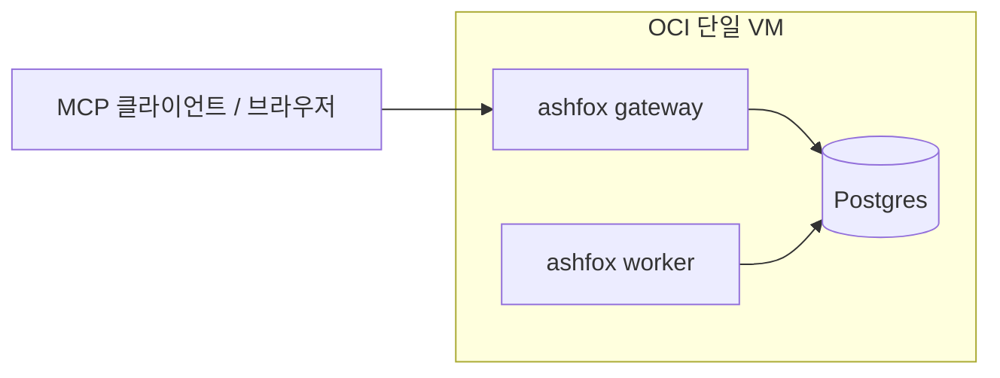
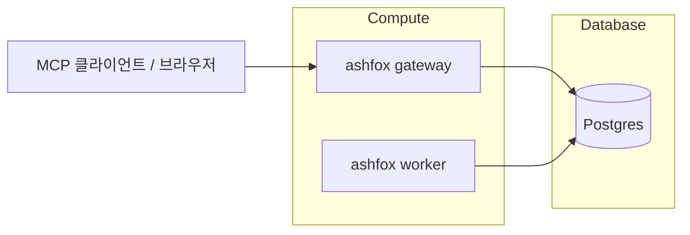

군대에서 오픈소스를 배포하거나 사이드 프로젝트를 운영하려고 마음먹으면, 제일 먼저 드는 생각이 있다. 그것은 기술이 얼마나 멋지냐, 얼마나 센세이션하냐가 아니라, 내가 이걸 내 카드값으로 버틸 수 있느냐라는 기준이다.

운영이라는 말을 입에 올리는 순간부터, 사이드 프로젝트는 취미가 아니라 고정비가 된다. 인스턴스 요금이든, 스토리지 요금이든, 도메인이든, 어쨌든 매달 빠져나가는 비용이 생긴다. 군대에서는 그 비용을 “필요할 때 더 넣고 필요 없을 때 빼는 방식”으로 대응하기가 쉽지 않아서, 처음부터 구조를 단순하게 잡는 편이 마음이 편했다.

내가 만들고 있는 `ashfox`도 결국 그 현실 위에 올라가 있다. `ashfox`는 외부 클라이언트가 요청을 보내면, 서버가 워크플로우를 처리하면서 상태와 산출물을 저장하는 서비스다. 이 구조는 특수성상 write가 자주 발생한다. “작업 하나”가 “저장 여러 번”으로 잘게 쪼개지기 쉬워서, 작은 인스턴스에서는 금방 저장소 병목과 마주친다.

그래서 나는 `ashfox`를 OCI 단일 인스턴스에 올려서 운영을 시작했다. 예산이 넉넉하지 않아서 처음부터 HA는 포기했고, 단일 VM에서 최대한 효율적으로 버티는 걸 목표로 잡았다. 대신 나중에 사용자가 모여서 가치가 생겼을 때, 옮기기 쉬운 형태로 남겨두자는 쪽에 더 신경을 썼다.

이 글은 그 과정에서 내가 선택한 구조와 그 이유를 기록해둔 회고에 가깝다. 성능 튜닝의 정답을 말하려는 글이라기보다는, “이 상황에서 나는 이렇게 시작했다”를 남겨두려는 목적이 더 크다. 그리고 시간이 지나서 규모가 커졌을 때, 내가 왜 이런 결정을 했는지 다시 읽고 납득할 수 있게 남기는 의미도 있다.

## ashfox 소개

`ashfox`는 내가 만들고 있는 개인 프로젝트다. 외부 클라이언트가 요청을 보내면 gateway가 받아서 처리하고, 시간이 걸리는 일은 worker가 비동기로 처리한다. 그리고 그 과정의 상태와 결과물은 Postgres에 쌓인다.

여기서 중요한 점은, `ashfox`가 상태를 “자주 저장하는 쪽”으로 설계되어 있다는 점이다. 중간에 실패해도 이어서 진행할 수 있어야 하고, 한 번에 길게 묶어서 처리하기보다는 스텝 단위로 진행하는 편이 운영에서 유리하다고 봤다. 그래서 성공하든 실패하든, 그리고 진행 중이든, 그때그때 상태를 남기게 된다. 이 선택은 개발할 때는 마음이 편하지만, 운영할 때는 write가 많아지는 선택이기도 하다.

운영 관점에서 보면 구성은 세 덩어리로 단순화된다. `gateway`는 외부 클라이언트가 붙는 진입점이고, MCP 엔드포인트와 웹 UI를 한 곳에서 제공한다. `worker`는 비동기 작업을 처리한다. `postgres`는 프로젝트/워크스페이스 상태를 저장하고, 필요하면 DB 기반으로 blob도 저장한다.

지금은 단일 VM이라 세 서비스가 같은 박스 안에서 돈다. 그래도 경계를 일부러 유지해두면, 나중에 옮길 때가 훨씬 편하다. 트래픽이 늘면 worker만 다른 인스턴스로 떼어내는 식으로 스케일을 먼저 탈 수도 있고, DB를 managed Postgres로 옮겨서 “운영의 책임”을 일부 덜어낼 수도 있다. 지금은 비용 때문에 단일 인스턴스를 고집하지만, 구조까지 단일 인스턴스 전용으로 굳혀버리면 다음 선택지가 사라진다.

서비스 간 관계를 개념도로 그리면 아래처럼 정리된다.



## 지금 운영에서 포기한 것과 남긴 것

단일 VM으로 운영하기로 했으면, 그 순간부터 포기해야 하는 것들이 있다. 장애가 나면 자동으로 넘어가는 구조는 없다. 트래픽이 급증하면 오토스케일링이 알아서 해결해주지도 않는다. 복구도 결국 내가 직접 해야 한다. 대신 구조가 단순하고, 싸고, 운영할 요소가 적다는 장점이 있다.

나는 이 장단점을 받아들이는 대신, 단일 VM에서 흔들리기 쉬운 포인트를 최대한 일찍 정리해두기로 했다. 병목이 어디에서 생기는지 설명 가능한 구조로 만들고, 돈을 쓰게 되는 순간이 오면 어디에 써야 하는지 미리 정리해두고, 지금의 최적화가 나중 이식의 발목을 잡지 않게 구성하는 쪽이다.

내가 겪은 대부분의 단일 VM 이슈는 “CPU가 부족해서”라기보다 “I/O가 꼬여서”였고, “DB가 느려서”라기보다 “DB가 흔들릴 때 같이 흔들리는 것들이 많아서”였다. 그래서 이 글도 화려한 튜닝보다, 단일 VM에서 가장 아픈 부분을 먼저 정리한 이야기로 채워졌다.

## 단일 VM에서 세운 원칙

내가 단일 VM 운영을 결정하면서 세운 원칙은 거창한 게 아니었다. 나는 일단 “복잡한 걸 못 한다”는 걸 인정하고 시작했다. 군대에서 운영은 내가 원할 때만 할 수 있는 일이 아니라, 일이 터졌을 때도 해야 하는 일이기 때문이다.

첫째 원칙은 원인을 분리하는 쪽으로 설계를 미는 것이었다. 단일 VM에서는 모든 게 한 박스에서 돌아가서, 한 군데가 흔들리면 다른 데도 같이 흔들린다. 그래서 나는 성능을 끌어올리는 것보다, 경합이 생길 수 있는 지점을 미리 갈라두는 쪽이 더 의미가 있다고 봤다.

둘째 원칙은 돈을 쓰더라도 “명확한 지점”에만 쓰는 것이었다. 단일 VM을 택한 사람의 가장 큰 무기는 비용을 아끼는 대신 구조를 단순하게 가져가는 것인데, 여기서 다시 비싼 걸 막 올리면 그냥 어중간한 구성이 된다. 그래서 나는 먼저 병목을 분리해서, 돈을 써야 할 때 “여기에만 쓰면 된다”라는 느낌이 들게 만들고 싶었다.

셋째 원칙은 이식성을 끝까지 버리지 않는 것이었다. 지금은 단일 VM이지만, 나중에는 분리해서 스케일을 타야 한다. 그때를 위해서 서비스 경계를 유지하고, 디스크와 DB 같은 상태 요소는 옮기기 쉬운 형태로 관리하려고 했다.

## 현재 스펙

현재 기준으로 인스턴스는 4코어/24GB 메모리다. 그리고 스토리지는 OS/DB/WAL을 30GB/150GB/20GB로 나눠서 잡았다. VPU는 아직 크게 건드리지 않았고, 이 글에서는 `10 VPUs/GB`를 기본값으로 잡아두겠다.

표로 쓰면 이렇다.

| 구분 | 용량 | 역할 |
| --- | ---: | --- |
| OS | 30GB | docker, 로그, 런타임, 기본 운영 영역을 담는다. |
| DB(Data) | 150GB | PGDATA에 해당하는 heap/index가 들어간다. |
| DB(WAL) | 20GB | WAL만 들어간다. |

이 구성이 “내가 생각한 최적의 수치”라서라기보다는, 지금 상황에서 너무 과하지 않게 시작하기 위한 타협에 가깝다. OS 볼륨은 크게 욕심내지 않았고, DB(data)는 나중에 용량 때문에 흔들리지 않게 넉넉하게 잡았다. WAL은 분리 자체가 목적이라서, 일단 20GB로 시작하고 운영하면서 다시 판단하기로 했다.

여기서 중요한 건 숫자 자체가 아니라, 숫자를 쪼개서 관리했다는 점이다. OS 볼륨이 가득 차는 사고는 생각보다 단순하게 터지는데, 단일 VM에서는 그게 곧 서비스 장애로 이어지기 쉽다. DB(data) 볼륨이 가득 차는 건 더 무섭다. WAL 볼륨이 가득 차는 것도 마찬가지로 바로 장애다. 그래서 나는 이 셋을 한 데 묶어서 “언젠가 한 번에 터지는 구조”로 만들고 싶지 않았다.

그리고 이 정도 스펙이면 웬만한 토이 프로젝트는 충분하다고 느끼는 사람이 많겠지만, write가 잦은 워크로드에서는 체감이 좀 다르다. 메모리가 24GB라고 해도 DB가 먹는 메모리, 컨테이너가 먹는 메모리, 커넥션이 먹는 메모리, 캐시가 먹는 메모리를 합치면 생각보다 금방 여유가 줄어든다. CPU도 4코어라서 동시에 이것저것 돌리면 여유가 많지 않다. 그래서 단일 VM에서는 “성능을 끌어올리는 방법”보다 “흔들리는 원인을 줄이는 방법”이 먼저 나온다.

## 왜 write가 문제였나

`ashfox`는 read가 몰려서 힘든 서비스라기보다는, write가 자주 발생하는 구조에 가깝다.

워크플로우가 짧은 스텝으로 이어지고, 중간에 실패해도 이어서 진행할 수 있게 상태를 자주 저장한다. 그래서 “한 번의 작업”처럼 보이는 요청도 DB 입장에서는 저장이 여러 번으로 쪼개지기 쉽다.

예를 들어 외부에서 하나의 요청이 들어오면, 서버는 그 요청을 바로 끝내기보다 우선 “받았다”라는 상태를 남긴다. 그리고 worker가 작업을 잡아 실행을 시작하면 “시작했다”라는 상태를 남긴다. 실행 도중에 단계가 넘어가거나 결과물이 생길 때마다 체크포인트를 남긴다. 마지막으로 작업이 성공하거나 실패하면 “끝났다”라는 상태를 남긴다. 이 흐름은 한 번의 요청을 여러 번의 write로 바꾸는 구조이고, 나는 일부러 이 방향을 택했다.

작업을 처리할 때의 흐름을 풀어서 쓰면 이렇다. 먼저 워크스페이스/프로젝트 단위로 락을 잡는다. 이 락은 말 그대로 메모리 락이 아니라 DB에 남는 형태라서, 여기서부터 write가 시작된다. 그 다음에 상태를 읽어서 메모리에서 변경하고, 변경된 상태를 DB에 다시 저장한다. 마지막으로 락 해제나 정리 과정에서 저장이 추가로 들어가기도 한다.

상태는 DB에 `jsonb`로 저장한다. `jsonb`는 구조를 바꾸기 편하고, 개발 초기에는 속도가 빠르다. 대신 update 관점에서는 “조금 바뀌었지만 결국은 update”라는 결과가 자주 나오고, 그런 update들이 모이면 WAL과 vacuum 부담도 같이 따라온다. 나는 이 트레이드오프를 알고도 편의와 속도를 우선해서 `jsonb`를 택했고, 운영에서 그 대가를 조금씩 치르고 있다.

그리고 Postgres에서 update는 단순히 “한 줄 바꿨다”로 끝나지 않는다는 점이 있다. update는 새로운 튜플이 추가되고, 기존 튜플은 바로 사라지지 않는다. 그래서 update가 많아지면 그만큼 정리(vacuum)가 필요해지고, 정리가 밀리면 또 성능이 흔들릴 여지가 생긴다. 나는 이 흐름을 알면서도 write-heavy 구조를 택했기 때문에, 단일 VM에서는 디스크를 더 중요하게 보게 됐다.

revision은 상태 JSON을 해시로 잡는 방식이라 작은 변화에도 revision이 바뀐다. 여기에 낙관적 가드(예상 revision이 맞을 때만 적용)가 얹혀 있으니, 이 서비스는 기본적으로 write가 잦을 수밖에 없다. 이 방식은 동시성 버그를 줄이는 데는 도움이 되지만, update가 늘어날수록 디스크가 먼저 민감해진다.

이건 트래픽이 커서 생기는 문제가 아니라, 설계 자체가 write를 자주 만드는 쪽이라는 의미다. 그래서 단일 VM으로 운영할 때는 “DB가 어느 순간부터 밀리는 구간”을 비교적 빨리 만나게 된다.

## 그래서 WAL이 먼저 민감해졌다

Postgres에서 커밋은 결국 WAL(Write-Ahead Log) flush/fsync를 타고, 이 지연이 커지면 애플리케이션의 응답 지연도 같이 영향을 받는다. write가 자주 발생하는 워크로드에서는 이 영향이 더 자주 드러난다.

WAL은 읽기와 쓰기 중에서도 특히 “안전하게 기록해야 하는 쓰기”에 가깝다. 그래서 디스크가 바쁘거나, 같은 디스크에 다른 I/O가 섞이면 체감 지연이 바로 올라올 수 있다. 단일 VM에서는 OS/컨테이너 런타임 I/O, DB 데이터 파일 I/O, WAL fsync I/O가 한 디스크에서 경합하기 쉽기 때문에 더 민감하다.

나는 이걸 “WAL이 느리면 DB가 느리다” 수준으로 단순화해서 생각하지 않으려고 했다. 실제 운영에서는 WAL이 느려지는 순간이 곧바로 애플리케이션의 요청 지연으로 번지고, 그 지연이 쌓이면 커넥션 대기와 큐잉으로 이어지는 경우가 많다. 단일 VM에서는 이런 연쇄가 한 번 시작되면, 원인을 분리하기가 더 어렵다.

그래서 나는 “전체를 빨리”보다 “WAL을 따로 떼어서 경합을 줄이자”를 먼저 했다. 돈을 더 쓰기 전에 구조적으로 싸움을 줄이는 쪽이 단일 VM에서는 먼저 할 수 있는 선택지라고 생각했다.

## OS / DB / WAL 분리

블록 스토리지를 아래처럼 나눴다.

```text
/ (OS volume, 30GB)
  - docker, logs, app runtime

/srv/ashfox/pgdata (Block Volume: data, 150GB)
  - PGDATA (heap/index)

/srv/ashfox/pgwal (Block Volume: wal, 20GB)
  - WAL only
```

OS와 DB를 분리한 이유는 단순하다. 운영을 하다 보면 OS 쪽에서도 디스크를 쓰는 일이 계속 생긴다. 로그가 쌓이거나, 컨테이너 레이어가 커지거나, 임시 파일이 생기거나, 업데이트 과정에서 캐시가 늘기도 한다. 이런 것들이 DB 디스크와 같이 움직이면 예상하기 어려운 순간에 성능이 흔들릴 수 있다.

DB(data)와 WAL을 분리한 이유는 좀 더 명확하다. WAL이 디스크 경합에 민감하다는 걸 알고 있었고, 나중에 성능을 올려야 한다면 WAL 쪽만 비용을 더 쓰는 선택을 하고 싶었다. 데이터 볼륨과 WAL 볼륨을 분리하면, 비용을 태워야 하는 지점을 더 좁힐 수 있다.

이걸 내 스펙 숫자로 다시 보면 더 명확해진다. DB(data)는 150GB이고 WAL은 20GB다. 같은 VPUs/GB 증가를 주더라도 150GB 전체에 적용하는 것과 20GB에만 적용하는 것은 부담이 다르다. 그래서 나는 “필요하면 WAL만 올릴 수 있게” 구조를 먼저 잡아두고 싶었다.

이 방식이 “성능이 무조건 좋아진다”라고 말하기는 어렵다. 그래도 단일 VM에서는 예측 가능성이 늘어난다. 어떤 날은 빠르고 어떤 날은 느린 상태에서 빠져나오고, 느려졌을 때도 “왜 느린지”를 좁혀가기 쉬워진다. 나는 이 예측 가능성 때문에 분리를 먼저 했다.

## 분리하면서 조심한 것들

디스크를 나눠서 붙이는 순간부터, 내 운영에서 가장 무서운 사고는 “마운트가 제대로 안 됐는데 컨테이너가 떠버리는 상황”이 됐다. 단일 VM에서 한 번 꼬이면 복구할 사람이 나밖에 없어서, 나는 초반부터 이런 실수를 최대한 줄이는 쪽으로 움직였다.

나는 신규 클러스터를 만들 때 특히 그 위험을 크게 봤다. `postgres` 컨테이너는 데이터 디렉터리가 비어 있으면 initdb를 돌려서 클러스터를 만들어버린다. 그래서 마운트가 빠진 채로 컨테이너를 올리면, “의도한 볼륨”이 아니라 “그냥 빈 디렉터리”에 클러스터가 생성될 수 있다. 나는 이 상황이 제일 싫어서, 운영 초기에는 마운트부터 확인하고 컨테이너를 올리는 습관을 만들었다.

또 하나는 권한과 경로 문제다. 호스트에서 분리한 디렉터리를 컨테이너에 바인드할 때, 경로가 틀리거나 권한이 꼬이면 Postgres는 그냥 안 올라온다. 이건 오히려 낫다. 애매하게 올라가서 데이터를 다른 곳에 쓰는 것보다, 처음부터 터져서 손이 가게 하는 편이 안전하다.

## WAL 분리를 실제로 적용하는 방법

여기서 말하는 WAL 분리는 “볼륨을 분리했다”로 끝나지 않는다. Postgres가 실제로 WAL을 그 경로에 쓰고 있어야 한다.

신규 클러스터라면 `initdb --waldir`로 시작하는 게 제일 깔끔하다. 도커에서 `postgres` 공식 이미지를 쓰는 경우, `POSTGRES_INITDB_ARGS`로 initdb 옵션을 전달할 수 있다.

```yaml
services:
  postgres:
    image: postgres:16-alpine
    environment:
      POSTGRES_DB: ashfox
      POSTGRES_USER: ashfox
      POSTGRES_PASSWORD: "<password>"
      POSTGRES_INITDB_ARGS: "--waldir=/var/lib/postgresql/wal"
    volumes:
      - /srv/ashfox/pgdata:/var/lib/postgresql/data
      - /srv/ashfox/pgwal:/var/lib/postgresql/wal
```

이 옵션은 초기화 시점에만 의미가 있다. 이미 데이터 디렉터리가 만들어진 상태에서는 적용되지 않기 때문에, 처음부터 분리해서 시작하는 편이 간단하다. 이미 운영 중인 클러스터에서 `pg_wal`을 옮겨서 심볼릭 링크로 붙이는 방법도 있긴 하지만, 작업 실수 여지가 커서 나는 가능하면 피하는 편이다.

그리고 이 구성은 도커에서 특히 더 중요하다. 컨테이너 안에서 경로를 나눠도, 결국 호스트의 같은 디스크로 들어가면 의미가 없기 때문이다. 그래서 나는 호스트의 마운트 지점을 먼저 나누고, 그 마운트 지점을 컨테이너에 바인드하는 방식으로 정리했다.

## WAL 분리가 적용됐는지 확인하는 방법

분리가 제대로 됐는지 확인하려면, 결국 `pg_wal`이 어디를 바라보고 있는지 확인하는 게 제일 확실하다. 나는 이런 식으로 확인하는 편이다.

```bash
# 컨테이너 안에서 PGDATA 기준으로 pg_wal이 어떻게 잡혀있는지 본다.
docker exec -it <postgres_container> sh -lc 'ls -la /var/lib/postgresql/data | rg "pg_wal" || true'

# wal 디렉터리가 실제로 마운트로 잡혔는지도 같이 확인한다.
docker exec -it <postgres_container> sh -lc 'df -h /var/lib/postgresql/data /var/lib/postgresql/wal'
```

서비스가 오래 돌기 시작하면 디스크 사용량도 같이 보기 시작한다. WAL이 빠르게 차오르는 패턴이 보이면, 운영 방식이나 스토리지 설정을 다시 봐야 한다.

## WAL 볼륨 용량에 대한 생각

WAL 볼륨을 20GB로 잡아놓고도 계속 신경 쓰는 이유가 있다. WAL은 상황에 따라 생각보다 빠르게 쌓일 수 있고, 단일 VM에서는 디스크가 꽉 차는 순간이 곧 장애가 되기 쉽기 때문이다.

WAL은 언제 쌓이냐를 생각하면 불안 요소가 꽤 많다. 트래픽이 조금 늘어도 쌓일 수 있고, 한 번에 큰 작업이 들어가도 쌓일 수 있다. 그리고 내가 의도한 write가 아니더라도, 인덱스를 건드리거나 vacuum이 돌거나, 특정 테이블이 자주 update되는 패턴이 나오면 WAL이 생각보다 빨리 늘어날 수 있다. 단일 VM에서는 이런 이벤트가 겹치기 쉬워서 더 신경이 쓰였다.

나는 지금 당장 20GB가 충분하다고 확신하진 않는다. 다만 “분리해두었기 때문에” 모니터링과 조정이 쉬워졌다고 생각한다. WAL이 쌓이는 패턴이 보이면 용량을 늘리거나, 운영 방식 자체를 다시 고민할 수 있다. 예를 들어 저장 빈도를 낮추거나, write를 분산시키는 구조를 추가하거나, 결과물을 DB 밖으로 빼는 식의 선택지가 열려 있다.

## VPU는 기본값, 필요하면 WAL만

아직은 VPU를 올리지 않고 기본값으로 두고 있다. 먼저 병목을 분리해두고, 실제로 부족한 지점이 보이면 그때 올릴 생각이다.

OCI 블록 볼륨은 볼륨 단위로 성능을 조절할 수 있고, 그 단위가 VPUs/GB로 표현된다. 나는 지금은 `10 VPUs/GB`를 기본값으로 두고 시작했고, 아직은 이 값만으로도 어디가 먼저 터지는지 보는 중이다.

만약 올리게 된다면 전체 볼륨이 아니라 WAL 볼륨에만 투자하는 쪽으로 보고 있다. write가 잦은 구조에서는 WAL 쪽이 먼저 민감해지고, 그 지점이 개선되면 체감도 비교적 명확하게 나오는 편이라고 봤다. 같은 돈이라면 “가장 아픈 곳”에 먼저 쓰는 게 단일 VM 운영에서는 낫다고 생각했다.

이 전략은 단순히 돈을 아끼는 것만이 아니라, 실험 비용을 줄이는 의미도 있다. 단일 VM에서 성능을 올리는 실험은 실패하면 그냥 비용만 빠진다. 그래서 나는 “가장 확실한 후보 하나”에만 먼저 투자하고, 반응을 보고 다음을 결정하는 방식이 맞다고 봤다.

## 커넥션 풀로 총 커넥션 수 제한

단일 VM에서는 DB 커넥션 수가 늘어나는 것도 부담이 된다. gateway/worker가 각각 커넥션 풀을 가지면 총 커넥션 수가 예상보다 빠르게 커질 수 있고, 그게 DB 리소스와 VM 리소스를 같이 갉아먹는다.

그래서 애플리케이션 레벨에서 풀 상한을 두고 운영하는 쪽을 택했다. `ashfox`는 `ASHFOX_DB_POSTGRES_MAX_CONNECTIONS`와 `ASHFOX_STORAGE_DB_POSTGRES_MAX_CONNECTIONS`로 Postgres 연결 풀의 상한을 줄 수 있다.

여기서 중요하게 본 건 “서비스 하나에 몇 개”가 아니라 “전체 합계가 몇 개”다. gateway 풀과 worker 풀이 따로 있으면, 결국 총량이 내가 생각한 상한을 넘어가기도 한다.

그리고 이 프로젝트는 상태 저장용 DB 연결과 blob 저장용 DB 연결이 분리될 수 있기 때문에, 풀을 잡을 때는 이 두 개를 합쳐서 생각해야 한다. 단일 VM에서 커넥션 수가 조금만 늘어나도 영향이 체감되기 쉽기 때문에, 처음에는 보수적으로 시작하고 운영하면서 천천히 올리는 쪽이 맞다고 봤다.

나는 이걸 “성능”이라기보다 “안전”의 문제로 봤다. Postgres는 커넥션 하나가 늘어날 때마다 그만큼 처리할 일이 늘어날 수 있고, 동시에 돌아가는 작업이 많아지면 디스크 경합도 같이 올라갈 수 있다. 작은 VM에서는 그 순간이 더 빨리 온다. 그래서 커넥션 풀은 “열어두면 편하니까 열어둔다”가 아니라, “열어둘수록 내가 감당해야 하는 변수가 늘어난다”라는 감각으로 접근하게 됐다.

커넥션 풀은 항상 양면이 있다. 풀을 크게 잡으면 순간 처리량이 올라갈 수도 있지만, 작은 VM에서는 그만큼 DB가 동시에 처리해야 할 일이 늘어난다. 풀을 너무 작게 잡으면 요청이 내부에서 대기하면서 응답이 느려질 수 있다. 그래서 나는 먼저 보수적으로 시작하고, 운영하면서 병목이 어느 쪽인지 확인한 뒤에 올리는 게 맞다고 생각했다.

또 하나는 “풀을 키워서 해결할 문제인지”를 계속 의심하는 태도였다. write-heavy 상황에서 풀을 무작정 키우면, 병목이 완화되기보다는 디스크 경합만 더 커지는 경우도 나온다. 단일 VM에서는 특히 그런 순간이 빨리 온다. 그래서 풀 조절은 튜닝이 아니라 운영의 안전장치에 가깝다고 생각했다.

## 운영하면서 같이 보는 것들

단일 VM 운영에서는 “지금 뭐가 병목인지”를 빨리 파악할 수 있어야 한다. 그래서 나는 운영 초반에는 기능 개발만큼이나 관측을 같이 챙기려고 했다.

나는 크게 세 가지를 자주 본다. 첫째는 WAL 볼륨의 사용량이다. 둘째는 DB 커넥션 수와 대기 상황이다. 셋째는 VM 전체의 I/O 대기(iowait)와 디스크 지표다. 이 셋이 같이 흔들리면, 지금 문제는 대개 애플리케이션보다 저장소 쪽에 가깝다.

완벽한 모니터링을 갖추진 못했지만, 최소한의 확인은 아래 정도로도 충분히 시작할 수 있었다.

```bash
# 디스크 사용량 확인 (특히 WAL 볼륨)
df -h

# 디스크와 마운트가 의도대로 나뉘었는지 확인
lsblk

# 컨테이너 상태 확인
docker ps
```

실제로 뭔가 느리다고 느껴지는 순간에는 이 순서대로 본다. 먼저 `df -h`로 디스크가 꽉 찬 곳이 없는지 확인한다. 그 다음에 `lsblk`로 내가 의도한 볼륨이 제대로 붙어 있는지 확인한다. 마지막으로 `docker ps`로 컨테이너가 갑자기 재시작을 반복하고 있지는 않은지 확인한다. 이 세 가지는 한 번에 문제를 해결해주진 않지만, 최소한 “지금 이게 운영 이슈인지, 애플리케이션 이슈인지”를 빨리 가르는 데는 도움이 됐다.

DB 레벨에서 확인할 게 필요하면, 아주 기본적인 것부터 본다. 커넥션이 몇 개 떠 있는지, 지금 대기가 있는지, 최근에 지연이 늘었는지 같은 것들이다.

```sql
SELECT count(*) AS connections FROM pg_stat_activity;
```

## 나중에 옮길 때의 순서

나는 지금 구조를 “단일 VM에서 끝나는 형태”로 굳히고 싶지 않았다. 그래서 지금 당장 쓰지 않는 기능이라도, 경계는 일부러 남겨두었다. 서비스가 커졌을 때 내가 하고 싶은 건, 한 번에 다 갈아엎는 게 아니라 가장 부담이 큰 축부터 하나씩 떼어내는 방식이다.

내가 머릿속에 둔 순서는 대략 이렇다. 먼저 worker를 다른 인스턴스로 분리해서 gateway가 상대적으로 가벼운 상태로 남게 만든다. 그 다음에 DB를 단일 VM 밖으로 옮기거나, 적어도 DB만 별도 머신으로 분리한다. 마지막으로 blob 성격의 데이터가 커지면, 그건 DB 밖 스토리지로 빼는 쪽을 고민한다. 지금은 비용과 시간을 이유로 미뤘지만, 선택지를 남겨두는 것만으로도 나중의 스트레스가 줄어든다고 생각했다.

이걸 그림으로 아주 단순하게 그리면 아래 같은 느낌이다.



## 지금 시점의 정리

지금 구성은 단일 VM에서 버티기 위한 시작점이다.

현재까지 내가 정리한 포인트는 세 가지다. 첫째, 워크플로우 특성상 write가 잦아서 WAL이 먼저 민감해진다. 둘째, 디스크를 OS/DB/WAL로 분리하면 경합을 줄일 수 있고, 나중에 성능 투자를 해야 할 때도 투자 지점을 더 명확하게 고를 수 있다. 셋째, 커넥션 풀 상한은 “각 서비스 기준”이 아니라 “총량 기준”으로 잡아야 단일 VM에서 흔들림을 줄일 수 있다.

지금은 이 정도로 시작해두고, 실제로 운영하면서 병목이 드러나면 그때 조금씩 바꾸려고 한다. 그리고 만약 이 프로젝트가 커지게 되면, 지금의 분리 덕분에 다음 단계는 비교적 단순하게 가져갈 수 있을 거라고 기대한다. gateway와 worker를 물리적으로 분리하는 것도 가능하고, DB만 따로 떼어내는 것도 가능하다. 나는 그 가능성을 남겨두는 선에서, 당장은 카드값이 버틸 수 있는 운영을 먼저 하기로 했다.
