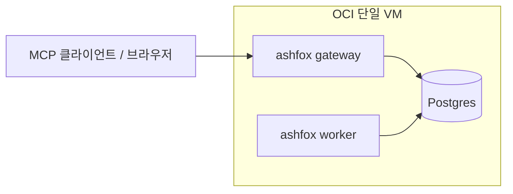
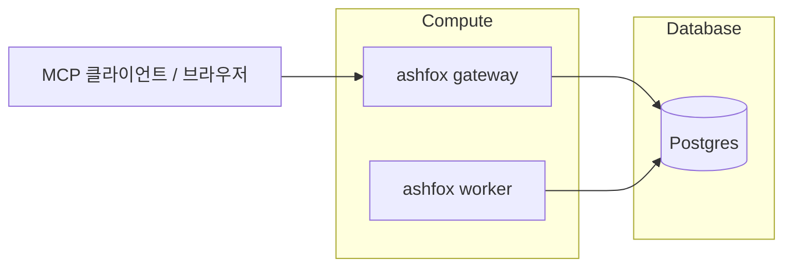

군대에서 오픈소스를 배포하거나 사이드 프로젝트를 운영하려고 마음먹으면, 제일 먼저 드는 생각이 있다. 그것은 기술이 얼마나 멋지냐, 얼마나 센세이션하냐가 아니라, 내가 이걸 내 카드값으로 버틸 수 있느냐라는 기준이다.

운영이라는 말을 입에 올리는 순간부터, 사이드 프로젝트는 취미가 아니라 고정비가 된다. 인스턴스 요금이든, 스토리지 요금이든, 도메인이든, 어쨌든 매달 빠져나가는 비용이 생긴다. 군대에서는 그 비용을 “필요할 때 더 넣고 필요 없을 때 빼는 방식”으로 대응하기가 쉽지 않아서, 처음부터 구조를 단순하게 잡는 편이 마음이 편했다.

내가 만들고 있는 `ashfox`도 결국 그 현실 위에 올라가 있다. `ashfox`는 외부 클라이언트가 요청을 보내면, 서버가 워크플로우를 처리하면서 상태와 산출물을 저장하는 서비스다. 이 구조는 특수성상 write가 자주 발생한다. “작업 하나”가 “저장 여러 번”으로 잘게 쪼개지기 쉬워서, 작은 인스턴스에서는 금방 저장소 병목과 마주친다.

그래서 나는 `ashfox`를 OCI 단일 인스턴스에 올려서 운영을 시작했다. 예산이 넉넉하지 않아서 처음부터 HA는 포기했고, 단일 VM에서 최대한 효율적으로 버티는 걸 목표로 잡았다. 대신 나중에 사용자가 모여서 가치가 생겼을 때, 옮기기 쉬운 형태로 남겨두자는 쪽에 더 신경을 썼다.

이 글은 그 과정에서 내가 선택한 구조와 그 이유를 기록해둔 회고에 가깝다. 성능 튜닝의 정답을 말하려는 글이라기보다는, “이 상황에서 나는 이렇게 시작했다”를 남겨두려는 목적이 더 크다. 그리고 시간이 지나서 규모가 커졌을 때, 내가 왜 이런 결정을 했는지 다시 읽고 납득할 수 있게 남기는 의미도 있다.

## ashfox 소개

`ashfox`는 내가 만들고 있는 개인 프로젝트다. 외부 클라이언트가 요청을 보내면 gateway가 받아서 처리하고, 시간이 걸리는 일은 worker가 비동기로 처리한다. 그리고 그 과정의 상태와 결과물은 Postgres에 쌓인다.

여기서 중요한 점은, `ashfox`가 상태를 “자주 저장하는 쪽”으로 설계되어 있다는 점이다. 중간에 실패해도 이어서 진행할 수 있어야 하고, 한 번에 길게 묶어서 처리하기보다는 스텝 단위로 진행하는 편이 운영에서 유리하다고 봤다. 그래서 성공하든 실패하든, 그리고 진행 중이든, 그때그때 상태를 남기게 된다. 이 선택은 개발할 때는 마음이 편하지만, 운영할 때는 write가 많아지는 선택이기도 하다.

운영 관점에서 보면 구성은 세 덩어리로 단순화된다. `gateway`는 외부 클라이언트가 붙는 진입점이고, MCP 엔드포인트와 웹 UI를 한 곳에서 제공한다. `worker`는 비동기 작업을 처리한다. `postgres`는 프로젝트/워크스페이스 상태를 저장하고, 필요하면 DB 기반으로 blob도 저장한다.

지금은 단일 VM이라 세 서비스가 같은 박스 안에서 돈다. 그래도 경계를 일부러 유지해두면, 나중에 옮길 때가 훨씬 편하다. 트래픽이 늘면 worker만 다른 인스턴스로 떼어내는 식으로 스케일을 먼저 탈 수도 있고, DB를 managed Postgres로 옮겨서 “운영의 책임”을 일부 덜어낼 수도 있다. 지금은 비용 때문에 단일 인스턴스를 고집하지만, 구조까지 단일 인스턴스 전용으로 굳혀버리면 다음 선택지가 사라진다.

서비스 간 관계를 개념도로 그리면 아래처럼 정리된다.


```mermaid title="서비스 구성 다이어그램"
flowchart LR
  Client["MCP 클라이언트 / 브라우저"] --> Gateway

  subgraph VM["OCI 단일 VM"]
    Gateway["ashfox gateway"] --> Postgres[("Postgres")]
    Worker["ashfox worker"] --> Postgres
  end
```

## 지금 운영에서 포기한 것과 남긴 것

단일 VM으로 운영하기로 했으면, 그 순간부터 포기해야 하는 것들이 있다. 장애가 나면 자동으로 넘어가는 구조는 없다. 트래픽이 급증하면 오토스케일링이 알아서 해결해주지도 않는다. 복구도 결국 내가 직접 해야 한다. 대신 구조가 단순하고, 싸고, 운영할 요소가 적다는 장점이 있다.

나는 이 장단점을 받아들이는 대신, 단일 VM에서 흔들리기 쉬운 포인트를 최대한 일찍 정리해두기로 했다. 병목이 어디에서 생기는지 설명 가능한 구조로 만들고, 돈을 쓰게 되는 순간이 오면 어디에 써야 하는지 미리 정리해두고, 지금의 최적화가 나중 이식의 발목을 잡지 않게 구성하는 쪽이다.

내가 겪은 대부분의 단일 VM 이슈는 “CPU가 부족해서”라기보다 “I/O가 꼬여서”였고, “DB가 느려서”라기보다 “DB가 흔들릴 때 같이 흔들리는 것들이 많아서”였다. 그래서 이 글도 화려한 튜닝보다, 단일 VM에서 가장 아픈 부분을 먼저 정리한 이야기로 채워졌다.

## 단일 VM에서 세운 원칙

내가 단일 VM 운영에서 세운 원칙은 단순했다. 군대에서 운영은 내가 원할 때만 하는 일이 아니라, 장애가 나면 바로 처리해야 하는 일이기 때문이다.

첫째는 원인 분리다. 단일 VM에서는 한 지점의 흔들림이 전체로 번지기 쉬워서, 성능 극대화보다 경합 지점을 미리 갈라두는 설계를 택했다.

둘째는 선택적 투자다. 병목을 분리해두면 돈을 써야 할 때도 “어디에 써야 체감이 나는지”가 명확해진다.

셋째는 이식성 유지다. 지금은 단일 VM이지만, 이후 분리를 위해 서비스 경계와 상태 요소를 옮기기 쉬운 형태로 관리했다.

## 현재 스펙

현재 기준으로 인스턴스는 4코어/24GB 메모리다. 그리고 스토리지는 OS/DB/WAL을 30GB/150GB/20GB로 나눠서 잡았다. VPU는 아직 크게 건드리지 않았고, 이 글에서는 `10 VPUs/GB`를 기본값으로 잡아두겠다.

표로 쓰면 이렇다.

| 구분 | 용량 | 역할 |
| --- | ---: | --- |
| OS | 30GB | docker, 로그, 런타임, 기본 운영 영역을 담는다. |
| DB(Data) | 150GB | PGDATA에 해당하는 heap/index가 들어간다. |
| DB(WAL) | 20GB | WAL만 들어간다. |

이 구성이 “내가 생각한 최적의 수치”라서라기보다는, 지금 상황에서 너무 과하지 않게 시작하기 위한 타협에 가깝다. OS 볼륨은 크게 욕심내지 않았고, DB(data)는 나중에 용량 때문에 흔들리지 않게 넉넉하게 잡았다. WAL은 분리 자체가 목적이라서, 일단 20GB로 시작하고 운영하면서 다시 판단하기로 했다.

여기서 중요한 건 숫자 자체가 아니라, 숫자를 쪼개서 관리했다는 점이다. OS 볼륨이 가득 차는 사고는 생각보다 단순하게 터지는데, 단일 VM에서는 그게 곧 서비스 장애로 이어지기 쉽다. DB(data) 볼륨이 가득 차는 건 더 무섭다. WAL 볼륨이 가득 차는 것도 마찬가지로 바로 장애다. 그래서 나는 이 셋을 한 데 묶어서 “언젠가 한 번에 터지는 구조”로 만들고 싶지 않았다.

그리고 이 정도 스펙이면 웬만한 토이 프로젝트는 충분하다고 느끼는 사람이 많겠지만, write가 잦은 워크로드에서는 체감이 좀 다르다. 메모리가 24GB라고 해도 DB가 먹는 메모리, 컨테이너가 먹는 메모리, 커넥션이 먹는 메모리, 캐시가 먹는 메모리를 합치면 생각보다 금방 여유가 줄어든다. CPU도 4코어라서 동시에 이것저것 돌리면 여유가 많지 않다. 그래서 단일 VM에서는 “성능을 끌어올리는 방법”보다 “흔들리는 원인을 줄이는 방법”이 먼저 나온다.

## 왜 write가 문제였나

`ashfox`는 read가 몰려서 힘든 서비스라기보다는, write가 자주 발생하는 구조에 가깝다.

워크플로우가 짧은 스텝으로 이어지고, 중간 실패 후 재개를 전제로 상태를 자주 저장한다. 그래서 “한 번의 작업”처럼 보이는 요청도 DB에서는 여러 write로 쪼개진다. 요청 수신, 실행 시작, 중간 체크포인트, 완료/실패 상태 기록이 반복되고, 워크스페이스/프로젝트 락 획득·해제 과정에서도 write가 추가된다.

상태는 DB에 `jsonb`로 저장한다. `jsonb`는 구조를 바꾸기 편하고, 개발 초기에는 속도가 빠르다. 대신 update 관점에서는 “조금 바뀌었지만 결국은 update”라는 결과가 자주 나오고, 그런 update들이 모이면 WAL과 vacuum 부담도 같이 따라온다. 나는 이 트레이드오프를 알고도 편의와 속도를 우선해서 `jsonb`를 택했고, 운영에서 그 대가를 조금씩 치르고 있다.

그리고 Postgres에서 update는 단순히 “한 줄 바꿨다”로 끝나지 않는다는 점이 있다. update는 새로운 튜플이 추가되고, 기존 튜플은 바로 사라지지 않는다. 그래서 update가 많아지면 그만큼 정리(vacuum)가 필요해지고, 정리가 밀리면 또 성능이 흔들릴 여지가 생긴다. 나는 이 흐름을 알면서도 write-heavy 구조를 택했기 때문에, 단일 VM에서는 디스크를 더 중요하게 보게 됐다.

revision은 상태 JSON을 해시로 잡는 방식이라 작은 변화에도 revision이 바뀐다. 여기에 낙관적 가드(예상 revision이 맞을 때만 적용)가 얹혀 있으니, 이 서비스는 기본적으로 write가 잦을 수밖에 없다. 이 방식은 동시성 버그를 줄이는 데는 도움이 되지만, update가 늘어날수록 디스크가 먼저 민감해진다.

이건 트래픽이 커서 생기는 문제가 아니라, 설계 자체가 write를 자주 만드는 쪽이라는 의미다. 그래서 단일 VM으로 운영할 때는 “DB가 어느 순간부터 밀리는 구간”을 비교적 빨리 만나게 된다.

## 그래서 WAL이 먼저 민감해졌다

Postgres 커밋은 기본 설정(`synchronous_commit=on`) 기준으로 WAL(Write-Ahead Log) flush/fsync 경로의 영향을 받으므로, write-heavy 워크로드에서 지연이 곧 응답 지연으로 번지기 쉽다. 특히 단일 VM에서는 OS/컨테이너 런타임 I/O, DB 데이터 파일 I/O, WAL I/O가 같은 디스크에서 경합해 커넥션 대기와 큐잉으로 이어질 가능성이 크다.

그래서 나는 “전체를 빨리”보다 “WAL을 분리해 경합을 줄이자”를 먼저 선택했다.

## OS / DB / WAL 분리

블록 스토리지를 아래처럼 나눴다.

```text title="스토리지 마운트 구조"
/ (OS volume, 30GB)
  - docker, logs, app runtime

/srv/ashfox/pgdata (Block Volume: data, 150GB)
  - PGDATA (heap/index)

/srv/ashfox/pgwal (Block Volume: wal, 20GB)
  - WAL only
```

OS와 DB를 분리한 이유는 단순하다. 운영을 하다 보면 OS 쪽에서도 디스크를 쓰는 일이 계속 생긴다. 로그가 쌓이거나, 컨테이너 레이어가 커지거나, 임시 파일이 생기거나, 업데이트 과정에서 캐시가 늘기도 한다. 이런 것들이 DB 디스크와 같이 움직이면 예상하기 어려운 순간에 성능이 흔들릴 수 있다.

DB(data)와 WAL을 분리한 이유는 투자 지점을 좁히기 위해서다. 내 스펙 기준으로 data 150GB, WAL 20GB라 같은 VPUs/GB를 올려도 비용 부담이 크게 다르다. 분리해두면 필요할 때 WAL만 조정할 수 있고, 느려졌을 때 원인도 더 쉽게 좁힐 수 있다.

## 분리하면서 조심한 것들

디스크를 나눠서 붙이는 순간부터, 내 운영에서 가장 무서운 사고는 “마운트가 제대로 안 됐는데 컨테이너가 떠버리는 상황”이 됐다. 단일 VM에서 한 번 꼬이면 복구할 사람이 나밖에 없어서, 나는 초반부터 이런 실수를 최대한 줄이는 쪽으로 움직였다.

나는 신규 클러스터를 만들 때 특히 그 위험을 크게 봤다. `postgres` 컨테이너는 데이터 디렉터리가 비어 있으면 initdb를 돌려서 클러스터를 만들어버린다. 그래서 마운트가 빠진 채로 컨테이너를 올리면, “의도한 볼륨”이 아니라 “그냥 빈 디렉터리”에 클러스터가 생성될 수 있다. 나는 이 상황이 제일 싫어서, 운영 초기에는 마운트부터 확인하고 컨테이너를 올리는 습관을 만들었다.

또 하나는 권한과 경로 문제다. 호스트에서 분리한 디렉터리를 컨테이너에 바인드할 때, 권한이 꼬이면 Postgres가 기동에 실패하는 경우가 많다. 반대로 경로 오타는 더 위험하다. bind mount 특성상 의도하지 않은 새 디렉터리가 생긴 채로 컨테이너가 떠버릴 수 있기 때문이다. 그래서 나는 `docker compose up` 전에 호스트 경로 존재 여부를 먼저 확인하고, 기동 후에는 `docker inspect`로 source/destination 매핑을 다시 확인한다.

## WAL 분리를 실제로 적용하는 방법

여기서 말하는 WAL 분리는 “볼륨을 분리했다”로 끝나지 않는다. Postgres가 실제로 WAL을 그 경로에 쓰고 있어야 한다.

신규 클러스터라면 `initdb --waldir`로 시작하는 게 제일 깔끔하다. 도커에서 `postgres` 공식 이미지를 쓰는 경우, `POSTGRES_INITDB_ARGS`로 initdb 옵션을 전달할 수 있다.

```yaml title="docker-compose.yml"
services:
  postgres:
    image: postgres:16-alpine
    environment:
      POSTGRES_DB: ashfox
      POSTGRES_USER: ashfox
      POSTGRES_PASSWORD: "<password>"
      POSTGRES_INITDB_ARGS: "--waldir=/var/lib/postgresql/wal"
    volumes:
      - /srv/ashfox/pgdata:/var/lib/postgresql/data
      - /srv/ashfox/pgwal:/var/lib/postgresql/wal
```

이 옵션은 초기화 시점에만 의미가 있다. 이미 데이터 디렉터리가 만들어진 상태에서는 적용되지 않기 때문에, 처음부터 분리해서 시작하는 편이 간단하다. 이미 운영 중인 클러스터에서 `pg_wal`을 옮겨서 심볼릭 링크로 붙이는 방법도 있긴 하지만, 작업 실수 여지가 커서 나는 가능하면 피하는 편이다.

그리고 이 구성은 도커에서 특히 더 중요하다. 컨테이너 안에서 경로를 나눠도, 결국 호스트의 같은 물리 디스크로 들어가면 성능 분리 효과는 제한적이기 때문이다. 다만 이런 경우에도 볼륨별 용량/장애 격리의 의미는 남는다. 그래서 나는 호스트의 마운트 지점을 먼저 나누고, 그 마운트 지점을 컨테이너에 바인드하는 방식으로 정리했다.

## WAL 분리가 적용됐는지 확인하는 방법

분리가 제대로 됐는지 확인하려면, 결국 `pg_wal` 심볼릭 링크가 어디를 바라보는지와 컨테이너 마운트 매핑이 맞는지를 같이 보는 게 제일 확실하다. 나는 이런 식으로 확인하는 편이다.

```bash title="terminal"
# 컨테이너 마운트 source/destination이 의도한 경로인지 먼저 확인
docker inspect -f '{{ range .Mounts }}{{ println .Source "->" .Destination }}{{ end }}' <postgres_container>

# 컨테이너 안에서 pg_wal 링크 타깃 확인
docker exec -it <postgres_container> sh -lc 'ls -ld /var/lib/postgresql/data/pg_wal'
docker exec -it <postgres_container> sh -lc 'readlink -f /var/lib/postgresql/data/pg_wal'

# data/wal이 실제로 분리된 파일시스템인지 확인
docker exec -it <postgres_container> sh -lc 'df -h /var/lib/postgresql/data /var/lib/postgresql/wal'
```

서비스가 오래 돌기 시작하면 디스크 사용량도 같이 보기 시작한다. WAL이 빠르게 차오르는 패턴이 보이면, 운영 방식이나 스토리지 설정을 다시 봐야 한다.

## WAL 볼륨 용량에 대한 생각

WAL 20GB는 출발점일 뿐 고정값이 아니다. write 증가, 대형 작업, 인덱스 변경이나 vacuum 패턴에 따라 예상보다 빨리 찰 수 있고, 단일 VM에서는 곧 장애로 이어지기 쉽다. 다만 WAL을 분리해둔 덕분에 용량 증설, 저장 빈도 조정, write 분산 같은 대응을 지점별로 선택할 수 있다.

## VPU는 기본값, 필요하면 WAL만

아직은 `10 VPUs/GB` 기본값으로 시작해, 병목이 드러나는 지점을 먼저 관찰하고 있다.

만약 올리게 된다면 전체 볼륨이 아니라 WAL 볼륨에만 투자하는 쪽으로 보고 있다. write가 잦은 구조에서는 WAL 쪽이 먼저 민감해지고, 그 지점이 개선되면 체감도 비교적 명확하게 나오는 편이라고 봤다. 같은 돈이라면 “가장 아픈 곳”에 먼저 쓰는 게 단일 VM 운영에서는 낫다고 생각했다.

## 커넥션 풀로 총 커넥션 수 제한

단일 VM에서는 DB 커넥션 수가 늘어나는 것도 부담이 된다. gateway/worker가 각각 커넥션 풀을 가지면 총 커넥션 수가 예상보다 빠르게 커질 수 있고, 그게 DB 리소스와 VM 리소스를 같이 갉아먹는다.

그래서 애플리케이션 레벨에서 풀 상한을 둔다. `ashfox`는 `ASHFOX_DB_POSTGRES_MAX_CONNECTIONS`와 `ASHFOX_STORAGE_DB_POSTGRES_MAX_CONNECTIONS`로 제한할 수 있다.

여기서 중요한 건 서비스별 수치가 아니라 총량이다. gateway/worker 풀, 상태 저장용 연결, blob 저장용 연결을 합쳐서 보수적으로 시작하고, 병목을 확인한 뒤 단계적으로 조정한다.

풀 증가는 항상 트레이드오프다. 크게 잡으면 순간 처리량이 오를 수 있지만 write-heavy에서는 디스크 경합을 키울 수 있어, “풀을 늘리면 해결되는 문제인지”를 먼저 검증한다.

## 운영하면서 같이 보는 것들

단일 VM 운영에서는 “지금 뭐가 병목인지”를 빨리 파악할 수 있어야 한다. 그래서 나는 운영 초반에는 기능 개발만큼이나 관측을 같이 챙기려고 했다.

나는 크게 세 가지를 자주 본다. 첫째는 WAL 볼륨의 사용량이다. 둘째는 DB 커넥션 수와 대기 상황이다. 셋째는 VM 전체의 I/O 대기(iowait)와 디스크 지표다. 이 셋이 같이 흔들리면, 지금 문제는 대개 애플리케이션보다 저장소 쪽에 가깝다.

완벽한 모니터링을 갖추진 못했지만, 최소한의 확인은 아래 정도로도 충분히 시작할 수 있었다.

```bash title="terminal"
# 디스크 사용량 확인 (특히 WAL 볼륨)
df -h

# 디스크와 마운트가 의도대로 나뉘었는지 확인
lsblk

# 컨테이너 상태 확인
docker ps
```

실제로 뭔가 느리다고 느껴지는 순간에는 이 순서대로 본다. 먼저 `df -h`로 디스크가 꽉 찬 곳이 없는지 확인한다. 그 다음에 `lsblk`로 내가 의도한 볼륨이 제대로 붙어 있는지 확인한다. 마지막으로 `docker ps`로 컨테이너가 갑자기 재시작을 반복하고 있지는 않은지 확인한다. 이 세 가지는 한 번에 문제를 해결해주진 않지만, 최소한 “지금 이게 운영 이슈인지, 애플리케이션 이슈인지”를 빨리 가르는 데는 도움이 됐다.

DB 레벨에서 확인할 게 필요하면, 아주 기본적인 것부터 본다. 커넥션이 몇 개 떠 있는지, 지금 대기가 있는지, 최근에 지연이 늘었는지 같은 것들이다.

```sql title="psql"
SELECT count(*) AS connections FROM pg_stat_activity;
```

## 나중에 옮길 때의 순서

나는 지금 구조를 “단일 VM에서 끝나는 형태”로 굳히고 싶지 않았다. 그래서 지금 당장 쓰지 않는 기능이라도, 경계는 일부러 남겨두었다. 서비스가 커졌을 때 내가 하고 싶은 건, 한 번에 다 갈아엎는 게 아니라 가장 부담이 큰 축부터 하나씩 떼어내는 방식이다.

내가 머릿속에 둔 순서는 대략 이렇다. 먼저 worker를 다른 인스턴스로 분리해서 gateway가 상대적으로 가벼운 상태로 남게 만든다. 그 다음에 DB를 단일 VM 밖으로 옮기거나, 적어도 DB만 별도 머신으로 분리한다. 마지막으로 blob 성격의 데이터가 커지면, 그건 DB 밖 스토리지로 빼는 쪽을 고민한다. 지금은 비용과 시간을 이유로 미뤘지만, 선택지를 남겨두는 것만으로도 나중의 스트레스가 줄어든다고 생각했다.

이걸 그림으로 아주 단순하게 그리면 아래 같은 느낌이다.


```mermaid title="이관 후 목표 구조"
flowchart LR
  Client["MCP 클라이언트 / 브라우저"] --> Gateway

  subgraph Compute["Compute"]
    Gateway["ashfox gateway"]
    Worker["ashfox worker"]
  end

  subgraph DB["Database"]
    Postgres[("Postgres")]
  end

  Gateway --> Postgres
  Worker --> Postgres
```

## 지금 시점의 정리

지금 구성은 단일 VM에서 버티기 위한 시작점이다.

현재까지 내가 정리한 포인트는 세 가지다. 첫째, 워크플로우 특성상 write가 잦아서 WAL이 먼저 민감해진다. 둘째, 디스크를 OS/DB/WAL로 분리하면 경합을 줄일 수 있고, 나중에 성능 투자를 해야 할 때도 투자 지점을 더 명확하게 고를 수 있다. 셋째, 커넥션 풀 상한은 “각 서비스 기준”이 아니라 “총량 기준”으로 잡아야 단일 VM에서 흔들림을 줄일 수 있다.

지금은 이 정도로 시작해두고, 실제로 운영하면서 병목이 드러나면 그때 조금씩 바꾸려고 한다. 그리고 만약 이 프로젝트가 커지게 되면, 지금의 분리 덕분에 다음 단계는 비교적 단순하게 가져갈 수 있을 거라고 기대한다. gateway와 worker를 물리적으로 분리하는 것도 가능하고, DB만 따로 떼어내는 것도 가능하다. 나는 그 가능성을 남겨두는 선에서, 당장은 카드값이 버틸 수 있는 운영을 먼저 하기로 했다.
