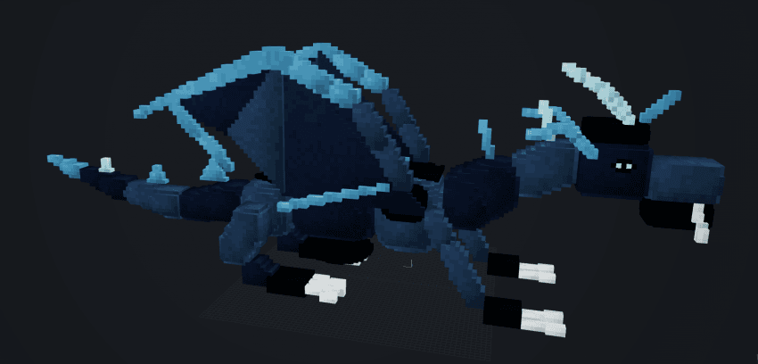
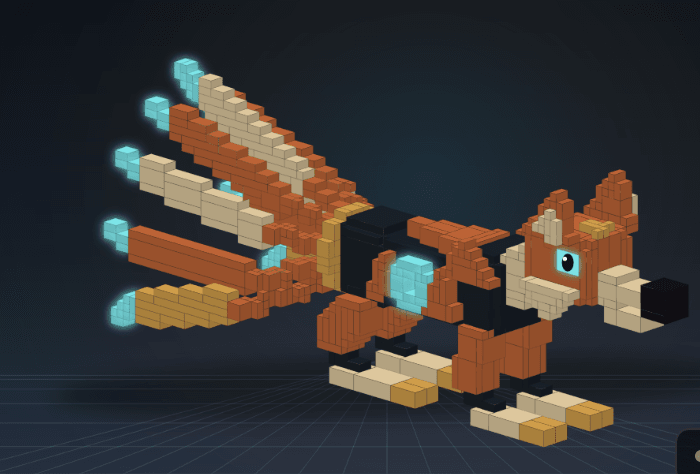
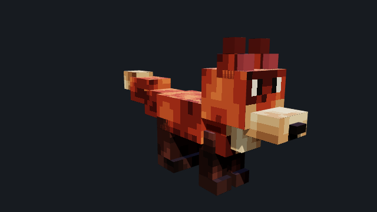
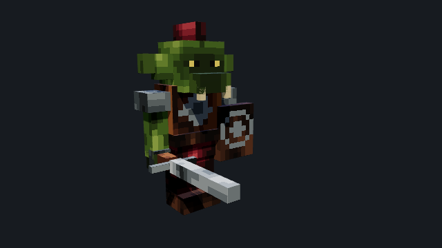
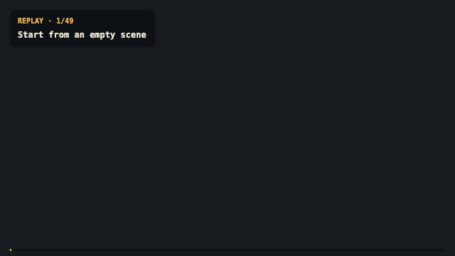
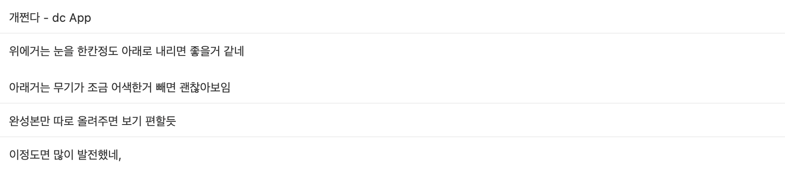
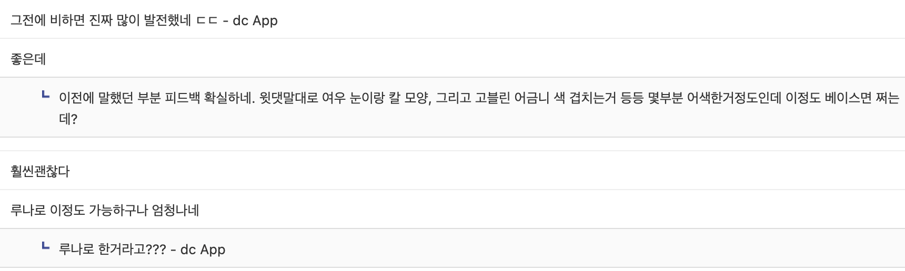

[지난 글](/posts/07-llm3dasset/)에서 Ashfox로 만든 모델을 마인크래프트 커뮤니티에 올렸다가 혹평을 받았다고 적었다. 혼자 고치면서는 꽤 좋아졌다고 생각해서 자랑하고 싶은 마음도 있었는데, 실제로 게임을 하는 사람들에게는 어색한 부분이 많았다. 아래 두 장이 개선 전 결과물이다.





다시 보면 댓글에서 왜 건축물 같다고 했는지 알 것 같다. 날개 끝이나 몸통의 굴곡을 작은 블록으로 이어 붙인 모습이 눈에 띄고, 밝은 장식과 블록의 경계가 여러 곳에 반복된다. 만들려던 생물의 특징은 있지만, 작은 디테일을 따라가다 보면 몸 전체의 모양을 한눈에 읽기 어렵다.

그때 받은 조언 중 가장 도움이 된 것은 큰 덩어리로 형태를 잡고 픽셀 텍스처로 디테일을 표현해 보라는 이야기였다. 기존 마인크래프트의 여우나 엔더드래곤, 코블몬 모델을 참고해 보라는 의견도 있었다. 그래서 다음 작업에서는 무엇을 입체로 만들지부터 다시 정했다. 몸통과 머리의 비율, 귀와 꼬리의 윤곽은 큐브로 잡고, 털의 무늬나 눈처럼 표면에 그릴 수 있는 표현은 텍스처로 옮기는 방향이었다.

그 방향으로 하네스와 예제를 다듬고, 9월 3일에 여우와 고블린을 다시 공개했다.





앞의 모델을 그대로 다시 만든 것은 아니라서 일대일 비교는 어렵다. 다만 이번 여우에서는 몸통과 머리의 넓은 면이 이어지고, 그 위에 털의 색과 눈을 그리는 방식으로 표현이 달라졌다. 고블린도 몸통과 팔다리, 무기를 큰 부위로 읽을 수 있다. 이번에는 [이전보다 많이 발전했다는 반응](https://gall.dcinside.com/mgallery/board/view/?id=steve&no=390480&page=1)을 받았고, 전에 의견을 남겼던 분도 피드백이 반영됐다고 말씀해 주셔서 꽤 기뻤다. 배너에 쓴 그리핀도 Ashfox 결과물이지만, 여기서는 당시 다시 공개하고 평가받은 여우와 고블린을 중심으로 이야기하려고 한다.

이 과정에서 바꾼 것은 모델을 작성하는 구조와, 그 구조를 사용해 형태를 만드는 방식이다. 지난 글에서는 에이전트가 의미 중심의 DSL을 쓰고 컴파일러가 이를 모델로 변환하게 했다고 설명했다. 이후 작성 체계를 여러 소스 파일을 묶는 에셋 워크스페이스로 바꿨다. 형태, 표면, 뼈대와 움직임을 각각 정의하고 연결할 수 있게 한 변경으로, [당시 커밋](https://github.com/sigee-min/ashfox/commit/0b838f90a53f547102e52ea1492a22f4551d1a00)에도 이전 작성 방식을 대체한 내용이 남아 있다.

이 구성을 여우 예제에 적용하면서 몸을 만드는 소스와 털·얼굴을 그리는 소스, 뼈대·애니메이션 소스를 나눴다. 몸통의 크기를 바꾸는 작업과 눈을 다시 그리는 작업을 따로 다루고 싶었기 때문이다. 형태 소스에서는 다음처럼 큐브의 위치와 크기를 지정하고, 그 큐브에 사용할 표면을 연결한다.

```text
cube torso {
  origin = (-4u, 7u, -4u);
  size = (8u, 6u, 12u);
  surface = skin.torso;
}
```

여기서 `skin.torso`가 몸통에 입힐 표면이다. 몸통의 무늬를 바꿀 때는 그 표면을 수정하면 되고, 몸통을 더 길게 만들 때는 형태 쪽의 크기를 수정할 수 있다. 큰 몸통 큐브를 쓰고 털의 얼룩을 표면에 넣은 것은 예제 모델에서 내린 선택이다. 하네스에는 형태와 표면을 연결하고 각각 수정할 수 있는 기능을 마련했다. 이 구분을 해두면 다른 생물을 만들 때도 각 부위에 맞는 표현을 선택할 수 있다.

귀와 꼬리처럼 윤곽을 잡기 위해 나눠야 하는 곳에는 여전히 여러 큐브를 썼다. 큐브 수 자체를 줄이는 것보다, 작은 무늬를 추가할 때마다 입체 구조까지 복잡해지지 않도록 하는 데 초점을 뒀다. 첫 피드백을 예제에 반영한 부분이기도 하다.

표면 소스에는 색뿐 아니라 무늬의 모양과 위치도 적을 수 있게 했다. 여우 예제는 한 장의 128×64 픽셀 텍스처 안에 부위별 영역을 두고, 털과 다리, 발, 귀 안쪽에 사용할 색을 팔레트로 정한다. 몸통과 꼬리의 얼룩은 패턴으로 넣고, 눈은 작은 픽셀 도안인 `stamp`로 그린다.

```text
stamp eye_pair {
  pixels = ".wk..kw./.wk..kw.";
  w = eye_white;
  k = eye_dark;
}
```

위 도안은 `/`를 기준으로 두 줄로 나뉘고, `w`와 `k`에 각각 눈의 흰색과 어두운 색을 연결한다. 도안을 머리 앞면의 어느 픽셀에 찍을지는 별도로 지정한다. 눈 모양을 고칠 때는 도안을 바꾸고, 위치를 고칠 때는 배치 좌표를 바꾸면 된다. 이런 작은 수정이 얼굴을 다시 만들거나 몸 전체를 재생성하는 작업으로 커지지 않게 하고 싶었다. [여우와 고블린의 당시 소스](https://github.com/sigee-min/ashfox/blob/0b838f9/examples/shared-creatures.ashfoxworkspace)에서 형태와 표면, 도안의 배치를 함께 볼 수 있다.

물론 에이전트가 소스를 쓰다 보면 서로 맞지 않는 값을 넣을 수 있다. 컴파일러에서는 도안의 크기와 배치 좌표를 텍스처 영역 크기와 비교해서, 영역 밖으로 나가면 소스 위치와 이유를 담은 오류를 돌려준다. 선언하지 않은 관절에 부품을 연결하거나 같은 관절을 중복으로 연결한 경우도 검사한다. 이런 검사는 결과가 잘못됐다는 사실뿐 아니라 어느 정의를 수정해야 하는지 알려주는 역할을 한다.

움직임은 부품과 뼈대의 연결을 따라간다. 여우의 머리·꼬리·다리가 어느 뼈대에 붙는지 정의하고, 고블린의 무기는 오른팔 아래에 연결했다. 애니메이션에서는 그 뼈대의 회전을 시간에 따라 지정한다. 무기의 형태를 수정하면서 팔에 붙어 움직이는 관계는 유지할 수 있도록 작성한 것이다. 아래 GIF에서는 두 모델에 형태와 텍스처가 적용되는 과정을 볼 수 있다.

<details>
<summary>여우와 고블린 제작 과정 보기</summary>




</details>

다시 공개한 글에는 좋아졌다는 반응과 함께 여우의 눈을 한 칸 정도 내리면 좋겠다는 의견, 고블린의 무기 모양과 어금니 색을 손보면 좋겠다는 의견이 달렸다. 완성본을 따로 보여달라는 요청도 있어 이 글에는 제작 GIF와 별도로 완성 이미지를 넣었다.





남은 지적을 보면 컴파일러가 검사할 수 있는 범위도 드러난다. 눈 도안이 텍스처 영역 안에 들어가 있어도 사람이 보기에는 한 칸 높을 수 있고, 무기가 오른팔에 제대로 연결돼 있어도 칼의 모양은 어색할 수 있다. 그래서 영역을 벗어난 배치나 잘못된 연결은 오류로 다루되, 눈의 위치와 부품의 비율은 소스에서 조정할 수 있도록 두었다. 눈 위치까지 고정해 버리면 머리 모양이나 표정이 달라졌을 때 필요한 수정도 막힐 수 있기 때문이다.

이번 반응을 보고 이 방향으로 더 다듬어 볼 만하다고 생각했다. 다만 작성 체계와 예제를 함께 바꿨고 비교한 생물도 다르니, 어느 변경이 품질을 얼마나 높였는지까지 분리해서 말하기는 어렵다. 지금 확인한 것은 새 결과를 본 사람들이 이전보다 자연스럽다고 받아들였다는 점이다. 다른 생물에서도 같은 방식이 통할지는 계속 만들어보며 확인해야 한다.

이 글에 실은 여우와 고블린은 새 댓글에서 지적한 부분을 아직 고치지 않은 모습이다. 다음에는 눈 배치와 무기 형태, 어금니 색부터 손보려고 한다. 이미지 생성 모델로 콘셉트 아트를 먼저 만들고 모델링에 참고해 보라는 제안도 받았는데, 만들기 전에 원하는 모습을 정해두는 방법으로 시도해 보고 싶다.

혼자 볼 때는 어디부터 고쳐야 할지 잘 몰랐는데, 큰 형태와 픽셀 표현을 나눠보라는 조언 덕분에 작업 방향을 잡을 수 있었다. 이번에 이전 글을 봤던 분이 달라진 점을 알아봐 준 것도 그래서 더 반가웠다. 피드백을 남겨주신 분들께 감사하다.

## 반응과 레퍼런스

- [개선 전 피드백](https://gall.dcinside.com/mgallery/board/view/?id=steve&no=387054)
- [개선 후 반응](https://gall.dcinside.com/mgallery/board/view/?id=steve&no=390480&page=1)
- [이전 하네스 글](/posts/07-llm3dasset/)
- [Ashfox GitHub](https://github.com/sigee-min/ashfox)
