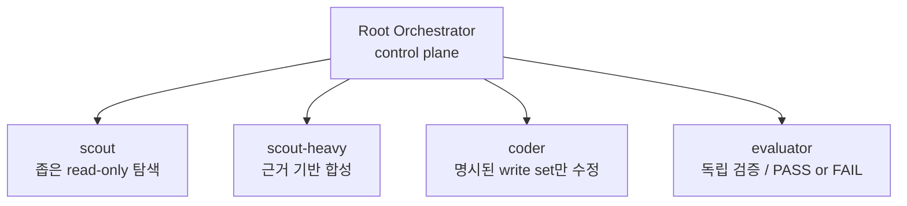
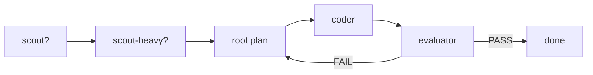

## 배경

처음에는 `Codex`를 그냥 "코드를 잘 써주는 단일 에이전트"처럼 붙여서 쓰곤 했다.
문제를 설명하면 읽고, 고치고, 테스트하고, 대충 마무리까지 이어가는 식이었다.
처음에는 이 방식만으로도 꽤 인상적이었다.
예전보다 훨씬 적은 입력으로 더 많은 작업을 넘길 수 있었기 때문이다.

그런데 조금 더 오래 붙여서 써보니, 진짜 문제는 모델이 얼마나 똑똑한가가 아니었다.
오히려 더 자주 남는 질문은 이것에 가까웠다.

`이 작업 흐름을 믿어도 되는가?`

에이전트가 실제로 파일을 읽고, 수정하고, 테스트를 돌리고, 결과를 정리하기 시작하면 생산성은 분명 올라간다.
하지만 그만큼 실패도 더 비싸진다.
한 번 잘못 판단한 결과가 단순한 답변 오류로 끝나는 것이 아니라, 코드 변경, 테스트 오염, 잘못된 결론까지 이어질 수 있기 때문이다.

그래서 우리는 `Codex`를 더 자율적으로 만드는 쪽보다, 오히려 더 제한된 구조 안에서 다루는 쪽으로 방향을 잡았다.
핵심 목표는 두 가지였다.

1. 에이전트의 작업을 더 정확하고 검증 가능하게 만들기
2. 반복 실패를 프롬프트 감각이 아니라 구조와 규칙으로 줄이기

내가 여기서 중요하게 보는 포인트는 단순하다.
좋은 에이전트 시스템은 "알아서 잘하는 모델"을 기대하는 시스템이 아니라, 어디까지 판단하고 어디서 멈춰야 하는지를 분명히 정해둔 시스템에 가깝다.

## 역할 분리

우리가 만든 구조에서 control plane은 루트 하나뿐이다.
서브에이전트는 전부 깊이 1 이상의 worker로만 동작하고, 자기 역할 밖으로 나가지 못하게 했다.

역할은 네 가지로 고정했다.

- `scout`: 하나의 좁은 read-only 질문만 탐색
- `scout-heavy`: 여러 `scout` 결과를 근거 기반으로 합성
- `coder`: 명시된 write set만 수정
- `evaluator`: 최종 결과를 독립적으로 검증하고 `PASS` 또는 `FAIL` 판정

이렇게 나눈 이유는 단순하다.
탐색, 구현, 평가가 한 덩어리로 섞이기 시작하면 흐름이 금방 흐려지기 때문이다.
조금 찾아보다가, 중간에 고치고, 돌아가는 것 같으니 끝냈다고 판단하는 식의 패턴은 처음에는 빨라 보여도 나중에 원인을 추적하기가 매우 어렵다.

반대로 역할을 명확히 분리하면 적어도 "누가 무엇을 했는가"가 남는다.
탐색과 구현과 평가가 섞이지 않고, 평가자는 구현자의 낙관을 그대로 이어받지 않게 된다.
우리가 모든 child에게 공통으로 강제한 것도 결국 이 지점을 위한 규칙들이다.

- child는 절대 root가 아니다
- child는 오케스트레이션 권한이 없다
- child는 자기 역할 밖으로 scope를 넓히지 않는다
- child는 다음 step을 제안할 수는 있어도, 새 child를 만들거나 루프를 이어가지는 못한다

즉, child는 똑똑한 worker일 수는 있어도, 작은 root가 되어서는 안 된다.

## 기본 루프

우리가 채택한 기본 루프는 아래와 같다.

이 구조는 일부러 단순하다.
실제로 작업을 하다 보면 예외는 얼마든지 생긴다.
하지만 중요한 것은 "언제 생략할 수 있는가"보다 "언제 반드시 거쳐야 하는가"를 명확히 하는 데 있었다.

예를 들어 아주 단순한 수정이라면 `scout` 없이 바로 갈 수도 있다.
반대로 증거가 코드, 로그, 문서처럼 여러 표면에 흩어져 있으면 `scout`을 `2~3`개 병렬로 붙이는 편이 더 낫다.
`scout-heavy`는 모든 경우에 쓰는 단계가 아니라, 흩어진 결과를 압축하고 모순을 정리해야 할 때만 넣는다.

대신 구현과 종료 조건은 더 엄격하게 잡았다.
구현은 가능하면 한 명의 `coder`가 맡고, 최종 종료는 항상 `evaluator`의 `PASS`가 있어야 한다.

우리가 이 루프를 통해 끊고 싶었던 흐름은 "생각 -> 구현 -> 자기합리화"였다.
대신 만들고 싶었던 흐름은 "증거 -> 계획 -> 구현 -> 독립 검증"이었다.

## 작업 카드

서브에이전트를 붙여보면 금방 느끼게 되는 것이 있다.
문장을 그럴듯하게 쓰는 것보다 입력 형식을 일관되게 만드는 쪽이 훨씬 중요하다는 점이다.

그래서 우리는 child prompt를 그냥 자유로운 지시문으로 두지 않고, 항상 self-contained task card 형태로 만들었다.
카드에는 최소한 아래 정보가 들어간다.

- 역할
- 좁게 제한된 질문 또는 slice
- 허용된 evidence surface
- 금지된 행동
- 기대하는 output packet
- 필요한 파일 경로 또는 검증 명령
- 현재 가정 또는 실패 가설

이 구조를 쓰면서 가장 크게 본 효과는 scope 오염이 줄었다는 점이다.
긴 부모 대화를 통째로 넘기면 child가 더 똑똑해지기보다는, 오히려 불필요한 문맥을 먹고 자기 임무를 넓게 해석하는 경우가 많았다.

그래서 우리는 `fork_context: false`를 기본값으로 뒀다.
부모의 긴 사고 흐름을 그대로 상속하지 않고, child는 가능한 한 짧고 압축된 packet만 받는다.
이 편이 토큰 비용도 줄고, 역할 경계도 더 잘 유지된다.

## 문서 우선

이 구조를 설계하면서 같이 정리한 것이 하나 더 있다.
`AGENTS.md`를 모든 지식을 담는 백과사전처럼 키우지 않는다는 원칙이다.

대신 `AGENTS.md`는 어디를 봐야 하는지 알려주는 라우터로만 두고, 실제 권위는 최대한 repo 안의 문서로 보냈다.
우리가 우선순위를 두는 표면은 대략 이렇다.

1. 공개 코드 계약과 테스트
2. 도메인 권위 문서
3. 거버넌스와 런북
4. guarded `CI` entrypoint
5. 체크인된 plan 또는 handoff 문서

이렇게 해두면 세션이 끊겨도 문맥이 남는다.
다음 실행이 지난 대화를 복원하려고 애쓰지 않아도 되고, "그건 전에 말했잖아" 같은 불안정성도 줄어든다.
결국 에이전트 메모리보다 저장된 시스템 문서를 믿는 편이 더 재현 가능하고, 더 관리 가능했다.

## 자가발전 루프

이 하네스에서 가장 중요한 철학은 아마 이 문장으로 가장 잘 요약된다.

> 같은 실수가 두 번 나오면, 프롬프트를 더 잘 쓰는 대신 하네스를 고친다.

에이전트를 오래 붙여보면 비슷한 실패가 반복되는 순간이 온다.
어떤 역할이 scope를 자꾸 넓힌다거나, 특정 검증을 자주 빼먹는다거나, handoff가 흐려서 다음 단계가 흔들리는 식이다.
이때 그때그때 더 길고 정교한 프롬프트를 붙이는 방식은 생각보다 오래 가지 않는다.

그래서 우리는 반복 실패를 가능한 한 구조적 변경으로 흡수하려고 했다.
보통은 아래 네 가지 중 하나로 바꾼다.

- 더 명확한 guide
- 더 강한 structural check
- 더 좁은 guarded entrypoint
- 더 나은 handoff convention

루프는 대략 이런 식이다.

이 방식은 화려하지는 않다.
모델이 갑자기 더 똑똑해지는 것도 아니다.
하지만 시스템은 점점 덜 같은 방식으로 실수하게 된다.
내가 생각하는 자가발전 루프는 결국 이런 종류의 개선에 가깝다.

## 종료 조건

에이전트를 붙여서 작업할수록 더 자주 보게 되는 패턴이 있다.
조금 돌아가면 금방 "거의 다 됐다"고 말한다는 점이다.
문제는 바로 그 지점에서 proof gap이 자주 생긴다는 것이다.

그래서 우리는 실행이 기대되는 작업에서는 종료 조건을 꽤 엄격하게 잡았다.

- 최종 종료는 `evaluator PASS`만 허용
- `FAIL`이면 같은 턴에서 루트가 다시 루프에 진입
- 테스트 실패, proof gap, dirty worktree, 재슬라이싱은 외부 blocker가 아님
- 외부 blocker는 정말 외부 요소만 인정

이 규칙을 둔 이유는 결국 하나다.
종료를 에이전트의 자기평가에 맡기지 않기 위해서다.
루트가 기대를 갖고 있으면 낙관 편향이 생기고, 구현자가 자기 변경을 평가하면 더더욱 그렇다.
그래서 종료는 가능하면 독립 evaluator의 증거 기반 판정에 묶는 편이 훨씬 안정적이었다.

## 재사용 규칙

최근에는 토큰 비용을 줄이기 위해 서브에이전트 재사용 규칙도 넣었다.
여기서도 핵심은 "재사용을 최대화한다"가 아니라, "재사용이 더 쌀 때만 재사용한다"는 쪽이다.

재사용 조건은 비교적 단순하다.

- 역할이 같다
- bounded surface가 같다
- ownership이 같다
- 이전 packet이 아직 fresh하다

반대로 아래 조건이 생기면 재사용을 무효화한다.

- write set이 바뀌었다
- 관련 파일이 바뀌었다
- 가정이 stale해졌다
- child transcript가 너무 길어져 새 spawn보다 비싸졌다

그리고 child를 수거할 때는 다음 재사용을 위한 압축 packet도 남기게 했다.

- exact scope
- touched paths
- anchors
- assumptions
- open risks
- invalidation triggers

이 규칙을 두고 나서부터는 균형이 조금 잡히기 시작했다.
같은 문맥을 매번 처음부터 설명하는 비용도 줄고, 반대로 오래된 child를 무한정 끌고 가면서 생기는 비대화도 피할 수 있었다.

## 역할별 모델

우리는 모든 역할에 같은 모델, 같은 추론 강도를 쓰지 않았다.
각 역할이 맡는 일이 다르면, 비용을 써야 하는 지점도 달라진다고 봤기 때문이다.

현재 기본 배치는 대략 이렇다.

- `scout`: `gpt-5.4-mini` + `medium`
- `scout-heavy`: `gpt-5.4` + `xhigh`
- `coder`: `gpt-5.4` + `medium`
- `evaluator`: `gpt-5.4` + `high`

여기서 중요한 것은 `scout`을 일부러 싸게 둔 이유다.
`scout`은 설계상 깊은 추론을 맡지 않는다.
하나의 좁은 evidence surface에서 필요한 근거를 회수하는 역할이기 때문이다.
그래서 탐색은 싸고 빠르게, 대신 합성과 검증에서 더 많은 비용을 쓰는 편이 전체 효율이 더 좋았다.

결국 우리는 모든 단계에 최고 비용을 쓰는 대신, `싼 탐색 -> 비싼 합성 -> 비싼 검증` 쪽으로 비용을 배치했다.

## 테스트 원칙

이 구조를 쓰면서 테스트에 대해서도 조금 현실적인 기준을 두게 됐다.
모든 작업에 엄격한 `TDD`를 강제하지는 않았다.
대신 행동, 계약, 검증 표면이 움직였는데 증거가 없는 상태를 금지했다.

기본 원칙은 이렇다.

- 좁고 싼 failing test로 표현 가능한 버그면 test-first
- 그게 비효율적이면 가장 작은 안전한 변경 후 가장 좁은 guarded verification 실행
- 새로운 테스트를 마구 추가하기보다 기존 contract 또는 regression test 확장 선호
- red-green이 어려웠다고 해서 evidence 자체를 생략하지는 않음

요약하면 교리는 약하게 두고, 증거 요구는 강하게 둔 셈이다.
내 경험상 실제 작업에서는 이 편이 더 오래 버틴다.

## 실제 효과

이 하네스를 쓰면서 가장 크게 느낀 효과는 세 가지였다.

첫째, 작업이 더 읽기 쉬워졌다.
누가 무엇을 왜 했는지, 어떤 증거를 봤는지, 어디서 실패했는지가 예전보다 훨씬 분리되어 남는다.

둘째, 실패가 덜 반복된다.
같은 miss가 다시 나오면 다음부터는 프롬프트 감각이 아니라 guide, sensor, handoff 같은 구조적 장치로 막기 때문이다.

셋째, 사람의 역할이 더 또렷해진다.
사람은 더 이상 매번 재현, 검색, 사소한 구현을 전부 직접 하지 않아도 되고, 의도 설정, 우선순위 결정, 최종 리스크 판단에 더 집중할 수 있다.

그래서 나는 이런 구조를 "자율 에이전트"라고 부르기보다는, 제한된 역할과 명시적 증거, 독립 검증, 반복 실패의 구조화된 흡수를 중심에 둔 작업 하네스라고 보는 편이 더 정확하다고 생각한다.

## 마무리

아직 이 구조가 완성됐다고 생각하지는 않는다.
실제로 굴려보면 생각보다 과한 규칙도 있고, 반대로 더 일찍 막았어야 했던 실패도 계속 나온다.
그래도 적어도 한 가지는 분명하게 느끼고 있다.
요즘 `Codex`를 오래 붙여 쓸수록 중요한 것은 모델을 더 그럴듯하게 설득하는 재주보다, 작업을 잘게 나누고, 확인할 수 있는 증거를 붙이고, 같은 실수를 다음번엔 덜 나오게 만드는 쪽이라는 점이다.

아마 앞으로도 이 하네스는 계속 바뀔 것 같다.
역할 이름도 달라질 수 있고, 루프도 더 단순해질 수 있고, 지금 중요하게 여기는 규칙 중 일부는 나중에 없어질 수도 있다.
다만 지금 시점에서 내가 제일 믿게 된 방향은 있다.
에이전트를 더 자율적으로 만든다는 말이 결국 아무 규칙 없이 풀어놓는다는 뜻은 아니라는 점이다.

그래서 나는 당분간은 프롬프트를 더 예쁘게 쓰는 쪽보다, 실패를 문서와 체크와 루프로 남기는 쪽에 더 시간을 쓰게 될 것 같다.
지금까지는 그 편이 훨씬 덜 불안했고, 대체로 더 잘 굴러갔다.

## 참고

- OpenAI, [Harness engineering: leveraging Codex in an agent-first world](https://openai.com/index/harness-engineering/)
- OpenAI, [Unlocking the Codex harness: how we built the App Server](https://openai.com/index/unlocking-the-codex-harness/)
- Birgitta Böckeler, Martin Fowler, [Harness engineering for coding agent users](https://martinfowler.com/articles/harness-engineering.html)
