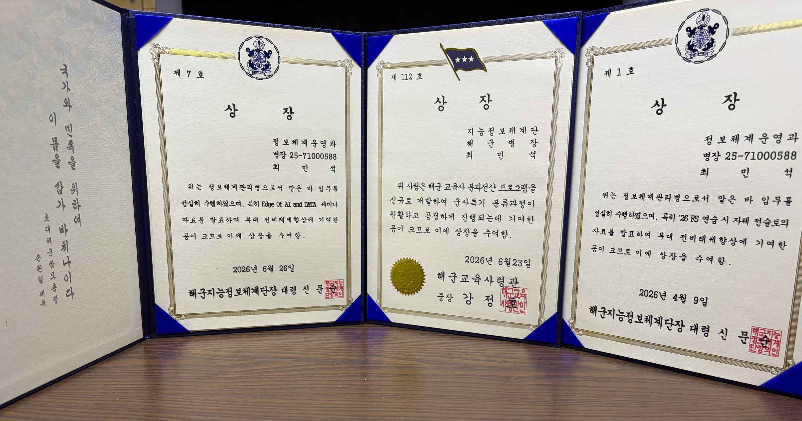
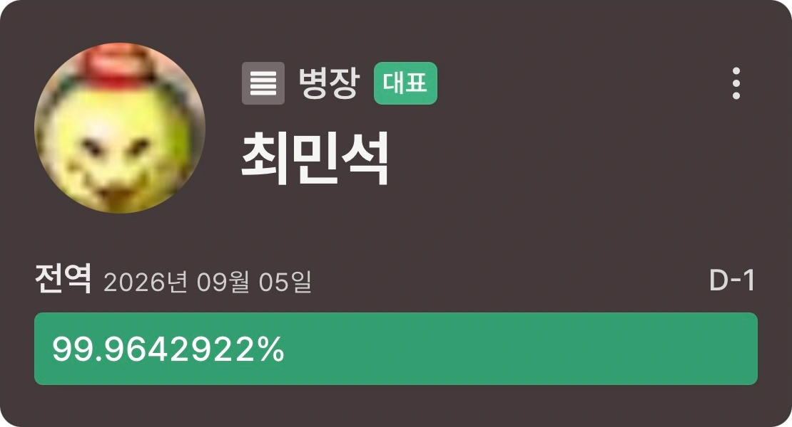

2025년 1월 6일에 해군 710기 SW개발병으로 입대해, 2026년 9월 5일에 전역했다. 입대할 때는 사실 별생각이 없었다. 개발병은 어떤 일을 할까 궁금하기는 했지만 군대에 대해 모르는 게 많아서, 일단 가면 알게 되겠지 싶었다.

입대하기까지는 우여곡절이 좀 있었다. 원래는 산업기능요원으로 복무하려고 회사에 들어가 수습 기간까지 마쳤는데, 학점 조건을 채우지 못해서 편입이 무산됐다. 이후 조건을 갖췄을 때는 현역 대학생의 산업기능요원 편입이 중단됐고, 전문연구요원을 고민하거나 카투사에 지원하기도 하다가 결국 SW개발병을 준비하게 됐다. 당시에는 징집 일정도 잡혀 있어서 남은 시간 안에 합격해야 한다는 생각에 마음이 급했다.

개발 경력을 이어갈 수 있는 곳으로 가고 싶었고, 면접을 준비하고 결과를 기다리는 동안에는 합격 여부에 온 신경이 쏠려 있었다. 그 과정은 앞서 쓴 합격 수기에 자세히 남겨두었다. 그렇게 입대할 곳은 열심히 준비했는데, 정작 군대에서 어떻게 생활하게 될지는 구체적으로 상상하지 못했다.

그러다 훈련소에서 첫날밤을 보내고 눈을 떴는데, 2층 침대 아래 칸에 누워 올려다본 침대 밑면에 낙서들이 적혀 있었다. 그걸 가만히 보고 있으니 정말 아찔했다. 아, 나 군대 왔구나. 해군 훈련소에서는 타종 소리로 기상방송을 하는데, 스피커가 낡아서 종소리가 찢어지는 것처럼 들렸다. 낯선 침대에서 잠을 깨자마자 듣는 그 소리가 꽤 섬뜩해서, 지금도 훈련소를 떠올리면 침대에 적힌 낙서와 기상 종소리가 같이 생각난다.

자대에서는 개발병분들과 간부님들이 자상하게 대해주신 덕분에 잘 적응할 수 있었다. 군대에 대해 모르던 점이 많았는데 주변에서 잘 챙겨주셨고, 개발을 좋아하는 사람들이 모여 있으니 기술 이야기를 나누기도 좋았다. 함께 복무하던 분들도, 새로 들어오시는 분들도 훌륭한 사람들이 많아서 이런 사람들이 개발병으로 오는구나 싶었다.

각자 관심을 두는 분야와 아는 것이 달라 이야기하다 보면 배울 게 있었고, 주변에서 꾸준히 공부하는 모습을 보니 나도 더 공부하고 싶어졌다. 혼자였으면 그냥 넘어갔을 부분을 더 찾아보게 되는, 그런 분위기가 좋았다. 근무지로 출근할 때도 다 같이 걸어가며 이런저런 이야기를 했는데, 같이 일하고 운동하며 보낸 날들 중에서도 그 출근길이 유독 기억에 남는다.

같이 만든 것 중에는 노래도 있다. 훈련 기간에 다른 개발병 몇 분과 해군 CM송 만들기 대회에 나갔는데, AI의 도움도 받고 직접 손도 보면서 「필승해군」이라는 노래를 만들어 제출했다. 결과는 상 하나 없이 탈락이었다. 그런데 노래가 생각보다 입에 착 붙어서, 전역할 때까지 1년 동안 계속 흥얼거렸다. 우리끼리는 거의 밈처럼 된 노래였다. 대회는 그렇게 끝났어도 같이 만든 노래가 군 생활 내내 따라다녔다는 게 아직도 웃기고 기억에 남는다. ㅋㅋㅋㅋ

::audio-player{src="/audio/pilseung-navy.mp3" title="필승해군"}

그렇게 자대 생활에 적응하면서 업무에서는 몇몇 프로젝트에 참여해 기여했고, 단 내부의 여러 기술 발표 세션에도 참여했다. 공부한 것을 실제로 써보고 다른 개발병분들과 함께 일하면서 개발 경험을 계속 쌓을 수 있었다. 프로젝트와 발표 활동으로 상장도 몇 개 받았는데, 복무를 마치고 돌아보니 참 보람차다.

일과가 끝나면 개인적으로 클라우드와 시스템 쪽 기술들을 공부했고, 일본어도 공부했다. 자대 업무에 적응하고 나니 시간이 꽤 지나 있어서, 그동안 공부한 내용을 기록으로 남기고 싶어 이 블로그를 시작했다. 그런데 사지방 컴퓨터는 브라우저 탭을 몇 개 열기만 해도 버거워했다. 공부하려고 앉으면 컴퓨터부터 답답해서 개인 공부를 할 환경을 따로 마련해야 했다.

처음에는 집 컴퓨터에 접속하는 방법을 생각했지만, 복무하는 동안 계속 켜두고 관리하기도 부담스럽고 문제가 생기면 다음 휴가까지 직접 손볼 수도 없었다. 결국 Oracle Cloud에 가상머신을 만들고 code-server를 올려, 사지방에서는 웹 브라우저로 접속해서 쓰기로 했다. 원격으로 코딩하면 느리지 않을까 걱정했는데 다행히 공부하는 데 크게 불편하지 않았고, 환경을 갖추고 나서는 그곳에서 공부하고 글을 썼다.

블로그를 만드는 데에도 시간을 꽤 썼다. Astro는 처음 써봤고 JS 생태계에도 익숙하지 않아서 하나씩 찾아가며 설정했는데, 오랜만에 서버를 만지고 블로그를 내 취향대로 고치는 게 재미있었다. Nginx Proxy Manager를 붙이고 도메인과 인증서까지 설정한 과정도 첫 글에 남아 있다. 그 글에는 전역 전까지 포스팅을 50개 이상 하겠다는 목표도 적어두었다. 동료 개발병들에게 블로그를 만들었다고 이야기까지 해두었는데, 지금 글 목록을 보면 꽤 멀리 잡았던 목표다. 글 수는 한참 못 미쳐도 그때 써둔 것들을 다시 읽으면 무엇을 공부하고 있었는지 생각난다.

함께 지내던 분들은 운동도 좋아해서 나도 러닝을 꾸준히 하게 됐다. 처음에는 3km를 22분 안에도 못 들어왔는데, 주변에 같이 달리는 사람들이 있다 보니 계속 뛰게 됐다. 근무지에서 개발 이야기를 나누던 사람들과 밖에서는 같이 운동하며 지냈다. 공부도 러닝도 혼자 했으면 이만큼 꾸준히 했을지 모르겠다.

외출을 나가면 보통 대전 은행동의 으능정이거리나 엄사에서 놀았다. 생각보다 주변 인프라가 괜찮아서 부대 밖에서 시간을 보내기 좋았고, 여자친구가 외출에 맞춰 내려와 주면 같이 은행동에 가서 자주 데이트했다. 유성온천 위쪽에 있는 돌비시네마에서 극장판 《체인소 맨: 레제편》을 본 적도 있는데, 극장이 꽤 만족스러워서 기억에 남는다. 군 생활을 떠올리면 부대에서 함께 지낸 사람들뿐 아니라 여자친구와 대전에서 놀던 날들도 생각난다.

휴가 때 대전역을 이용하면 성심당에 들러 빵을 사 가곤 했다. 그렇게 빵을 들고 가면 주변 사람들의 이쁨(?)을 받을 수 있어서, 대전역을 거쳐 가는 것도 꽤 좋았다. 여자친구가 내려와서 함께 보내던 외출도, 빵을 사 들고 나가던 휴가도 기다려지는 시간이었다.

그러다 전역이 한 달 정도 남았을 때부터는 본격적으로 취업 준비를 하면서, 면접을 보러 가려고 외출과 휴가를 썼다. 은행동에서 놀거나 여자친구를 만나러 나가던 때와 달리 마지막에는 면접 일정에 맞춰 나갔다 오는 일이 생겼고, 준비할 것들을 챙기다 보니 시간이 참 빨리 갔다. 그렇게 기다리던 전역이었는데 마지막 한 달은 취업 준비를 하면서 보냈다.

군대에 들어오기 전에도 회사에 다녔지만, 다시 취업을 준비하면서는 복무 중에 공부한 내용과 참여했던 일들도 정리하게 됐다. 입대 전에 개발 경력을 이어가고 싶어서 SW개발병을 준비했는데, 실제로 군대에서 공부하고 일한 경험을 가지고 다음 회사를 준비하고 있었다. 꾸준히 공부했던 것들이 내 기술적 깊이와 역량을 키우는 데 정말 도움이 됐다는 걸 이때 많이 느꼈다. 아직 채용 과정이 진행 중이라 결과는 더 기다려봐야 한다.

전역 이틀 전에는 9월 5일에 맞춰 9.05km를 달려보려고 소대장님과 기념 러닝을 나갔다. 그런데 소대장님께 속아서 계룡대를 크게 두 바퀴 돌고 나니, 어느새 10.5km를 뛰고 있었다. 처음에는 3km를 22분 안에도 못 들어오던 내가 1시간 20분 동안 쉬지 않고 달린 것이다. 참 뿌듯했다. 날짜에 맞춰 뛰려던 거리는 넘어버렸지만, 소대장님과 같이 뛰어서 더 오래 기억할 것 같다.

전역할 때는 여자친구 것도 기념으로 핑크색 자수가 들어간 전역모를 함께 맞췄다. 글 맨 위 사진에 나란히 놓인 두 모자가 내 것과 여자친구 것이다. 외출 때 내려와서 같이 시간을 보내주던 여자친구와 전역 기념도 함께 남기게 됐다.

군대의 빡빡한 규율은 그립지 않을 것 같지만, 그 안에서 만난 사람들과 함께했던 일상은 많이 그리울 것 같다. 근무지까지 같이 걸어가며 이야기하던 길, 같이 달리고 사지방에서 전역 컴퓨터를 찾아보던 시간이 생각난다. 좋은 개발병분들과 간부님들을 만나 잘 적응하고, 공부도 운동도 꾸준히 할 수 있어서 감사하다.

군 복무를 고민하는 사람 중에 개발을 진심으로 좋아하고 기술적인 교류를 즐기는 사람이 있다면, 해군 SW개발병에 한 번 지원해 보기를 추천한다. 나는 훌륭한 사람들과 함께 일하고 공부할 수 있어서 좋았다. 함께 복무했던 개발병분들과 간부님들, 외출에 맞춰 내려와 준 여자친구에게도 고맙다는 말을 남기고 싶다.
