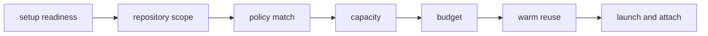

## 배경

예전부터 `GitHub Actions`를 쓰면서 늘 비슷한 아쉬움이 있었다.
기본 제공 러너는 편하지만 하드웨어 선택권이 거의 없고, 반대로 self-hosted runner는 직접 붙잡고 운영하기 시작하면 생각보다 금방 귀찮아진다.

특히 벤치마크나 성능 비교처럼 머신 스펙이 중요한 작업은 더 그렇다.
어떤 `CPU`를 쓰는지, 메모리를 얼마나 줄지, 네트워크를 어떻게 붙일지, 필요하면 spot이나 preemptible 인스턴스를 쓸지까지 직접 통제하고 싶어지기 때문이다.

문제는 여기서부터다.
그런 요구가 생긴다고 해서 항상 `Kubernetes`까지 들고 와서 `ARC(actions-runner-controller)`를 얹고 싶지는 않았다.
내가 원한 건 대규모 엔터프라이즈 러너 플랫폼이 아니라, 작은 운영자가 자기 계정 안에서 이해 가능한 수준으로 유지할 수 있는 control plane에 더 가까웠다.

그래서 결국 만들게 된 것이 `OhoCI`다.

코드는 [sigee-min/ohoci](https://github.com/sigee-min/ohoci)에서 공개하고 있다.

`OhoCI`는 한 문장으로 설명하면,
`workflow_job` webhook을 받아서, 어떤 작업을 받아들일지 설명 가능하게 판단하고, 조건이 맞으면 `OCI`에 ephemeral runner를 띄우고, 작업이 끝나면 다시 정리하는 작은 control plane이다.

내가 여기서 중요하게 본 것은 “더 많은 기능”이 아니었다.
오히려 반대였다.
작게 유지해도 되는 문제를 굳이 큰 시스템으로 만들지 않는 것이 더 중요했다.

## 왜 만들었나

처음에는 그냥 고정된 self-hosted runner 몇 대를 두고 돌리는 쪽도 생각했다.
실제로 사용량이 안정적이면 그 방식이 제일 단순하다.
하지만 내 경우에는 작업량이 계속 일정하지 않았고, 벤치마크나 테스트를 특정 shape에서만 돌리고 싶은 경우도 자주 있었다.

그렇게 되면 상시 켜둔 VM은 금방 애매해진다.
평소에는 놀고 있고, 막상 필요할 때는 shape나 설정이 맞지 않거나, 러너 상태가 꼬였는지부터 다시 봐야 하기 때문이다.

반대로 GitHub-hosted runner는 너무 일반적이다.
“어디선가 잘 돌아간다”는 점은 좋지만, 어떤 OCI shape 위에서, 어떤 비용 조건으로, 어떤 네트워크 안에서 돌릴지를 직접 잡고 싶은 경우에는 점점 한계가 분명해진다.

그렇다고 이 문제를 풀기 위해 바로 `ARC`로 가고 싶지는 않았다.
`ARC`는 분명 강한 도구지만, 내 경우에는 “러너를 동적으로 관리하기 위해 쿠버네티스 control plane까지 같이 운영하는 것”이 문제보다 더 큰 답처럼 느껴졌다.

그래서 내가 원했던 것은 이런 종류의 시스템이었다.

- `GitHub Actions`와 연결된다
- 필요한 순간에만 runner를 띄운다
- 러너는 가능한 한 ephemeral하게 쓴다
- 어떤 이유로 작업이 막혔는지 설명할 수 있다
- 소규모 운영자가 혼자 유지할 수 있을 만큼 작다

`OhoCI`는 결국 이 요구를 그대로 형태로 만든 결과에 가깝다.

## 작은 control plane

이 프로젝트를 만들면서 가장 먼저 정한 것은 “작은 운영 모델을 끝까지 유지한다”는 원칙이었다.

그래서 `OhoCI`는 처음부터 HA나 active-active를 목표로 두지 않았다.
하나의 `OhoCI` 인스턴스가 webhook을 받고, 정책을 평가하고, `OCI` 인스턴스를 띄우고, 정리하는 구조로 두었다.
`SQLite`를 로컬 디스크에 두고 단일 노드로 운영하는 것도 기본 경로로 잡았다.

물론 이렇게 말하면 바로 “그럼 확장성은?” 같은 질문이 붙는다.
그런데 적어도 내가 풀고 싶었던 문제에서는, replica 수를 늘리는 것보다 admission과 cleanup이 이해 가능하게 유지되는 쪽이 더 중요했다.

runner를 많이 띄울 수 있는 것과, control plane 자체를 분산 시스템으로 만드는 것은 다른 문제다.
`OhoCI`는 전자를 원했지 후자를 원한 것은 아니었다.

이렇게 범위를 줄이면서 얻는 장점도 분명했다.

- 상태 관리가 단순해진다
- webhook intake와 cleanup 경합이 줄어든다
- 운영자가 “어디서 판단이 내려졌는지”를 추적하기 쉬워진다
- 시스템을 이해하는 비용이 낮아진다

내가 이 프로젝트를 만들면서 계속 피하고 싶었던 것도 바로 “작은 문제를 풀다가 control plane 자체가 주인공이 되어버리는 상황”이었다.

## admission 순서

이 프로젝트에서 내가 가장 중요하게 본 부분은 runner launch 자체보다 admission이다.
정확히는 “이 job을 받아야 하는가, 받아야 한다면 왜 그런가, 막혔다면 어디에서 막혔는가”를 고정된 순서로 설명할 수 있어야 한다고 봤다.

그래서 admission은 아래 순서로 고정했다.

이 순서가 중요한 이유는 단순하다.
러너를 못 띄웠을 때 원인을 설명할 수 있어야 하기 때문이다.

예를 들어 setup이 안 끝났는데 policy부터 보게 만들면, 운영자는 지금 문제가 GitHub App 연결인지, repo scope인지, label mismatch인지 구분하기 어려워진다.
반대로 순서를 고정해두면 적어도 어디에서 멈췄는지는 항상 같은 방식으로 설명할 수 있다.

실제로 `OhoCI`에서 내가 의도한 진짜 사용자 경험도 이런 쪽이다.

- 왜 launch됐는지 설명 가능해야 한다
- 왜 warm runner를 재사용했는지 설명 가능해야 한다
- 왜 queued 상태에 남았는지 설명 가능해야 한다

내가 생각하기에 작은 control plane일수록 “똑똑해 보이는 것”보다 “설명 가능하게 고정된 것”이 더 중요하다.

## policy lane

`OhoCI`에서 policy는 단순한 설정 묶음이 아니다.
실제로는 하나의 launch lane에 가깝다.

각 policy는 대략 이런 것을 정의한다.

- 어떤 label 조합이 이 정책에 매칭되는가
- 어떤 `OCI shape`를 쓸 것인가
- 동시에 몇 개의 runner를 허용할 것인가
- warm capacity를 쓸 것인가
- budget guardrail을 적용할 것인가

여기서도 핵심은 범위를 좁히는 것이었다.
나는 policy를 너무 영리한 규칙 엔진으로 만들고 싶지 않았다.
조건이 많아질수록 운영자가 이해하기 어려워지고, 결국 “왜 이 job이 여기로 갔지?”가 다시 반복되기 때문이다.

그래서 label match도 일부러 단순하게 유지했다.
`self-hosted`는 인프라 관리용 label로 보고, 나머지 label set이 어떤 policy와 정확히 맞는지를 보는 쪽으로 잡았다.

이렇게 하면 적어도 각 policy가 “무슨 종류의 job lane인가”를 한 문장으로 설명할 수 있다.
내 경험상 이건 생각보다 중요하다.
설명이 안 되는 policy는 시간이 지나면 거의 항상 운영 부채가 된다.

## warm과 budget

그렇다고 단순한 on-demand launch만으로 충분하다고 보지는 않았다.
실제로 쓰다 보면 두 가지 요구가 금방 생긴다.

하나는 “조금 더 빨리 붙었으면 좋겠다”는 요구고,
다른 하나는 “이러다 비용이 계속 새는 것 아닌가”라는 걱정이다.

그래서 `OhoCI`에는 warm capacity와 budget guardrail을 둘 다 넣었다.

warm capacity는 말 그대로 항상 큰 풀을 유지하는 방식이 아니다.
오히려 정책 단위로 아주 좁게 켜는 쪽에 가깝다.
특정 repository와 policy 조합에서만 idle runner 하나를 남겨둘 수 있게 해서, startup latency를 줄이되 상시 비용이 커지지 않도록 했다.

budget guardrail도 마찬가지다.
정교한 과금 시스템을 만들려는 것이 아니라, 적어도 정책 단위에서 “이 정도면 새 launch를 멈춰야 한다”는 선을 둘 수 있게 하려는 목적이 더 컸다.

여기서도 내가 중요하게 본 것은 완벽한 재무 시스템이 아니라 운영 감각에 가까웠다.
작은 운영자에게 필요한 것은 세밀한 chargeback보다, “여기서 더 띄워도 괜찮은가”를 제어할 수 있는 가드레일에 더 가깝다고 봤기 때문이다.

## setup 흐름

이 프로젝트에서 의외로 중요했던 부분은 setup flow였다.
처음에는 그냥 Settings 화면을 여러 개 두고 알아서 채우게 해도 된다고 생각했는데, 그렇게 만들면 결국 어느 값이 launch readiness의 진짜 blocker인지 흐려지기 쉽다.

그래서 setup은 아예 다섯 단계로 고정했다.

1. 관리자 비밀번호 변경
2. GitHub App 연결
3. OCI credential 저장
4. repository 선택
5. OCI launch target 저장

이 순서를 둔 이유도 admission과 비슷하다.
제대로 launch가 가능해지기 전까지 필요한 최소 조건을 고정된 shell 안에서 하나씩 끝내게 만들고 싶었기 때문이다.

나는 이런 종류의 control plane에서 “설정 자유도”보다 “초기 진입 경로의 명확성”이 더 중요할 때가 많다고 생각한다.
운영자가 한 번이라도 setup 상태를 잘못 이해하면, 그 뒤 문제는 거의 항상 러너가 아니라 설정 문맥에서 시작되기 때문이다.

## cleanup 루프

동적으로 runner를 띄우는 시스템을 만들다 보면 처음에는 launch 쪽에 더 눈이 간다.
어떤 shape를 쓰는지, cloud-init을 어떻게 굽는지, registration token을 어떻게 붙이는지 같은 부분이 더 재미있기 때문이다.

그런데 실제로 오래 굴리면 더 중요한 쪽은 cleanup에 가깝다.

ephemeral runner 시스템은 띄우는 것보다 정리하는 쪽이 흔들릴 때 더 빠르게 망가진다.
인스턴스는 죽었는데 GitHub 쪽 runner registration이 남아 있다거나, 반대로 job은 끝났는데 OCI instance가 남아 있다거나, warm으로 재활용할 수 없는 러너가 애매하게 idle 상태로 누적되기 시작하면 금방 시스템 신뢰도가 떨어진다.

그래서 `OhoCI`에서도 cleanup은 그냥 마지막 부속 단계가 아니라, control plane의 핵심 루프 중 하나로 봤다.
`OCI` 인스턴스 상태와 GitHub runner 등록 상태를 같이 확인하고, 이미 terminal state에 들어간 리소스는 그대로 mark하고, 필요한 경우 termination과 deregistration을 같이 요청하는 식으로 정리 루프를 두었다.

결국 ephemeral 시스템에서 중요한 것은 “잘 띄운다”보다 “끝나면 흔적 없이 정리된다”에 더 가까운 것 같다.

## 의도적 비기능

이 프로젝트를 설명할 때 같이 말해야 하는 것도 있다.
`OhoCI`는 일부러 하지 않는 것이 많다.

예를 들면 이런 것들이다.

- multi-replica coordination
- leader election
- distributed locking
- enterprise-grade multi-tenant control plane
- 범용 CI 플랫폼

이건 빠진 기능 목록이라기보다, 내가 문제를 어디까지로 정의했는지를 보여주는 경계에 가깝다.

작은 운영자를 위한 control plane을 만들겠다고 시작했으면, 그 전제를 끝까지 지키는 편이 맞다고 생각했다.
기능을 더 넣는 것보다, 어디서 멈출지를 정하는 것이 오히려 더 중요했다는 뜻이다.

그래서 나는 `OhoCI`를 “작은 ARC”라고 생각하지 않는다.
오히려 “ARC가 너무 큰 답으로 느껴질 때 선택할 수 있는, 더 좁고 설명 가능한 대안”에 가깝다고 본다.

## 마무리

이 프로젝트를 만들면서 가장 자주 들었던 생각은, 인프라 도구도 결국 규모보다 운영 모델이 더 중요하다는 점이었다.

모든 문제를 큰 플랫폼으로 풀 필요는 없다.
특히 혼자 운영하거나 아주 작은 팀에서 관리하는 시스템이라면, 높은 확장성보다 설명 가능성, 기능 풍부함보다 경계가 분명한 설계가 더 오래 버티는 경우가 많다.

`OhoCI`는 그런 판단의 결과물에 가깝다.
`GitHub Actions` job이 들어오면, 준비 상태를 확인하고, repository scope를 보고, label과 policy를 매칭하고, capacity와 budget을 확인한 뒤, 필요하면 warm runner를 재사용하거나 새 `OCI` 인스턴스를 띄우고, 끝나면 다시 정리하는 작은 control plane이다.

결국 내가 만들고 싶었던 것은 “많은 러너를 다루는 시스템”이 아니라,
`필요한 순간에만 compute를 붙이고, 그 이유를 설명할 수 있는 시스템`이었다.

지금도 이 구조가 모든 경우에 맞는다고 생각하지는 않는다.
하지만 적어도 내가 풀고 싶었던 문제, 그러니까 작은 운영자가 자기 클라우드 계정 안에서 이해 가능하게 유지할 수 있는 CI burst capacity라는 문제에는 꽤 잘 맞는 답이라고 느끼고 있다.
