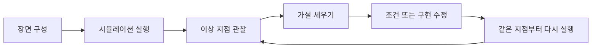
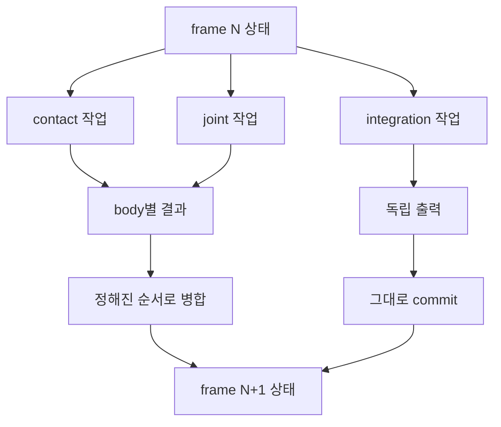
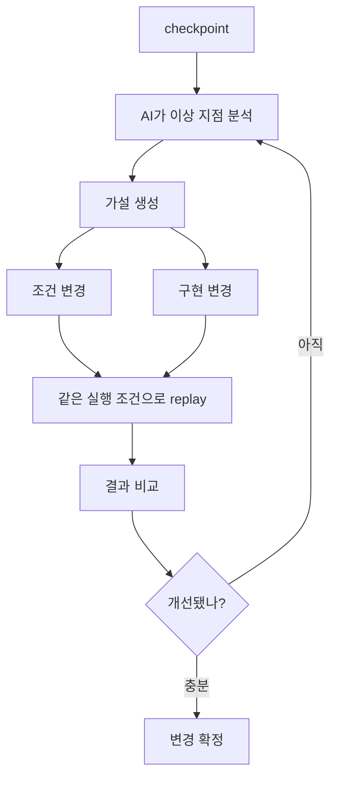

## 문제의식

요즘 `Physical AI`라는 말을 자주 본다.

처음에는 로봇이나 시뮬레이션 쪽에서 쓰는 새 키워드 정도로 넘겼다.
계속 보다 보니 관심이 조금 다른 쪽으로 갔다.
AI가 물리 세계를 얼마나 잘 설명하는지도 흥미롭다.
나는 물리 시뮬레이션을 만드는 과정 자체에 AI를 넣는 쪽이 더 궁금했다.

지금도 AI는 코드를 꽤 잘 고친다.
문서를 읽고, 테스트를 돌리고, 실패 로그를 보고, 수정안을 만든다.
물리 시뮬레이션은 여기서 조금 다른 문제가 붙는다.
함수 하나가 통과했는지보다, 어떤 장면이 어떤 조건에서 어떻게 변했는지를 계속 따라가야 했다.

처음 그린 작업 순서는 이랬다.



AI에게 이 일을 맡기려면 단순히 코드를 고치는 수준을 넘어야 한다고 생각했다.
특정 시점의 물리 상태를 열고, 조건을 바꾸고, 다시 실행하고, 결과를 비교하는 쪽까지 맡길 수 있어야 했다.

여기서 바로 걸리는 질문이 있었다.

같은 지점으로 정말 돌아갈 수 있는가.
같은 조건으로 다시 실행할 수 있는가.
결과가 달라졌을 때 그 차이가 수정 때문인지, 실행 환경이 흔들렸기 때문인지 구분할 수 있는가.

`Replay Native Physics`라는 이름은 여기서 붙였다.

## 재현성 기준

비슷한 관심은 이미 물리 시뮬레이터 쪽에도 있다.
재현 가능한 실행은 꽤 오래된 주제다.
`MuJoCo`는 저장한 시뮬레이션 상태에서 다시 step을 진행했을 때 같은 다음 상태로 이어지는 문제를 문서에서 다룬다.
`Isaac Sim`이나 `Genesis` 같은 플랫폼도 로봇 학습과 `Physical AI` 실험을 위한 물리 기반 가상환경 쪽에 가깝다.

내가 보려던 지점은 한 번의 replay보다 그 replay를 개선 루프에 넣는 방식이었다.
시뮬레이션을 돌리다 보면 어떤 순간부터 결과가 이상해지는 경우가 있다.
물체가 튀거나, 관절이 무너지거나, 충돌이 엉뚱하게 풀리거나, 에너지가 조금씩 쌓이는 식이다.

이때 전체 실행을 처음부터 다시 돌리면 시간이 많이 든다.
원인을 좁히려면 문제가 생긴 근처로 돌아가는 편이 낫다.
그 시점의 상태를 열고, 조건을 조금 바꾸고, 다시 실행하고, 결과를 비교하는 방식을 원했다.

그 비교가 의미 있으려면 실행 조건이 같이 고정되어야 한다.
같은 상태에서 시작했더라도 contact 순서가 달라지거나, solver row 적용 순서가 바뀌거나, fixed-point의 scale, rounding, saturation, accumulator law가 다른 계약으로 해석되면 다음 상태가 달라진다.
차이가 통제 밖으로 빠지면, 수정의 효과와 실행 환경의 흔들림이 섞인다.

그래서 처음부터 끝까지 다시 돌리는 방식보다 한 단계 더 안쪽을 보고 싶었다.
문제가 생긴 근처로 돌아가 그 지점부터 다시 실험하는 방식이다.

```text
t0 ── t1 ── t2 ── t3 ── t4 ── t5 ── t6
                ↑
             여기로 돌아가고 싶다

t2 상태에서
  ├─ 조건 A로 다시 실행
  ├─ 조건 B로 다시 실행
  └─ 구현 수정 후 다시 실행
```

이 정도가 되면 디버깅 방식도 달라진다.
처음부터 다시 돌리며 결과를 기다리는 방식에서 벗어나, 문제가 생긴 지점 근처에서 여러 가설을 바로 비교한다.

AI 쪽도 사정은 같다.
AI가 실험을 설계하고 개선하려면 실험 대상이 고정돼야 한다.
같은 상태를 다시 열 수 있어야 AI가 관찰한 차이를 믿고 다음 실험으로 넘어간다.

## 프레임 경계와 내부 순서

프레임 단위로 진행되는 시뮬레이션이라면 한 tick의 입력 상태와 다음 tick의 출력 상태가 분리된다.
모든 작업이 이전 상태만 읽고, 서로 다른 출력 위치에만 쓴다면 worker가 어떤 순서로 실행되든 결과는 같다.
이 경우에는 merge 순서를 크게 신경 쓰는 일이 줄어든다.

내가 신경 쓴 부분은 그보다 안쪽이다.
물리 시뮬레이션에는 여러 작업이 같은 body나 같은 island 상태에 영향을 주는 구간이 생긴다.
contact가 여러 개 붙고, joint constraint가 걸리고, solver가 impulse를 반복해서 적용하는 순간이다.
그 구간에서는 결과를 단순히 "프레임 끝에서 한 번 합친다"고 보기에는 무리가 있었다.

```text
frame N state
  ├─ contact A -> body 3
  ├─ contact B -> body 3
  ├─ joint C   -> body 3
  └─ contact D -> body 8

body 3에는 여러 결과가 다시 모인다.
```

내가 쓰는 방향에서는 권위 있는 물리 값이 fixed-point 계약을 따른다.
같은 scale, 같은 overflow law, 같은 rounding law, 같은 division law로 계산하면 숫자 자체는 훨씬 분명해진다.
그 다음에 남는 문제도 또렷해진다.
어떤 constraint row를 먼저 적용했는지, impulse clamp가 언제 걸렸는지, accumulator를 어떤 폭과 순서로 접었는지가 다음 속도와 위치에 영향을 준다.

그래서 병렬 merge를 볼 때는 먼저 계약을 확인했다.
순서에 민감한 구간에는 stable key와 ordered reduction을 두고, 순서가 독립인 구간에는 disjoint write나 worker-local scratch 근거를 남긴다.



프레임 경계는 먼저 잡아야 한다.
다만 프레임 안쪽의 phase들이 어떤 순서로 결과를 만들고, 같은 상태로 모이는 값들을 어떤 순서로 접는지도 같이 정해야 했다.
물리 시뮬레이션에서는 그 작은 차이가 다음 tick의 입력이 된다.
한 번 생긴 차이는 뒤로 갈수록 커진다.

그래서 재현성을 random seed 하나로 볼 수 없었다.
숫자 의미, 작업 순서, 병렬 폭, 메모리 조건, 결과 병합 순서까지 같이 봐야 한다.

## 실험 통제 변수

AI가 시뮬레이션을 보고 판단 실험을 한다고 생각하면 문제가 더 선명해진다.

AI가 어떤 장면에서 contact 처리가 문제라고 판단했다고 하자.
그 부분을 수정하고 같은 지점부터 다시 실행했다.
결과가 좋아졌다.

이때 바로 묻게 된다.
결과가 바뀐 이유가 정말 수정 때문인가.
실행 순서가 살짝 달라졌을 수도 있다.
GPU backend가 다른 경로를 탔을 수도 있다.
작업 폭이 달라지면서 island work item의 처리 순서가 바뀌었을 수도 있다.
lane-local 결과를 합치는 순서가 달라졌을 수도 있다.
prepared workspace capacity가 달라지면서 no-growth 경로와 일반 경로가 갈렸을 수도 있다.
numeric contract id나 ordered replay token reduction이 어긋났을 수도 있다.

요소가 통제 범위 밖으로 나가면 AI의 판단도 같이 흐려진다.
모델이 좋은 분석을 내놓아도, 실험 환경이 매번 조금씩 달라지면 비교 자체가 약해진다.

내가 replay를 시뮬레이션의 기본 성질로 보고 싶은 이유가 여기에 있었다.
중간 상태로 돌아가고, 같은 조건으로 다시 돌리고, 필요한 부분만 바꿔 비교하는 방식을 기본으로 두고 싶었다.

## 실행 조건 모델

처음에는 snapshot만 잘 저장하면 된다고 생각했다.
world state를 저장하고, body 상태와 collider 상태를 다시 불러오면 어느 정도 될 것처럼 보였다.

실제로는 실행 조건이 같이 따라와야 했다.
상태가 같아도 실행 조건이 다르면 다음 결과가 달라진다.

```text
재실행에 필요한 것

  world state
  input event
  numeric contract
  execution width
  task order
  memory capacity
  reduction order
  execution evidence
```

여기서 눈에 밟힌 건 아래쪽 항목들이었다.
어떤 숫자 규칙으로 계산했는지, 작업을 어떤 순서로 나눴는지, 몇 개의 worker로 실행했는지, 결과를 어떤 순서로 합쳤는지도 같이 남아야 한다.

CPU와 GPU를 같이 생각하면 더 그렇다.

CPU에서 맞던 장면이 GPU에서 달라질 수 있다.
GPU 경로는 CPU 경로와 실행 모델이 다르다.
병렬성이 더 강하고, backend마다 지원하는 연산과 제약도 다르다.

그래서 CPU와 GPU를 한 줄 단위로 맞추는 접근보다, 같은 numeric contract와 같은 ordered evidence를 공유하는 방식을 먼저 봤다.

이 실행은 가능한가.
어떤 연산이 허용됐는가.
어떤 순서로 결과를 합쳤는가.
다시 돌렸을 때 비교할 증거가 남는가.

이 질문에 답하는 쪽으로 모델을 잡았다.

## 목표 루프

내가 원하는 최종 그림은 대략 이렇다.



여기서 AI는 코드 제안을 넘어선다.
장면을 보고, 의심 지점을 잡고, 다시 실험하고, 결과를 비교하는 쪽까지 들어온다.

그러려면 시뮬레이션 환경이 먼저 실험 장치처럼 동작하는 편이 맞다.
원하는 중간 지점으로 돌아갈 수 있고, 실행 조건을 설명할 수 있고, 결과 차이를 비교할 수 있어야 한다.
그래야 AI에게도 일을 맡길 수 있다.

`Replay Native Physics`는 이 문제의식에서 시작했다.

다음 글에서는 이 생각을 실행 구조로 내리는 이야기를 해보려고 한다.
같은 장면을 다시 돌리려면, 먼저 같은 일을 같은 의미로 나눠야 하고, 작업 단위, 실행 순서, 메모리 조건을 어떻게 고정할지부터 시작해야한다. 여러 삽질을하면서 개발을 하고 있는데, 작업하면서 알게된 여러 어프로치 등을 일대기처럼 남겨보려고 한다.

## 참고 자료

1. `MuJoCo` 문서: [Reproducibility](https://mujoco.readthedocs.io/en/stable/computation/index.html#reproducibility)
2. NVIDIA: [Isaac Sim](https://developer.nvidia.com/isaac/sim)
3. Genesis 문서: [Genesis Documentation](https://genesis-world.readthedocs.io/)
