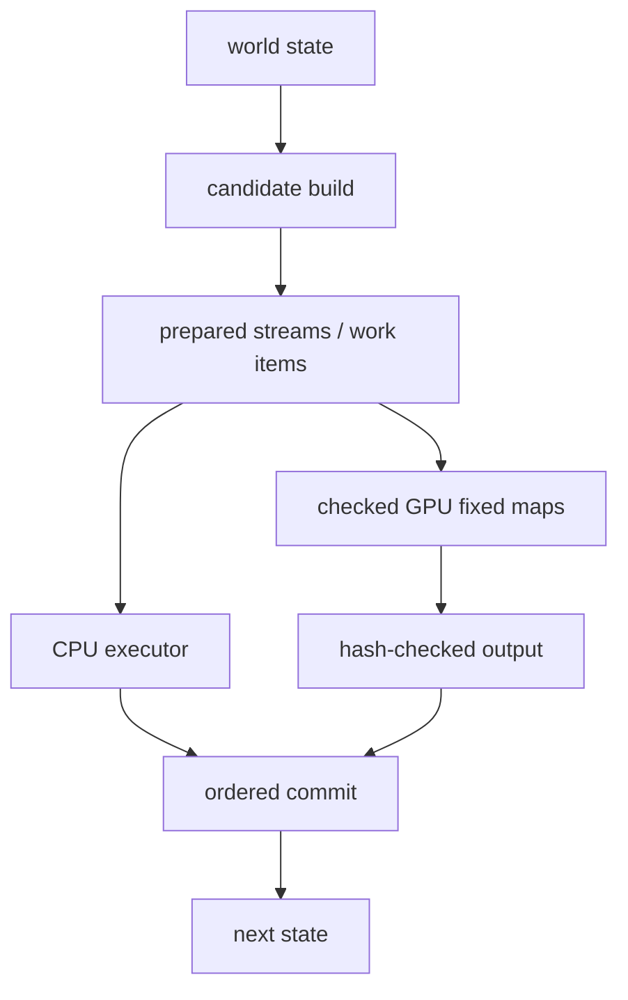
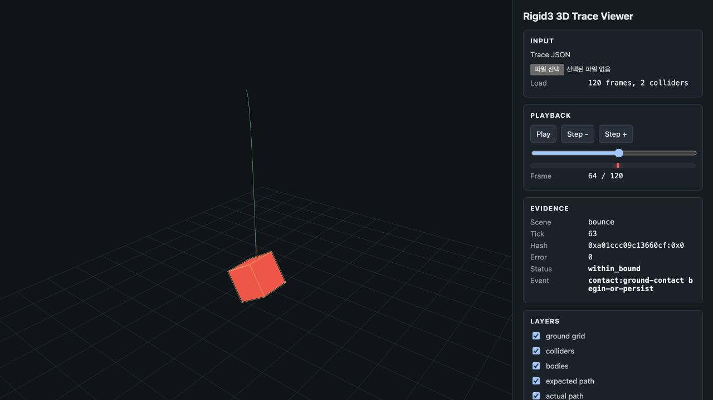
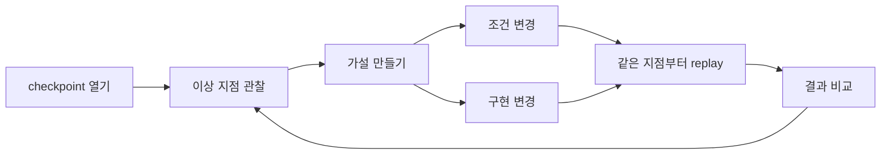

## 재실행 문제

이전 글에서는 물리 시뮬레이션을 AI가 고쳐나가는 루프를 생각해봤다.
특정 장면을 돌리고, 이상한 지점을 찾고, 가설을 세운 뒤, 같은 지점으로 돌아가 조건이나 구현을 조금 바꿔 다시 비교하는 방식이다.

그 생각을 실제 실행 단위로 내려보니 제일 먼저 걸리는 질문은 단순했다.

`같은 장면을 다시 열 수 있는가?`

처음에는 world state를 잘 저장하면 된다고 생각했다.
body의 위치와 속도, joint 상태, collider 정보, 입력 이벤트를 snapshot으로 남기면 그 시점으로 돌아갈 것처럼 보인다.
물리 시뮬레이션을 한 단계 더 안쪽에서 보면 상태만으로 비교가 흐려지는 구간이 있었다.

한 프레임 안에서는 contact 후보를 만들고, constraint를 구성하고, solver가 여러 번 값을 갱신하고, 마지막에 위치와 속도를 확정한다.
이 과정 중 일부는 병렬로 돌기 좋고, 일부는 순서가 결과에 영향을 준다.
그래서 같은 상태에서 다시 시작해도, 안쪽 작업의 모양이 달라지면 비교 기준이 흔들린다.

나는 그 지점을 잡아보려고 했다.
중간 상태에서 다시 시작하려면 한 프레임 안의 일을 어떤 단위로 붙잡아야 하는지, CPU와 GPU에서 같은 질문을 던지려면 어떤 기록이 남아야 하는지를 적었다.

## 프레임 내부 파이프라인

밖에서 보면 물리 시뮬레이션은 대개 `step()` 한 번으로 보인다.
이전 상태를 넣으면 다음 상태가 나온다.
게임 루프나 렌더링 루프에서는 이 정도 모델로도 충분할 때가 많다.

안쪽은 조금 더 복잡하다.

```text
state[N]
  -> broadphase
  -> narrowphase / contact manifold
  -> constraint row build
  -> island grouping
  -> solver iteration
  -> integration
  -> state[N + 1]
```

각 단계는 다음 단계의 재료를 만든다.
`broadphase`는 충돌 가능성이 있는 쌍을 찾고, `narrowphase`는 실제 contact 후보와 normal, penetration 같은 값을 만든다.
그다음 constraint row가 생기고, solver는 이 row들을 반복해서 적용한다.
마지막으로 속도와 위치가 갱신된다.

여기서 모든 작업이 이전 상태만 읽고 서로 다른 출력 위치에만 쓴다면 병렬 실행은 비교적 편하다.
worker가 어떤 순서로 끝나든 각자의 결과를 정해진 위치에 적으면 된다.

문제는 여러 작업이 같은 body나 같은 island에 모이는 구간이었다.
한 body에 contact가 여러 개 붙고, joint constraint가 같이 걸리고, solver가 impulse를 반복해서 적용하는 장면을 생각하면 된다.

```text
frame N

  contact A  -> body 3
  contact B  -> body 3
  joint C    -> body 3
  contact D  -> body 8

body 3에는 여러 계산 결과가 다시 모인다.
```

내 구현에서는 권위 있는 물리 값이 fixed-point 계약을 따른다.
그래서 문제의 중심은 숫자 계약과 실행 순서 쪽으로 옮겨 간다.
같은 scale, overflow, rounding, division law로 계산하고, wide accumulator를 어떤 순서로 접는지도 고정해야 replay가 닫힌다.

solver는 한 row의 결과를 다음 row의 입력으로 다시 사용한다.
row 순서가 바뀌면 fixed-point에서도 impulse clamp, accumulated impulse, position correction이 달라진다.
한 번 생긴 차이는 다음 tick으로 넘어가면서 더 커진다.

그래서 replay를 생각할 때 프레임의 시작과 끝만으로는 비교가 모자랐다.
프레임 안에서 어떤 후보가 나왔고, 어떤 작업으로 나뉘었고, 어떤 순서로 결과를 접었는지도 같이 봐야 한다.

## 후보 안정성

같은 장면을 다시 열려면 먼저 같은 후보가 나와야 했다.
여기서 후보란 contact pair, contact point, constraint row, island 같은 중간 산출물이다.

같은 world state에서 출발해도 후보 목록이 흔들릴 여지는 있다.
예를 들어 broadphase가 내부 tree나 grid를 순회하는 방식, lookup table의 iteration 순서, 병렬 worker가 lane-local slab에 결과를 쓴 뒤 merge하는 순서가 후보 목록의 순서를 바꾼다.

값 자체가 같아도 순서가 바뀌면 다음 단계가 달라진다.
solver가 row를 배열 순서대로 읽는 구조라면, contact A와 contact B의 위치가 바뀐 것만으로도 적용 순서가 달라진다.
replay 입장에서는 이 차이를 실행 환경의 우연으로 남겨두기 부담스럽다.

그래서 후보에 안정적인 이름을 붙이기로 했다.
단순히 배열의 몇 번째 원소라는 위치보다, 그 후보가 어떤 의미를 갖는지 드러나는 key가 있어야 한다.

```text
contact key
  phase
  stable body a / stable body b
  collider a / collider b
  canonical pair key
  contact seed
  island id
  row-local subkey
```

이 key를 두고 후보 목록을 다시 정렬한다.
직렬 경로에서 만들었든 병렬 경로에서 만들었든, 같은 장면에서 같은 후보가 같은 이름으로 나타나는지 확인한다.
차이가 생겼을 때도 배열 위치보다 의미 있는 후보 이름이 먼저 남는다.
예를 들어 "body 3과 body 7 사이의 feature 12 contact가 사라졌다"처럼 말하게 된다.

AI가 실험을 이어받는 상황에서도 이 차이는 크다.
모델이 관찰한 이상 지점이 배열 위치로만 남으면 다음 실험으로 이어가기 부담스럽다.
contact, constraint, island가 안정적인 이름을 가지면 AI도 어느 지점을 의심하는지 더 구체적으로 다룬다.

## 작업 식별자

병렬 실행을 생각하면 먼저 worker부터 떠올리기 쉽다.
몇 개의 thread를 쓸지, GPU block을 어떻게 나눌지, 어떤 queue에 작업을 넣을지 같은 질문이다.

나는 그보다 먼저 작업의 이름을 정했다.
실행 방식보다 앞에, 한 프레임 안의 일을 어떤 단위로 부를지 잡아야 했다.

대략 다음 형태로 잡았다.

```text
work item
  phase
  stable work index
  prepared input range
  writable body range
  worker-local scratch or lane
  merge / reduction law
  numeric contract
  replay token contribution
```

`phase`는 이 일이 broadphase인지, narrowphase인지, solver인지 알려준다.
`stable work index`는 lane 결과를 어떤 순서로 모을지 정한다.
`prepared input range`는 worker가 읽을 compact stream 범위를 나타낸다.
`writable body range`는 같은 worker가 책임지는 body 범위를 드러낸다.
`worker-local scratch or lane`은 공유 쓰기를 피하는 임시 공간이다.
`merge / reduction law`는 lane-local 결과를 어떤 key와 순서로 접을지 정한다.
`numeric contract`는 fixed64 scale, saturation, rounding, division, accumulator law를 묶는다.
`replay token contribution`은 이 work item이 replay hash에 어떤 증거를 남기는지 나타낸다.

이렇게 잡아두면 실행기는 꽤 자유롭다.
CPU에서는 work item을 직렬 loop나 thread pool로 돌린다.
GPU 쪽에서는 먼저 fixed32/fixed64 map이 같은 IR bytes, operation hash, backend policy, input bytes에서 같은 output hash를 내는지 닫아야 한다.
worker 수보다 같은 장면에서 같은 prepared stream과 work item identity가 만들어졌는지를 먼저 봤다.

작업에 이름이 붙으면 디버깅도 달라진다.
로그에 "solver가 이상하다"라고 남기기보다, 어떤 island의 어떤 row 묶음에서 차이가 시작됐는지 좁혀 간다.
이름은 나중에 비교 가능한 단서가 된다.

## 실행 순서와 작업 의미

CPU와 GPU를 같이 생각하면 실행 순서를 그대로 맞추는 일은 금방 커진다.
CPU는 비교적 직관적인 loop를 돌기 쉽고, GPU는 많은 작업을 한꺼번에 밀어 넣는 쪽이 자연스럽다.
같은 순서로 같은 코드를 실행시키겠다는 접근은 병렬성을 잘 쓰기 부담스럽게 만든다.

그래서 실행 순서와 작업 의미를 분리해서 봤다.

작업 의미는 고정한다.
어떤 후보가 어떤 prepared stream으로 들어가고, 어떤 work item으로 나뉘고, 어떤 key로 정렬되고, 어떤 phase barrier를 지나며, 결과를 어떤 순서로 commit하는지는 기록으로 남긴다.

실행 순서는 backend가 선택한다.
CPU는 직렬 loop나 thread pool을 쓰고, GPU는 admitted fixed map이나 kernel dispatch 단위로 묶는다.
다만 commit 지점에서는 다시 같은 의미의 순서로 모인다.



이 방식에서 CPU와 GPU는 같은 numeric contract, 같은 graph identity, 같은 key, 같은 commit 규칙을 공유한다.
그 위에서 각 backend는 자기에게 맞는 실행 방식을 선택한다.

이 방식에는 비용이 붙는다.
stable key를 만들고, phase barrier를 두고, commit 규칙을 명시하면 빠르게 대충 흘려보낼 수 있는 구간이 줄어든다.
그만큼 비교 가능한 증거가 남는다.
replay를 전제로 한 물리 환경에서는 이 비용을 치를 만하다고 봤다.

## 체크포인트 설계

중간 상태에서 다시 시작하려면 checkpoint도 더 잘게 잡아야 했다.
tick의 시작점만 저장하면 "이 tick 안에서 contact를 만든 뒤부터 다시 돌리고 싶다" 같은 실험이 빡빡하다.

예를 들어 solver를 고치고 싶다면 contact 후보와 constraint row는 그대로 두고 solver phase부터 다시 실행하게 된다.
contact generation을 고치고 싶다면 broadphase 결과는 그대로 두고 narrowphase부터 비교하게 된다.

그래서 checkpoint에는 world state 옆에 실행 조건도 같이 들어가야 했다.

```text
checkpoint[tick=124]

  canonical snapshot package
  command / input stream
  numeric-contract stream
  fixed dt
  solver iterations
  partition count
  replay hash
  prepared stream identity
  ordered reduction evidence
```

여기서 `canonical snapshot package`는 body, collider, material, constraint, terrain, streaming owner 같은 replay-visible state를 canonical binary stream으로 묶는다.
`numeric-contract stream`은 fixed64 q8, q16, q24, q32, time q24, proxy i32 같은 계약을 같이 싣는다.
`fixed dt`, `solver iterations`, `partition count`는 같은 tick 실행을 다시 만들기 위한 입력이다.
`prepared stream identity`와 `ordered reduction evidence`는 한 tick 내부의 phase까지 비교하려고 할 때 필요한 다음 기록이다.



이렇게 남겨두면 실험 범위가 좁아진다.
같은 checkpoint에서 solver만 바꿔 돌리거나, 같은 prepared stream을 다른 실행 폭으로 처리하거나, 특정 island만 떼어 작은 실험으로 만든다.

여기서 replay 지점은 디버깅용 저장 파일보다 조금 더 큰 의미를 갖는다.
AI가 실험을 이어받는 환경에서는 checkpoint가 작업 단위가 된다.
모델은 checkpoint를 열고, 관찰하고, 조건을 바꾸고, 다시 실행한 뒤, 결과 차이를 비교한다.

## AI 실험 루프

내가 최종적으로 만들고 싶은 것은 AI가 물리 시뮬레이션 개선 루프에 실제로 들어오는 환경이다.
AI가 장면을 보고, 이상 지점을 찾고, 어떤 조건을 바꿔볼지 정하고, 같은 지점부터 다시 실행한다.
그 결과를 보고 다음 실험을 잡는다.



이 루프가 굴러가려면 AI에게 실험 대상이 안정적으로 보여야 한다.
같은 checkpoint를 열었을 때 같은 후보와 같은 work item이 보이고, 조건을 하나 바꿨을 때 어떤 차이가 생겼는지 비교한다.

여기서 replay native라는 말을 다시 쓰게 된다.
시뮬레이션 코어가 처음부터 다시 열 수 있는 장면, 이름 있는 작업, 비교 가능한 실행 증거를 남기는 방향으로 설계되어야 했다.

그러면 AI에게 맡길 일도 조금 더 구체적으로 바뀐다.
"이상해 보인다"에서 출발해, 특정 checkpoint의 특정 island를 열어 solver iteration을 바꿔보고, contact threshold를 조정하고, CPU와 GPU 결과를 나란히 비교하는 판단 실험으로 이어간다.

여기서 잡은 것은 그 첫 단위였다.
같은 장면을 다시 열려면 먼저 같은 후보와 같은 work item이 필요했다.
다음에는 이 실행 단위를 실제 코어로 내리면서, CPU와 GPU에서 어떤 조건을 공유해야 비교가 성립하는지 더 구체적으로 써보려고 한다.
